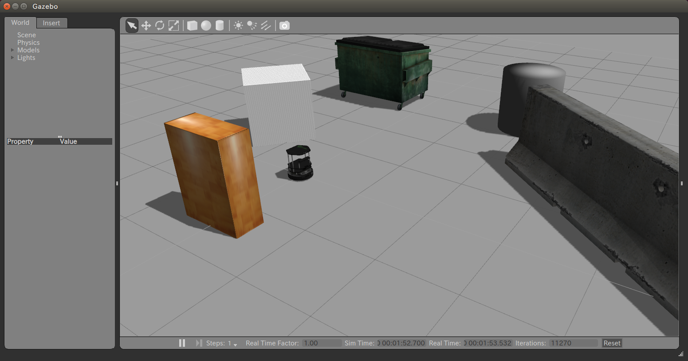
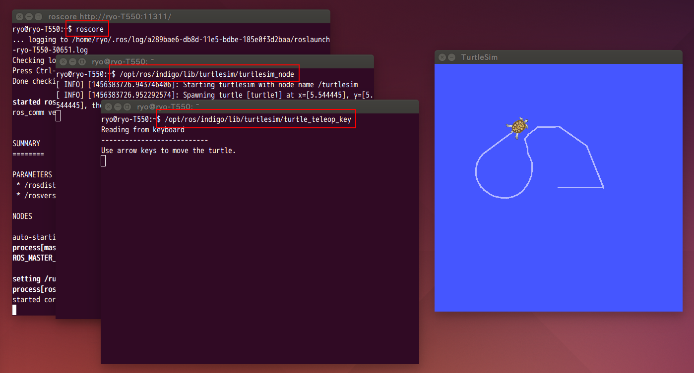
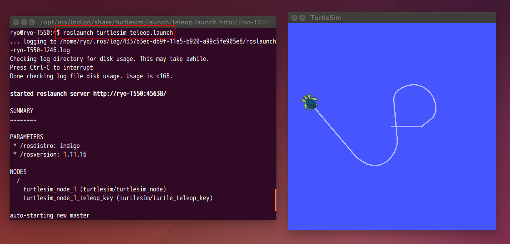
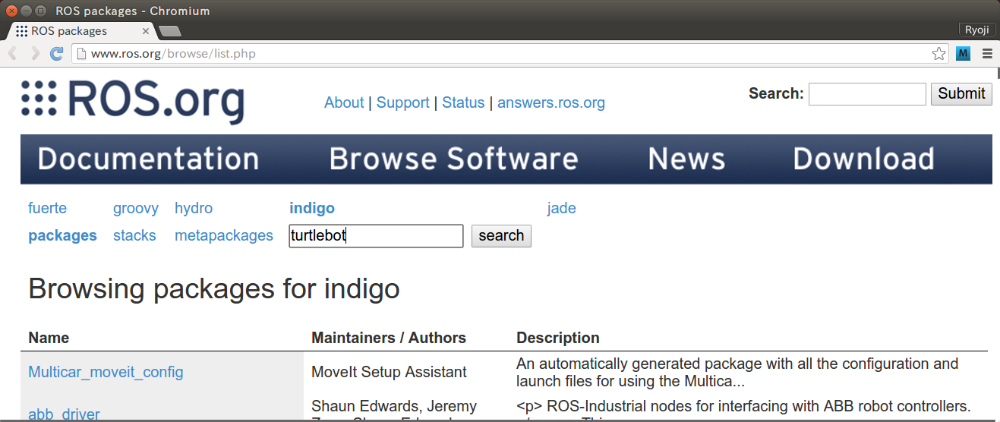
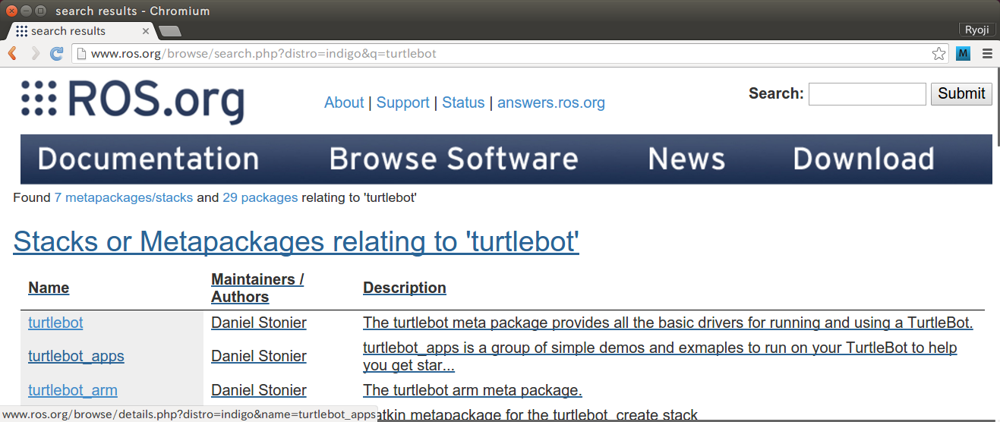
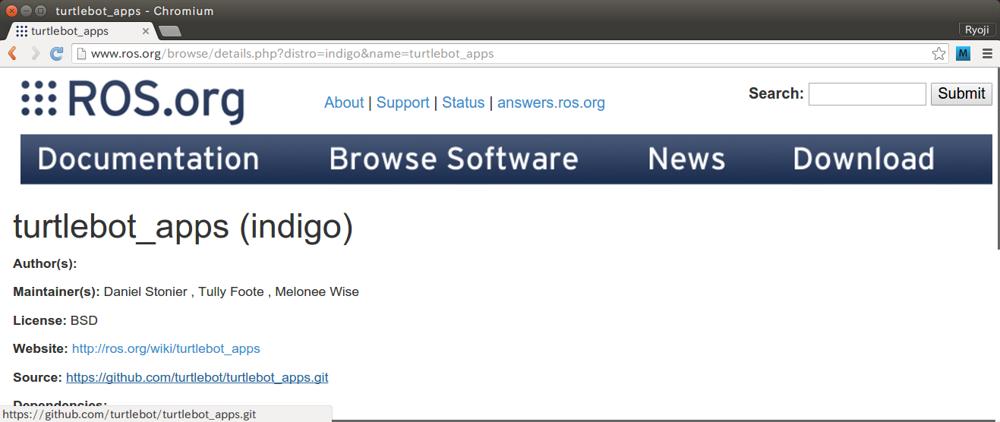
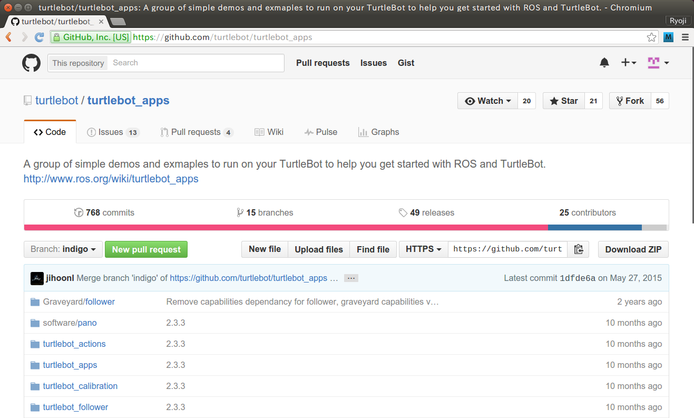
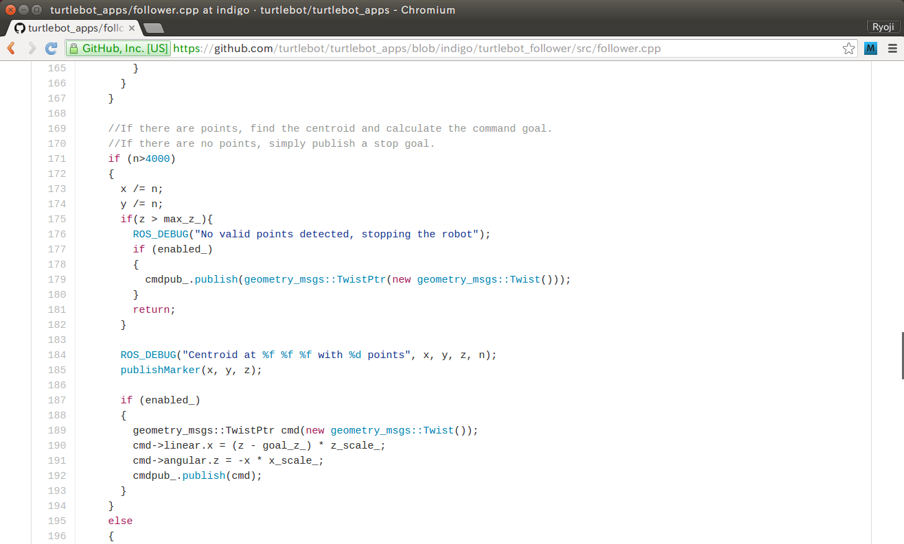
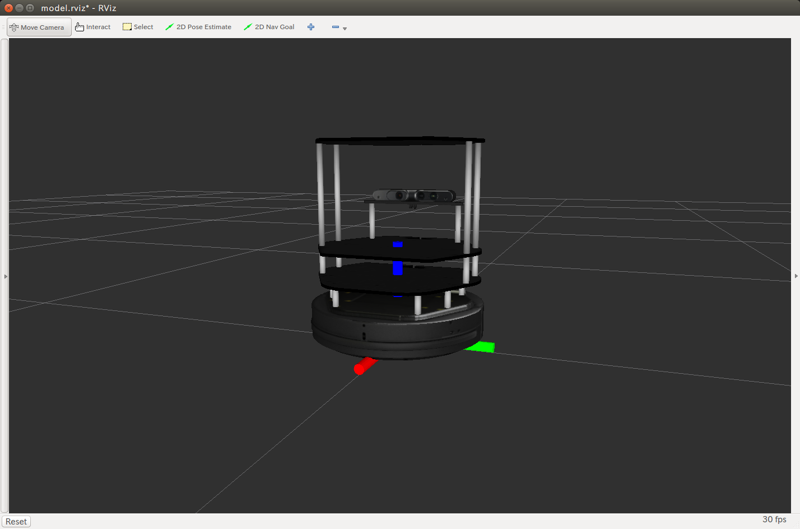

# ロボットを動かしてみる

まずは肩慣らし。ロボットを動かしてみましょう。

## TurtleBot

本稿は、ロボットとして[TurtleBot](http://wiki.ros.org/Robots/TurtleBot)を使用します。TurtleBotはROSアプリケーションの開発プラットフォームで、iRobot社のCreateやYujin Robot社のKobuki、Microsoft社のKinect、Asux社のXtion PRO LIVEといった市販のハードウェアで構成される、オープン・ソース・ハードウェアのロボットです。

<iframe width="640" height="360" src="https://www.youtube.com/embed/MOEjL8JDvd0" frameborder="0" allowfullscreen></iframe>

### なぜ、TurtleBot？

本稿がTurtleBotを使用する理由は、安くて簡単で情報が豊富なためです。

<dl>
  <dt>安い</dt>
  <dd>20万円程度で購入できます。もしiRobot社のルンバの中古品とXbox360から取り外したKinect、ベニヤ板があるなら、<a href="http://www.turtlebot.com/build">公開された設計書</a>に従って自作することもできます。</dd>
  <dt>簡単</dt>
  <dd>TurtleBotに対応した多数のROSパッケージがあるので、開発範囲を小さくできます。たとえば、<a href="http://wiki.ros.org/Robots/TurtleBot">ROS WikiのTurtleBotのページ</a>の記述通りにコマンド入力すれば、プログラミングせずとも地図作成や自律移動ができます。</dt>
  <dt>情報が豊富</dt>
  <dd>多数の開発者が、安くて簡単なTurtleBotでROSアプリケーションを開発しています。だから、情報も豊富です。たとえば<a href="http://learn.turtlebot.com">Learn Turtlebot and ROS</a>では、セットアップからスマートフォンで呼び出し可能なTurtleBotによるコーヒー配膳システムの完成まで、丁寧に解説してくれています。トラブルが発生しても、インターネットを検索すれば解決方法が見つかりますし。</dd>
</dl>

### セットアップ

[TurtleBot Installation](http://wiki.ros.org/turtlebot/Tutorials/indigo/Turtlebot%20Installation)に従い、TurtleBotに必要なソフトウェアをセットアップしてください。

### 実機がない場合は、シミュレーターで

TurtleBotを用意できなくても、ご安心ください。ROSに対応した、Gazeboというシミュレーターがあります。[Gazebo Bringup Guide](http://wiki.ros.org/turtlebot_gazebo/Tutorials/indigo/Gazebo%20Bringup%20Guide)に従って、TurtleBotのシミュレーターを起動してみてください。内蔵された物理エンジンが、いい感じに物理演算してくれます。

一点だけ、気をつけてください。Gezeboは初回起動時にオブジェクトのデータをダウンロードしますから、画面が表示されるまでかなり時間がかかります。気長に待っていただければ以下の画面が表示され、TurtleBotの実機がなくてもROSを試せるようになります。



## ROSの仕組み

プログラミングに入る前に、簡単にROSについて説明させてください。ROSはただの通信ライブラリなのですけれど、どんな通信をしてどのようにロボットを動かすのか、そもそもどうして通信ライブラリがロボットのソフトウェア開発に必要になるのかが分からないと、モヤモヤしますもんね。

### ロボットのソフトウェア開発と通信

少し遠回りになりますけど、電子工作相当の低水準の話から。ロボットはセンサーやモーターで構成されているわけですけど、これらはアナログな電気で制御されます。センサーはその測定結果を電圧として渡してきますから、専用の回路でデジタルに変換しなければなりません。DCモーター（普通のモーター）の力の制御も電圧で、でも、電子回路で電圧そのものを制御するのは難しい。だから、PWM（Pulse Width Modulation）制御と呼ばれるスイッチを高速にオン/オフする方式で、DCモーターの力を調節しなければなりません。

で、これがやたらと面倒くさい。だって、高速でスイッチをオン/オフするには、CPUのタイマー割り込みを使った面倒なコードが必要なのですから。なので、例えば電子工作で人気のArduinoでは、`analogWrite()`というPWM制御用のライブラリを用意し、タイマー割り込みを隠蔽しています。サーボ・モーター（ロボット・アームの関節等で使われる、角度を指定できるモーター）のようにスイッチをオン/オフする周波数が定められている場合向けに、一つのタイマーで複数のサーボ・モーターを制御するServoクラスも用意されています。

でも、ライブラリが揃っても、まだ他に問題があるんです。ロボット・プログラムの動作は「センサーの値を読む→読み取った値に合わせてモーター等を制御する」の繰り返しで、それをコードで表現すると以下になります。

```cpp
Rate loop_rate(30)  // 30Hz（秒に30回）でループできるように、ループ・レートを設定。
while (1) {  // 無限ループ。
  auto accelerator_opening = analogRead(ACCELERATOR_PIN);  // アクセル開度のセンサーから情報を取得。
  analogWrite(MOTOR_PIN, accelerator_opening);  // モーターの速度を設定。
  
  loop_rate.sleep();  // ループ・レートに合わせてスリープする。
}
```

上のコードは、一定の周期でループが回るようになっています。たとえば秒30コマ撮るビデオ・カメラのデータを使うプログラムなら秒30回処理が動けば十分なので、ループを30Hzに制限します。でも、この周期って、デバイスによって違うんですよ。たとえば、細かい制御が可能なブラシレス・モーター[^3]制御の最小タイミングはモーターが少し回転するたびで、だから、はるかに大きな周波数を設定しなければなりません。でも、センサーやモーターが増えると複数の周波数に対応しなければならなくなって、これを一つのループで表現するとコードが複雑になるのでやりたくない。PWM制御ライブラリのようなタイマー割り込みでの実現も、作成コストが高いから避けたい。マルチ・スレッドで複数のループを作る方式は、制御が不正確になってしまうのでダメ。

だから一般に、この複数の周波数問題は、CPUを分けることで解決します。CPUと言ってもPCに入ってるIntel Core i7とかの高級品ではなくて、16*M*Hz動作の*8*bitでメモリ2*K*B（単位に注意してください）とかの、マイクロ・コントローラーと呼ばれる安価なやつです。これを、センサーやモーター毎につけて、それぞれのデバイスに適した周波数でループを回して制御すればよい。ロボットを分散型で制御するわけですね。

でも、センサーとマイクロ・コントローラー、モーターとマイクロ・コントローラーのような小さな単位を組み合わせて大きなロボットを作るのは、組み合わせが多すぎるので大変。だから、センサーやモーターのマイクロ・コントローラーを、デジタルなので管理が容易なシリアル通信でつなげて、移動ユニットのような形でコンポーネント化します。このコンポーネントの組み合わなら、ロボットの作成は楽になりそう……なのですけれど、残念ですけどまだ課題があります。

というのも、シリアル通信ではビット列を送受信しますが、そのビット列にどのようなデータを使うのかは利用者の自由なんです。だから、A社の移動ユニットとB社の移動ユニットではシリアル通信する内容が異なっていて、コンポーネントを組み合わせたり交換したりはできません。あと、人工知能が行き先を示すようなハードウェア無関係のソフトウェア・コンポーネントでも、問題が発生します。自由度が高いソフトウェア・コンポーネント同士を自由度が低いシリアルで通信させるのは無意味ですから。というわけで、通信はもっと抽象度が高いネットワークで実現すべきでしょう。

まぁ、ネットワーク通信でも、HTTPでどんな内容のホームページでも送信できるように、自由なデータを送れちゃう。でも、ソフトウェアで階層的に実現されている層が多いですから、送信内容の規格化は容易です。各種業界団体が専用のXML規格を定めるように、移動を表現するデータ構造（X軸とY軸とZ軸の移動量と、X軸とY軸とZ軸の回転量）を定めてあげれば、A社の移動ユニットとB社の移動ユニットが交換可能になります。

でも、先ほど例に出てきたHTTPそのものだとセッション単位で1対1の接続なので、センサーから取得した同じデータを複数回送信することになって効率が悪そう。あと、ブラウザからリクエストが来たらデータを送る方式だと、センサーというデータを流し続ける仕組みと合致しない。メッセージがXMLだと、プログラムを書くのが大変そうで嫌。構造体のような、もっとプログラミング言語寄りの楽なやり方が欲しい。うん、やっぱり、既成品じゃあダメですね。

というわけで、ロボット専用の通信ライブラリが必要という結論になりました。ROSは、このロボット専用の通信ライブラリなのです。

[^3]: モーターは電磁石と永久磁石が引き合ったり反発したりして回っていて、電磁石の極を入れ替える（+/-を入れ替える）ことで回転を継続させています。回転で機械的に+/-を切り替えるのが普通のモーターで、電子回路で+/-を切り替えるのがブラシレス・モーターになります。

### Publish/Subscribeの、ロボットに適した通信を実現する

さて、そのロボット専門の通信ライブラリであるROSですが、実はその内部では先ほど文句をつけたHTTPも使用しています。でも、外から見えるROSの動作はHTTPとは大きく異なっていて、さすがはロボット専用な感じ。HTTPはブラウザからGETやPOSTというリクエストを受け取ったらサーバーがコンテンツを送る方式ですけれど、ROSでのサーバーはメッセージ流しっぱ、クライアントが必要に応じて読み取るという方式です。いわゆるPublish/Subscribe。センサーに適した、同じデータが複数回流れない効率のよい動作です。

で、このメッセージを流したり受け取ったりするプログラムの単位をROSではノードと呼び、通常はプロセスとして実現します。あと、種々雑多なメッセージが流れると取捨選択が必要になってしまいますから、同じメッセージをトピックとしてまとめます。このノードやトピックは、管理しやすいように階層で管理します。Microsoft社のKinectを管理する`/kinect`というノードが、取得した3D点群のメッセージを`/3dsensor/depth/points`というトピックに流す感じ。で、3D点群から障害物を検知してハンドル操作する`/steering`ノードや、3D点群を後で分析できるようにディスクに保存する`/pointcloud_to_pcd`ノードが、先ほどの`/3dsensor/depth/points`というトピックからメッセージを読み込んでそれぞれの処理を実施します。

この、メッセージをトピックに送ることをpublish、トピックからメッセージを受け取ることをsubscribeと呼びます。出版と購読ですね。先ほどは書きそびれましたけど、3D点群から障害物を検知する`/steering`ノードは、多分、右へ行けとか左に行けというメッセージをpublishします。で、このメッセージを`/move_unit`ノードがsubscribeする。さらに、`/steering`ノードは`/move_unit`ノードがpublishする機体の情報をsubscribeして、移動が可能かどうかの判断に使っているでしょう。ROSのノードは対等で、HTTPのようなサーバーとかクライアントという区分けは存在しないんです。

### サービスで、1対1の同期通信にも対応する

Publish/Subscribeでのメッセージの流れはパブリッシャーからサブスクライバーへの1方向のみで、非同期です。センサーが情報を垂れ流すロボット制御におけるほとんどの処理はPublish/Subscribeが適しているのですけれど、もしメッセージの内容が変わらないならpublishし続けるのは無駄が多いですし、メッセージを受け取ったかどうかを確認したい場合は非同期だと困ります。

たとえば、ロボットの名前を渡したいとします。名前はいつまでも変わらないですから、名前を何度もpublishするのは無駄です。「あなたの名前は？」「ロボット三等兵です」のようなやりとりの方が、「私の名前はロボット三等兵です」という同じ内容を繰り返し叫び続けるより適切でしょう。

カメラの動作モード設定のような場合も、Publish/Subscribeは使えません。動作モードを切り替えるメッセージをpublishしたけど、/cameraノードはsubscribeしそこねた（RDBMSでトランザクションのようなプログラムを書いている人には信じられないかもしれませんけど、ロボットでは十分にありえる話）。だから、/cameraノードは指定した動作モードとは異なるモードの画像をpublishする。でも、動作モード切り替えを指示したノードは、それを知るすべがない。だから、画像の解析に失敗しちゃう。

というわけで、ROSは、Publish/Subscribe方式に加えてサービスと呼ぶ1対1の同期通信も提供します。残念なことにROSの用語はテキトーで、Publish/Subscribeの場合はトピックとメッセージという用語で、サービスの場合はサービスとサービスという混乱する用語になっています（正しくは、Publish/Subscribeの場合は`topic`と`msg`で、サービスの場合は`service`と`svc`なんですけれど）。だから、わけのわからない説明で申し訳ありませんが、ノードは、サービスからサービス・リクエストを受け取ってサービス・レスポンスを返すことで1対1の同期通信をするという説明になります。

### メッセージやサービスを、簡単に定義/使用可能にする

メッセージは\*.msg、サービスは\*.svcというファイルで定義します。文法は、struct宣言みたいな感じ（実際にプログラミングするところで詳細を述べます）。そして、\*.msgや\*.svcはビルド時にC++の構造体のコードに変換されます。普通のコードでメッセージやサービスを作れるわけで、専用のAPIを使わなければならないXML作成より簡単です。トピックにpublishされたメッセージを表示するツールもあって、XMLと同様に人間が目で内容を確認することもできます。

ここまでをまとましょう。ROSプログラムは、ノードと呼ばれるプログラムの集合になります。ノードは、トピックにメッセージをpublishしたりトピックからメッセージをsubscribeしたりして、非同期通信で処理を進めます。あまり使いませんけど、サービスという1対1の同期通信もあります。メッセージやサービスは、struct宣言みたいな感じで定義して、我々が書くC++のコードからはstructに見えるようになります。ほら、「ロボットのソフトウェア開発と通信」で挙げたHTTPとXMLでロボットする場合の問題が、すべて解決されたでしょ？

### マルチスレッドとスレッド間通信で、高パフォーマンスも実現する

でも、どれだけ良いものであっても、遅すぎるなら使えません。ROSではノードからノードへメッセージがネットワークで送られていくわけで、しかもそのメッセージには画像とか3D点群とかの大きなデータが含まれるみたい。だとしたら、パフォーマンス面がちょっと不安かも……。

ご安心ください。ROSはパフォーマンスも考慮しています。ROSは、複数のノードをマルチ・スレッドで動作させて、ネットワークではなくメモリでスレッド間通信する`Nodelet`という仕組みも提供しているんです。しかも、コードを修正しなくても、通信相手のノードが別のプロセスや別のコンピューターにあるなら自動でネットワーク通信に切り替えてくれます。これなら、パフォーマンスも安心ですよね。

あと、マルチ・スレッドにまつわる面倒事は`Nodelet`が解消してくれますから、マルチ・スレッドであってもプログラミングは難しくありません。本稿では、この速くて簡単な`Nodelet`を使用してプログラミングしていきます。

### ついでに、ディストリビューションとバージョンの話

ROSとROSに対応したパッケージ群を指して、ROSディストリビューションと呼びます。UbuntuやDebianのような、Linuxのディストリビューションと同じ感じ。ディストリビューションの目的は、組み合わせが自由な整合性のあるパッケージのセットを用意することです。

ROSディストリビューションは、毎年新バージョンがリリースされます。本稿を執筆している2016年2月の最新ディストリビューションの名前は「ROS Jade Turtle」で、2016年5月に出る予定の次のディストリビューションは「ROS Kinetic Kame」です。JからKへと、名前の最初のアルファベットがABC順で進んでいきます。なお、ROSディストリビューションのバージョンは、「ROS Jade」や「ROS Kinetic」のように省略して書くことが多いようです。あと、偶数年にリリースされるROSディストリビューションはLTS（Long Term Support）版で、サポート期間が5年間になります（奇数年リリースのサポート期間は2年）。2014年リリースの「ROS Indigo Igloo」と2016年リリース予定の「ROS Kinetic Kame」が、LTSになります。

本稿は、ROS Indigoを使用します。最新のROSディストリビューションへの対応が追いついていないパッケージが多いことと、やはりサポートが長いLTSを使いたいですためです。なお、ROS Wikiの日本語のページでは、ROS Indigo Iglooのさらに前のROS Hydro Medusa向けの記事が多く存在します。ROS Wikiの通りにやってもうまく行かないという場合は、その文書がどのROSディストリビューションを対象にしているのかを確認してみてください。

## roslaunch

さて、いよいよプログラミング……の前に、既存のROSプログラムを動かしてみましょう。プログラムは完成したけど動かし方が分からないなんて、笑い話にもならないですもんね。ROSのノードは、直接起動、`rosrun`で起動、`roslaunch`で起動の3つの方法で起動できます。本稿のおすすめは`roslaunch`なのですけれど、その理由を理解していただくためにも、順を追って説明していきます。

### 直接起動する

通常のROSのノードは、実行可能なプログラムです。だから、直接起動できます。ターミナルを3つ開いて、それぞれで以下のコマンドを実行してください。

* ターミナル#1

```bash
$ roscore
```

* ターミナル#2

```bash
$ /opt/ros/indigo/lib/turtlesim/turtlesim_node
```

* ターミナル#3

```bash
$ /opt/ros/indigo/lib/turtlesim/turtle_teleop_key
```

画面は以下のようになって、`turtle_teleop_key`を実行したターミナル#3でカーソルキーを押すと、TurtleSimウィンドウの亀が動きます。



少しだけ解説を。ノード同士が通信するには、相手の情報が必要です。そのために、ROSでは`Master`というプログラムが動いていて、ノードの情報を集中管理しています。インターネットにおけるDNS（動的な登録ができるので、ダイナミックDNSの方が適切かも）みたいなモノですね。他にも、柔軟なパラメーター管理のために、`Parameter Server`というプログラムも動いています。そうそう、ログ管理も。これらのプログラムを1つずつ動かしていくのは大変なので、ターミナル#1で実行した`roscore`というコマンドで一気に起動できるようになっています。あと、ターミナル#2と#3で`/opt/ros...`のように長々と入力しているのは、ROSはプログラムはディレクトリ分割で管理されていて、プログラムのあるディレクトリ群が多すぎて`PATH環境変数`に登録できないためです。

そうそう、ROSのプログラムは`Ctrl-c`（キーボードのコントロール・キーを押しながらcを押す）で終了できます。起動したプログラムをすべて終了させて、次に進んでください。

### rosrunで起動する

上の直接起動する方式だと、パスを入録するのが面倒です。この問題を解決するために、ROSは`rosrun`というコマンドを提供します。

* ターミナル#1

```bash
$ roscore
```

* ターミナル#2

```bash
$ rosrun turtlesim turtlesim_node
```

* ターミナル#3

```bash
$ rosrun turtlesim turtle_teleop_key
```

これで、少し楽になりました。

### roslaunchで起動する

でも、`rosrun`でもまだまだ面倒くさい。`roscore`せずに`rosrun`するとエラーが表示されますから、`roscore`が動いているかどうかは検出できるはず。だったら、何もしなくても必要に応じて`roscore`を自動で実行させて欲しい。ターミナルを複数開くのも、コマンドを複数回も入力するのも、終了させるために`Ctrl-C`を何度も叩くのも面倒です。

この問題はシェル・スクリプトを書けば解消できそうなのですけれど、できれば、汎用言語であるシェル・スクリプトではなく、ROSに特化した言語で楽にやりたい。Javaプログラムのビルドを、シェル・スクリプトではなくてAntやMaven（.NET FrameworkならMSBuild、RubyならRake、私が大好きなClojureならLeiningen）でやる方が楽なのと同じ。というわけで、`roslaunch`を使いましょう。`roslaunch`は、ROSプログラム起動用のコマンドと、そのコマンドで処理可能な言語（フォーマットはXML）の文法の両方を指します。

ただ、これまでで例として使用してきた`turtlesim`は、`roslaunch`の`launchファイル`を提供してくれていないんですよ（`roslaunch`の文法で書かれたファイルを`launchファイル`と呼びます）。なので、本当はセットアップされたパッケージ対してやっていはならないことなのですけれど、`launchファイル`を追加してみます。

ターミナルで以下のコマンドを実行して、

```bash
$ sudo mkdir /opt/ros/indigo/share/turtlesim/launch
$ sudo gedit /opt/ros/indigo/share/turtlesim/launch/teleop.launch
```

以下の内容のファイルを作成してください[^4]。

```xml
<launch>
  <node pkg="turtlesim" type="turtlesim_node" name="turtlesim_1"/>
  <node pkg="turtlesim" type="turtle_teleop_key" name="turtlesim_1_teleop_key"/>
</launch>
```

`roslaunch`の場合の起動の仕方は、以下の通り。必要なターミナルは一つだけです。

```bash
$ roslaunch turtlesim teleop.launch
```



うん、これなら楽ちんですね[^5]。`Ctrl-c`一回ですべて終了できましたし。

[^4]: `name`の値は、ユニークな値なら何でも構いません。`type`と同じ値を使う場合が多いようです。

[^5]: `turtiesim`には`draw_square`等のノードもあり、キーボードで操作したり自律移動させたりして楽しめます。なので、ごめんなさい。無条件に`turtle_teleop_key`を起動してしまう今回の`launchファイル`は、楽ちんではありますけど正しくはありません。`turtlesim_node`の起動と`turtle_teleop_key`の起動は分けておくのが、`turtlesim`の使い方的に正しい形でしょう。

## catkin

ついにプログラミング……の前に、パッケージの作成です。ROSアプリケーションは、パッケージと呼ばれる単位で管理されます。我々がこれから作成するROSアプリケーションでも、パッケージのお約束を守らねばなりません。このお約束をうまいこと守りながらビルドしてくれるツールとして、`catkin`というビルド・ツールがあります。

### ワーク・スペースの作成

前にも述べましたが、ROSアプリケーションは、複数のノードがメッセージを送り合うことで動作します。で、これから我々が開発するノードが使用するメッセージは、他のパッケージで定義されたものかもしれません。この「他のパッケージ」をうまいこと利用できるようにする手段が「ワーク・スペース」なのですけど、ROSのプログラミングをまだ始めていない状態ではナンノコッチャって感じ。なので、他のケースで思考実験してみましょう。

題材は、C++のヘッダー・ファイルのインクルードにします。あなたのソース・コードは、もちろん`#include <stdio>`できます。標準ライブラリのヘッダーですもんね。あと、あなたが今日作成した`for_this_project.h`も`#include "for_this_project.h"`できるでしょう。ファイルをインクルード可能なディレクトリに置くでしょうからね。

でも、昔やったプロジェクトの`good_old_days.h`だったら？　この場合は、コンパイラにインクルード・ディレクトリを指定するオプション（`-I`）を付けなければならないでしょう。でもね、追加したいディレクトリがいっぱいあったら？　オプションを何度も書くのは面倒くさいので、どーにかしたい。幸いなことにROSをインストールしたUbuntuはLinuxなのでコマンドがいっぱいあって大抵のことはできますから、たとえば、

```bash
$ g++ `find ~/my_projects \( -name include -a -type d \) -print | sed "s/^/-I/g" | paste -s` x.cpp
```

と実行すれば、`a_long_time_ago.h`が`my_projects`の下のプロジェクト用ディレクトリの下の`include`ディレクトリにあるなら`#include "a_long_time_ago.h"`できます。でもまぁ、`include`以外のフォルダに置かれていると駄目なんですけど……。

はい、思考実験終わり。この思考実験から得られる結論は、同じルールに従うプロジェクトのディレクトリを、あるディレクトリの下にまとめて格納すると便利ってことです。で、`catkin`のルールに従うパッケージ用のディレクトリを格納して便利にやってやろうぜというディレクトリが、`catkin`のワーク・スペースというわけ。

では、その便利なワーク・スペースを作りましょう。ターミナルで以下のコマンドを実行することで、ワーク・スペースを作成できます。

```bash
$ source /opt/ros/indigo/setup.bash
$ cd <ワーク・スペースの親ディレクトリ>
$ mkdir -p <ワーク・スペース名>/src
$ cd <ワーク・スペース名>/src
$ catkin_init_workspace
$ cd ..
$ catkin_make
$ echo 'source <ワーク・スペースの親ディレクトリ>/<ワーク・スペース名>/devel/setup.bash' >> ~/.bashrc
```

最後の`echo`している1行では、ターミナルを開いたときにこのワーク・スペース向けの環境設定をするように指示しています（お好きなテキスト・エディタで`~/.bashrc`を編集してもOK）。これをしておかないとせっかく作成したワークスペースが使われませんので、注意してください。

上のコマンド中の、`<ワーク・スペースの親ディレクトリ>`は、どこでも構いません。私は`~/Documents/Projects`の下に開発プロジェクトのファイルを置くと決めているので、ここにしました。`<ワーク・スペース名>`もなんでも構わないのですが、一般的に`catkin_ws`とすることが多いようで、私もこの名前にしました。というわけで、私の環境では`~/Documents/Projects/catkin_ws`ディレクトリがワーク・スペースになりました。以降の記述では、このワーク・スペースを`<catkin_ws>`と記述します。頭の中で皆様のワーク・スペースに置き換えてくださるよう、お願いいたします。

### パッケージの作成

ワーク・スペースができたので、パッケージを作成しましょう。ターミナルから以下のコマンドを実行すれば、パッケージを作成できます。

```bash
$ cd <catkin_ws>/src
$ catkin_create_pkg <パッケージ名> [<依存するパッケージ名1> [<依存するパッケージ名2>]]
```

最初に`cd`する先は、`src`ディレクトリです（私の環境では`~/Documents/Projects/catkin_ws/src`）。`catkin_create_pkg`をワーク・スペース直下で実行しないように、注意してください（まぁ、間違えて実行しても、生成されたディレクトリを消せば大丈夫なのですけれど）。

2行目の`catkin_create_pkg`が、パッケージの雛形生成です。オプションの二番目以降の`<依存するパッケージ名>`は、そんなの作る前に分かるはずが無いですし、入れると雛形に余計な記述が増えて混乱したりもするので、使うことが確実なC++開発用パッケージである`roscpp`だけでよいでしょう。

で、さて、必須オプションの`<パッケージ名>`は、何にしましょうか？　本稿で作成するプログラムは、ロボットの周囲360°の3D点群や対象物の周囲360°からの3D点群を生成するというものです。キーワードは360°ですね。ただ、プログラミングの世界では180°をπにしたラジアンを使うのが一般的なので、2π≒2×3.14＝6.28を名前にしましょう。というわけで、`catkin_create_pkg six_point_two_eight roscpp`してパッケージを作成してください。

### package.xmlとCMakeLists.txtの編集

生成されたパッケージ・ディレクトリを`ls`してみると、以下のようになっています。

```
$ ls -F six_point_two_eight
CMakeLists.txt	include/  package.xml  src/
```

`include`は\*.hファイルを格納するディレクトリ、`src`は\*.cppファイルを格納するディレクトリです。とりあえずこの2つは無視してください。パッケージの情報を表す`package.xml`ファイルと、ビルドを制御する`CMakeLists.txt`ファイルは、今のうちに編集しておきましょう。

#### package.xml

コメントを削除し、埋めるべきところを埋めると、以下になります。

```xml
<?xml version="1.0"?>
<package>
  <name>six_point_two_eight</name>
  <version>0.1.0</version>
  <description>Getting 360 degree PointCloud.</description>
  <maintainer email="rojima1@gmail.com">OJIMA Ryoji</maintainer>
  <license>BSD</license>

  <buildtool_depend>catkin</buildtool_depend>
  
  <build_depend>roscpp</build_depend>
  
  <run_depend>roscpp</run_depend>

  <export>
  </export>
</package>
```

#### CMakeLists.txt

自動生成されたゴチャゴチャのファイルから必要な部分だけを残し、C++14でのプログラミング向けの要素を追加します。

```bash
cmake_minimum_required(VERSION 2.8.3)
project(six_point_two_eight)

find_package(catkin REQUIRED COMPONENTS
  roscpp
)

# find_package(Boost REQUIRED COMPONENTS system)

# add_message_files(
#   FILES
#   Message1.msg
#   Message2.msg
# )

# add_service_files(
#   FILES
#   Service1.srv
#   Service2.srv
# )

# add_action_files(
#   FILES
#   Action1.action
#   Action2.action
# )

# generate_messages(
#   DEPENDENCIES
#   std_msgs  # Or other packages containing msgs
# )

catkin_package(
#  CATKIN_DEPENDS                          # roscppを削除
)

add_compile_options(                       # 追加
  "-std=c++14"                             # 追加
)                                          # 追加

include_directories(
  include                                  # 追加
  ${catkin_INCLUDE_DIRS}
)

add_library(six_point_two_eight
  src/six_point_two_eight.cpp              # ${PROJECT_NAME}/を削除
)

# add_dependencies(six_point_two_eight ${${PROJECT_NAME}_EXPORTED_TARGETS} ${catkin_EXPORTED_TARGETS})

target_link_libraries(six_point_two_eight
  ${catkin_LIBRARIES}
)
```

`add_compile_options`で、C++14モードでコンパイルするように指示しています。あと、`catkin_create_pkg`は`includeディレクトリ`を作ったくせに、`catkin_create_pkg`が生成した`CMakeLists.txt`のままだと、インクルード対象のディレクトリになりません……。仕方がないですから、`include_directories`で追加しました。

### g++ 4.9

最後に、もう一つだけ準備作業を。ROS Indigoの対象プラットフォームであるUbuntu 14.10のg++のバージョンは4.8で、バージョン4.8だとC++11までしかサポートしないんです……。

なので、以下のコマンドを実行して、g++ 4.9をセットアップしておいてください。

```bash
$ sudo add-apt-repository ppa:ubuntu-toolchain-r/test
$ sudo apt-get update
$ sudo apt-get install gcc-4.9 g++-4.9
$ sudo update-alternatives --install /usr/bin/gcc gcc /usr/bin/gcc-4.9 60 --slave /usr/bin/g++ g++ /usr/bin/g++-4.9
$ sudo update-alternatives --config gcc
```

## Nodelet

やりました。ついに、プログラミングです。

### \*.hに書く？　\*.cppに書く？

回りくどくて申し訳ないのですけど、古き良き時代の話から。C++が生まれる前、C言語の時代の物事は単純で、関数の宣言は\*.h、関数の実装は\*.cに書くと決まっていました。そして、C++が生まれ、クラス宣言を\*.hに書くようになったところで、この美しい原則は壊れました。クラスのメンバー関数はC言語の関数よりも小さな場合があり、通常の関数呼び出しだとプログラムが遅くなるからインライン展開が必要で、その場合の実装は\*.hに書くことになっちゃったんですよ。\*.hに、宣言に加えて実装（の一部）を書くわけです。その後、ジェネリック・プログラミング（テンプレート）が混乱に拍車をかけました。ジェネリック・プログラミングはコンパイル時にコードを生成する技術で、コード生成には生成元のコードが必要です。コンパイル時には\*.hしか参照できませんから、生成元コードは\*.hに書くしかない……。というわけで、実装のほとんどが\*.hにあるコードが増えてきました。たとえば、線形代数ライブラリのEigenでは、実装のすべてが\*.hに入っています。\*.hには、それが宣言であれ実装であれ、\*.cppで共有しなければならないものは何でも書くことになりました。

では我々も\*.hにコードを書けばよいのかというと、ROSの場合はちょっと微妙です。\*.hには複数の\*.cppで共有する内容を書くべきなのですけれど、でもROSのノードはROS通信で呼び出されます。だから、C++の仕組みでの呼び出しは不要なわけ。だからクラス宣言を\*.hで共有する必要はないわけで、だったら全部を\*.cppに書いても問題ないはず。折衷案として、インライン展開するかどうかはコンパイラの判断に任せることにして、クラス宣言は\*.hに、メンバー関数の実装は\*.cppに書くという手もあるのですけれど、それだとジェネック・プログラミングが使えません。ノード間で共有するユーティリティーではテンプレートを使いたいわけで、その場合だけ\*.hに実装があるのではコードの閲覧性が悪くなってしまいます。

と、いろいろ考えても明らかな正解はなさそうだったので、実利だけを考え、本稿ではコード量が少なくて閲覧性が高い\*.hに実装を書く方式を採用しました。

### package.xmlとCMakeLists.txtにnodeletを追加

さて、我々はこれから`Nodelet`を作成するわけですが、その`Nodelet`は、`nodelet`パッケージが提供する機能です。でも、我々の`six_point_two_eight`パッケージが参照しているのは`roscpp`パッケージだけ。このままでは`Nodelet`を作れませんので、`nodelet`パッケージを参照するように`package.xml`と`CMakeLists.txt`を編集しましょう[^6]。

### package.xml

`<build_depend>`にビルド時に必要なパッケージを、`<run_depend>`に実行時に必要なパッケージを指定します。`nodelet`パッケージはビルドでも実行でも必要ですから、両方を記述してください。

```xml
<?xml version="1.0"?>
<package>
  <!-- 略 -->
  
  <buildtool_depend>catkin</buildtool_depend>
  
  <build_depend>roscpp</build_depend>
  <build_depend>nodelet</build_depend>  <!-- 追加 -->
  
  <run_depend>roscpp</run_depend>
  <run_depend>nodelet</run_depend>      <!-- 追加 -->
  
  <!-- 略 -->
</package>
```

#### CMakeLists.txt

`find_package`に`nodelet`を追加するだけです。

```bash
cmake_minimum_required(VERSION 2.8.3)
project(six_point_two_eight)

find_package(catkin REQUIRED COMPONENTS
  nodelet  # 追加
  roscpp
)

# 略
```

[^6]: 実は、`package.xml`と`CMakeLists.txt`を修正しなくてもビルドできちゃう場合も多いです。でも、`package.xml`に依存するパッケージが正しく入っていないと他の環境でどのパッケージが必要なのか分からなくてビルドできなくなっちゃいますし、`CMakeLists.txt`の`find_package()`はパッケージ情報を環境変数に設定してくれてそれを使ってビルドを制御するかもしれませんから、面倒でも登録するようにしてください。本稿でも、真面目に追加していきます。

### make\_world\_models.h

初めてのROSプログラミングですから、Hello, world!をやりましょう。`include/six_point_two_eight/make_world_models.h`を作成し、以下のコードをタイプしてください。

```cpp
#pragma once

#include <nodelet/nodelet.h>
#include <ros/ros.h>

namespace six_point_two_eight {
  class MakeWorldModels : public nodelet::Nodelet {
  public:
    void onInit() {
      ROS_INFO_STREAM("Hello, world!");
    }
  };
}
```

[ROS Style Guide](http://wiki.ros.org/CppStyleGuide)では、ファイル名は`under_scored`となっています。なので、`MakeWorldModels`というクラスのファイル名は、`make_world_models.h`になりました（本稿のコードの「{」の位置はスタイル・ガイドに準拠していませんけど、個人的に譲れないところなのでご容赦ください。皆様は、スタイル・ガイド準拠でコードを書いてください）。

`Nodelet`を作る時は、`nodelet::Nodelet`を継承しなければなりません。あと、初期化処理は`onInit()`に書きます。今回は、ROSのログ出力である`ROS_INFO_STREAM`を使用して「Hello, world!」という文字列を出力することにしました。`Nodelet`のドキュメントを見ると`NODELET_INFO_STREAM`という`Nodelet`用のログ出力マクロが出てきますけど、`Nodelet`の外側で使用できなくて不便なので、本稿では使用しません。

そうそう、`MakeWorldModels`というクラス名は「ロボットを動かしてみる」という内容と合っていませんが、これは、次の章の「対象物の周囲360°からの3D点群を作成する」につなげたいからなのでご容赦ください。

### six\_point\_two\_eight.cpp

\*.hをインクルードする\*.cppも作成しましょう。`Nodelet`のクラスをエクスポートするには`PLUGINLIB_EXPORT_CLASS`というマクロを呼び出しておく必要があって、ドキュメントにはそのマクロのヘッダー・ファイル（`pluginlib/class_list_macros.h`）は\*.cppでインクルードしろと書いてあります。\*.cppの記述は単純でクラス単位に分割する必要はなさそうですから、全体で一つ、パッケージ名と同じファイル名にしましょう。

というわけで、`src/six_point_two_eight.cpp`に、以下のコードをタイプしてください。

```cpp
#include <pluginlib/class_list_macros.h>
#include "six_point_two_eight/make_world_models.h"

PLUGINLIB_EXPORT_CLASS(six_point_two_eight::MakeWorldModels, nodelet::Nodelet)
```

コードを作成したら、ビルドです。`catkin`のビルドは、`catkin_ws`直下で実行します（ワーク・スペース全体のビルドにしないと、パッケージの整合性をとれませんから。`catkin_ws/src/six_point_two_eight`でビルドを実行しないように、気をつけてください）。ビルドのためのコマンドは、`catkin_make`です。

```bash
$ cd <catkin_ws>
$ catkin_make
Base path: /home/ryo/Documents/Projects/catkin_ws
Source space: /home/ryo/Documents/Projects/catkin_ws/src
Build space: /home/ryo/Documents/Projects/catkin_ws/build
Devel space: /home/ryo/Documents/Projects/catkin_ws/devel
Install space: /home/ryo/Documents/Projects/catkin_ws/install
####
#### Running command: "make cmake_check_build_system" in "/home/ryo/Documents/Projects/catkin_ws/build"
####
-- Using CATKIN_DEVEL_PREFIX: /home/ryo/Documents/Projects/catkin_ws/devel
（後略）
```

`catkin_make`の出力には進捗が％で表示されるのですけれど、それが100%になってエラーが表示されてなければ、ビルド成功です。

### six\_point\_two\_eight.xmlと、もう一度package.xml

作成した`Nodelet`には、ROS向けの名前をつけてあげなければなりません。まずは、`six_point_two_eight.xml`を作成し、以下のコードをタイプしてください。

```xml
<library path="lib/libsix_point_two_eight">
  <class name="six_point_two_eight/make_world_models" type="six_point_two_eight::MakeWorldModels" base_class_type="nodelet::Nodelet"/>
</library>
```

次に、作成したXMLファイルをROSに認識させるために、`package.xml`の`<export>`に1行追記してください。

```xml
<?xml version="1.0"?>
<package>
  <!-- 略 -->
  <export>
    <nodelet plugin="${prefix}/six_point_two_eight.xml" />  <!-- 追加 -->
  </export>
</package>
```

### make\_world\_models.launch

さて、`Nodelet`は`nodelet`パッケージの`nodelet`コマンドを通じて起動するのですけれど、これが[実に面倒くさい](http://wiki.ros.org/nodelet/Tutorials/Running%20a%20nodelet)。だから、前述した`roslaunch`で起動することにしましょう。`launch/make_world_models.launch`を作成して、以下をタイプしてください。

```xml
<launch>
  <node pkg="nodelet" type="nodelet" name="six_point_two_eight_nodelet_manager" args="manager" output="screen"/>
  <node pkg="nodelet" type="nodelet" name="make_world_models" args="load six_point_two_eight/make_world_models six_point_two_eight_nodelet_manager" output="screen"/>
</launch>
```

2行目で、`NodeletManager`をプロセスとして起動しています。この`NodeletManager`の中に、複数の`Nodelet`を起動するわけです（今回は一つだけですけど）。`output="screen"`と指定しているのは、ログを画面に出力させたいから。これを書いておかないと、何か問題が起きても画面に何も表示されなくて、開発時にかなり混乱します。

3行目が、作成した`Nodelet`の起動です。`args`属性の`load`の次が起動する`Nodelet`の名前で、その次が`NodeletManager`の名前です。今回は`NodeletManager`に2行目で起動した`six_point_two_eight_nodelet_manager`を指定しましたが、ロボットのドライバ等が作成した`NodeletManager`を指定することも可能です。たとえば、TurtleBotの深度センサーのドライバが動作している`camera/camera_nodelet_manager`という`NodeletManager`とか。`six_point_two_eight_nodelet_manager`の代わりに`camera/camera_nodelet_manager`を指定すれば、深度センサーからデータを取得する速度が、ネットワーク通信が減る分だけ向上するでしょう。ただし、作成したプログラムの不具合で`NodeletManager`が異常終了して深度センサーのドライバまで止まってしまうという危険性もありますから、開発時は専用の`NodeletManager`の使用を推奨します。

これですべての作業は完了しましたので、さっそく、我々の`Nodelet`を起動してみましょう。

```bash
$ roslaunch six_point_two_eight make_world_models.launch
... logging to /home/ryo/.ros/log/60de7594-df68-11e5-b06d-3b9332081cf6/roslaunch-ryo-T550-17006.log
Checking log directory for disk usage. This may take awhile.
Press Ctrl-C to interrupt
Done checking log file disk usage. Usage is <1GB.

started roslaunch server http://ryo-T550:33789/

SUMMARY
========

PARAMETERS
 * /rosdistro: indigo
 * /rosversion: 1.11.16

NODES
  /
    make_world_models (nodelet/nodelet)
    six_point_two_eight_nodelet_manager (nodelet/nodelet)

auto-starting new master
process[master]: started with pid [17018]
ROS_MASTER_URI=http://ryo-T550:11311

setting /run_id to 60de7594-df68-11e5-b06d-3b9332081cf6
process[rosout-1]: started with pid [17031]
started core service [/rosout]
process[six_point_two_eight_nodelet_manager-2]: started with pid [17034]
process[make_world_models-3]: started with pid [17044]
[ INFO] [1456807510.442436453]: Loading nodelet /make_world_models of type six_point_two_eight/make_world_models to manager six_point_two_eight_nodelet_manager with the following remappings:
[ INFO] [1456807510.444383031]: waitForService: Service [/six_point_two_eight_nodelet_manager/load_nodelet] has not been advertised, waiting...
[ INFO] [1456807510.482190090]: Initializing nodelet with 4 worker threads.
[ INFO] [1456807510.486318180]: waitForService: Service [/six_point_two_eight_nodelet_manager/load_nodelet] is now available.
[ INFO] [1456807510.538166303]: Hello, world!
```

うん、最後の行に、「Hello, world!」が出力されました……。

## Publisher

おいおい、「Hello, world!」と画面に出すだけって、ROS関係ないじゃん！　ごめんなさい、おっしゃる通りです。もう少し高度なこと、TurtleBotを前に進ませる処理を書いてみましょう。

### トピックとメッセージ

さて、ロボットに命令を出すにはどうすればよいのか？　前述したように、適切なトピックに適切なメッセージをpublishすればよい。でも、ロボットを移動させる場合は、具体的にどのトピックとメッセージを使えばいいの？

それを調べるツールとして、ROSは`rostopic`と`rosmsg`を提供しています。試してみましょう。まずは、ターミナルを開いてTurtleBotのドライバを起動してください。

```bash
$ roslaunch turtlebot_bringup minimal.launch
... logging to /home/ryo/.ros/log/b43068d0-df70-11e5-b152-630afb514811/roslaunch-ryo-T550-22396.log
Checking log directory for disk usage. This may take awhile.
Press Ctrl-C to interrupt
Done checking log file disk usage. Usage is <1GB.

started roslaunch server http://ryo-T550:45177/

SUMMARY
========

PARAMETERS
 * /app_manager/auto_rapp_installation: False
```

いろいろメッセージが出て、中にはWarningと書かれていたりもしますけど、エラーが出ない限りは大丈夫です。

もう一つターミナルを開いて、`rostopic list`してみてください。

```bash
$ rostopic list
ryo@ryo-T550:~/Documents/Projects/catkin_ws$ rostopic list
/capability_server/bonds
/capability_server/events
/cmd_vel_mux/active
/cmd_vel_mux/input/navi
/cmd_vel_mux/input/safety_controller
/cmd_vel_mux/input/teleop
/cmd_vel_mux/parameter_descriptions
/cmd_vel_mux/parameter_updates
/diagnostics
/diagnostics_agg
/diagnostics_toplevel_state
/gateway/force_update
/gateway/gateway_info
/info
/interactions/interactive_clients
/interactions/pairing
/joint_states
/laptop_charge
/mobile_base/commands/controller_info
/mobile_base/commands/digital_output
/mobile_base/commands/external_power
/mobile_base/commands/led1
/mobile_base/commands/led2
/mobile_base/commands/motor_power
/mobile_base/commands/reset_odometry
/mobile_base/commands/sound
/mobile_base/commands/velocity
/mobile_base/controller_info
/mobile_base/debug/raw_control_command
/mobile_base/debug/raw_data_command
/mobile_base/debug/raw_data_stream
/mobile_base/events/bumper
/mobile_base/events/button
/mobile_base/events/cliff
/mobile_base/events/digital_input
/mobile_base/events/power_system
/mobile_base/events/robot_state
/mobile_base/events/wheel_drop
/mobile_base/sensors/bumper_pointcloud
/mobile_base/sensors/core
/mobile_base/sensors/dock_ir
/mobile_base/sensors/imu_data
/mobile_base/sensors/imu_data_raw
/mobile_base/version_info
/mobile_base_nodelet_manager/bond
/odom
/rosout
/rosout_agg
/tf
/tf_static
/turtlebot/incompatible_rapp_list
/turtlebot/rapp_list
/turtlebot/status
/zeroconf/lost_connections
/zeroconf/new_connections
```

これが、TurtleBotのドライバ起動後にROS上に存在するトピックの一覧です。この中から、適切なトピックを選べばよいというわけ……なんですけど、TurtleBotのドキュメントを見てもトピックの説明は見つかりませんでした。しょうがないので、`rosmsg`も活用して、アタリをつけていきます。

```bash
$ rostopic info /mobile_base/commands/velocity
Type: geometry_msgs/Twist

Publishers: 
 * /mobile_base_nodelet_manager (http://ryo-T550:58177/)

Subscribers: 
 * /mobile_base_nodelet_manager (http://ryo-T550:58177/)

$ rosmsg show geometry_msgs/Twist
geometry_msgs/Vector3 linear
  float64 x
  float64 y
  float64 z
geometry_msgs/Vector3 angular
  float64 x
  float64 y
  float64 z
```

`rostopic info <トピック名>`で、トピックの情報を表示できます。表示内容で重要なのは1行目の`Type:`で、これで`/mobile_base/commands/velocity`トピックには`geometry_msgs/Twist`をpublish/subscribeできるということが分かります。で、`rosmsg show <メッセージ名>`でメッセージの型情報を表示できるので、なんとなく推測ができるというわけ。上の情報から、`/mobile_base/commands/velocity`トピックがたぶん移動で、`geometry_msgs/Twist`の`linear`が直線移動で`angular`が回転なんだなぁと推測できます。カン頼みのでたらめな方法ですけど、試して駄目なら別のトピックを調べればいいだけですし、ROSアプリケーションに慣れるとカンが冴えてくるので、それほど大きな問題にはなりません。

別のやり方としては、同じようなことをしているTurtleBot向けROSアプリケーションのコードを調べるという手があります。まずは、[ROS.orgのBrowse Software](http://www.ros.org/browse/list.php)で`indigo`と`package`を選択してテキスト・ボックスに「turtlebot」と入力し、`search`ボタンをクリックしてください。



検索結果の中から、アプリケーションっぽい感じがする`turtlebot_apps`をクリック。



今はソース・コードを見たいので、`Source:`の後ろの[https://github.com/turtlebot/turtlebot_apps.git](https://github.com/turtlebot/turtlebot_apps.git)をクリック。



移動に関係がありそうな`turtlebot_follower`、`src`、`follower.cpp`と開いて、てコードを読む。



コードを読んでいくと、多分`geometry_msgs::Twist`が移動用のメッセージなんだろうなぁと推測できます。



もし推測したトピックとメッセージに自信がないなら、`rostopic pub <トピック名> <メッセージ名> <YAML形式のデータ>`を使って、トピックにメッセージをpublishすることもできます。プログラムを書きだす前に、試してみましょう。

```bash
$ rostopic pub /mobile_base/commands/velocity geometry_msgs/Twist '{linear: {x: 0.1}}'
```

はい、TurtleBotが少し前に動きました。これで、`/mobile_base/commands/velocity`トピックと`geometry_msgs/Twist`メッセージでTurtleBotを動かせることが分かりました。

### 座標系と単位

プログラミングに入る前に、ROSの座標系について述べさせてください。先ほどの`rostopic pub`で`linear.x`に0.1を指定すると前に進むってのを理解するには、座標系と単位の知識が必要ですもんね。

ROSの座標系は、X軸が前でY軸が左、Z軸が上です。また、X軸を赤、Y軸を緑、Z軸を青で描きます。だから、`linear.x`にプラスの数値を入れると前に進むというわけ。回転の場合は、座標軸の正の方向を見た場合の時計回り、負の方向に見ると反時計回りになります。だから、Z軸の回転は、ロボットを上から見ると反時計回り。なので、`rostopic pub /mobile_base/commands/velocity geometry_msgs/Twist '{angular: {z: 0.5}}'`とすると、少しだけ反時計回りします。



あと、距離の単位はメートル、時間の単位は秒、角度の単位はラジアン、周波数はHzです。`linear.x = 0.1`は、秒速0.1mで前進しろ、`angular.z = 0.5`は秒0.5ラジアンで反時計回りに回転しろという意味になります。

### package.xmlとCMakeLists.txt

さて、移動のメッセージは`geometry_msgs/Twist`であることは分かったわけですけど、このメッセージを使うには`package.xml`と`CMakeLists.txt`の修正が必要です。ROSのメッセージ名は`<パッケージ名>/<クラス名>`に分解できますので、それぞれに`geometry_msgs`を追加しましょう。

#### package.xml

```xml
<?xml version="1.0"?>
<package>
  <!-- 略 -->
  
  <buildtool_depend>catkin</buildtool_depend>
  
  <build_depend>geometry_msgs</build_depend>  <!-- 追加 -->
  <build_depend>nodelet</build_depend>
  <build_depend>roscpp</build_depend>
  
  <run_depend>geometry_msgs</run_depend>      <!-- 追加 -->
  <run_depend>roscpp</run_depend>
  <run_depend>nodelet</run_depend>

  <!-- 略 -->
</package>
```

#### CMakeLists.txt

```bash
cmake_minimum_required(VERSION 2.8.3)
project(six_point_two_eight)

find_package(catkin REQUIRED COMPONENTS
  geometry_msgs  # 追加
  nodelet
  roscpp
)

# find_package(Boost REQUIRED COMPONENTS system)

# 略
```

### make\_world\_models.hpp

前準備が完了しましたので、プログラミングしましょう。ロボットを前に進ませるコードを追加した`include/six_point_two_eight/make_world_models.h`は、以下の通り。

```cpp
#pragma once

#include <nodelet/nodelet.h>
#include <ros/ros.h>
#include <thread>

#include <geometry_msgs/Twist.h>

namespace six_point_two_eight {
  inline auto createTwistMsg(float linear_x, float angular_z) {
    geometry_msgs::Twist msg;
    msg.linear.x = linear_x;
    msg.angular.z = angular_z;
    
    return msg;
  }
  
  class MakeWorldModels : public nodelet::Nodelet {
  private:
    ros::Publisher velocity_publisher_;
    std::thread working_thread_;
    
  public:
    void onInit() {
      // Publisherを生成します。
      velocity_publisher_ = getNodeHandle().advertise<geometry_msgs::Twist>("mobile_base/commands/velocity", 1);

      // onInitの中でループするとNodeletManagerの処理が止まってしまうので、別スレッドで実行します。
      working_thread_ = std::thread(
        [&]() {
          ros::Rate rate(10);  // 周波数は10Hz（1秒に10回ループします）。
          while (ros::ok()) {  // ROSがシャットダウンされるまで、無限ループします。
            velocity_publisher_.publish(createTwistMsg(0.1, 0.0));  // メッセージを生成して、publishします。
            rate.sleep();  // 適切な周波数になるようにスリープ。
          }
        });
    }
  };
}
```

`geometry_msgs/Twist`を使えるようにするために、`#include <geometry_msgs/Twist.h>`しています。あと、ROSのメッセージには気の利いたコンストラクタが無くて使いづらいので、`createTwistMsg()`というメッセージ生成用の関数を作りました（TurtleBotは前後進とZ軸の回転しかできないので、`linear.x`と`angular.z`のみを設定すれば十分）。メンバー関数ではなくて普通の関数なので、`inline`を付加しています。C++14だと、関数の戻り値の型を`auto`にしておくと型推論してくれてとても便利ですな（型が無いのとは違います。静的な型チェックが実施されますから、コードに型間違いがあればコンパイル・エラーになって安心でもあります）。

publishは、`ros::Publisher`を使用して実施します。`ros::Publisher`は、`ros::NodeHandle`クラスの`advertise<メッセージの型>(トピック名, キューのサイズ)`メンバー関数で作成できます。この`ros::NodeHandle`クラスってのはROSノードへのハンドルで、ノードに関する操作はこの`NodeHandle`を通じて実施します（`Nodelet`はノードを名乗っていますけど、ROSノードを操作するためのメンバー関数は提供しません……）。で、`Nodelet`の中で`ros::NodeHandle`を取得するメンバー関数が、上のコードで使用している`getNodeHandle()`なわけです。

`getNodeHandle()`には、対になる`getMTNodeHandle()`というマルチ・スレッド対応バージョンもあるのですけれど、その場合はスレッドの排他制御を自前でプログラミングしなければなりません。`getNodeHandle()`ならROSからの呼び出しが直列化され、排他制御が不要になってとても楽ちんで安心です。あと、`getPrivateNodeHandle()`と`getMTPrivateNodeHandle()`という`Private`付きのバージョンもあるのですけど、`Private`付きだと名前解決にノード名が追加されてしまいます（`mobile_base/commands/velocity`が`/make_world_models/mobile_base/commands/velocity`と解釈されちゃう[^7]）。というわけで、通常は`getNodeHandle()`を使ってください。

あとは、作成した`ros::Publisher`のインスタンスが消えてしまわないよう、メンバー変数の`velocity_publisher_`に保持しておきます。

`onInit()`の後半。別スレッドを起こしてループしているところ。なんでこんな面倒なことをしているかを理解していただくために、先ほどの`rostopic echo`の時のロボットの動きを思い出してください。あの時、ロボットは少しだけ動いてすぐに止まってしまいましたよね？　これは、ロボットは一定周期で指示を受け取る仕組みになっているためです。動けと言われたので1周期分動いて、次の周期には命令が来ていないから動きを止めちゃったってわけ。というわけで、ロボットを動かし続けるためにはループが必要です。

で、`getNodeHandle()`のところで少し述べたように、`Nodelet`はスレッドの排他制御が不要になる仕組みを用意しています。そのためには、同じリソースを扱うスレッドを並行に動作させない（直列化して順番に実行させる）ことが有効です。`Nodelet`で`getNodeHandle()`を使うと、異なるノードの処理は並行で、同じノードの処理は直列で動作するようにになります。ただし、`onInit()`はどうやら全ノードで直列らしくて、`onInit()`の中でループすると他のノードの初期化が始まらなくなってしまいます。というわけで、ループのような時間がかかる処理を実行する場合は、上のコードのように`std::thread`を使用して別スレッドを起こしてあげてください。

最後。`std::thread`の引数の`[&]() { ... }`の部分は、C++14のラムダ式です。関数をその場で生成して、`std::thread`のコンストラクタに渡します。ラムダ式の最初の`[]`には処理の中で使用するラムダ式の外側の変数を書くのですけど、ここに`[&]`と書いておくと外側の変数すべてを使用できるようになってとても便利です（だから、ラムダ式の中で`velocity_publisher_`が使えています）。

[^7]: `getPrivateNodeHandle().advertise<geometry_msgs::Twist>("/mobile_base/commands/velocity", 1)`（トピック名を「/」で始める）にすれば問題ないように思えるかもしれませんが、ロボットが2台あって`/turtlebot_1/mobile_base...`と`/turtlebot_2/mobile_base...`に分けているような場合に問題が発生します。トピック名はノードが所属している名前空間からの相対パスで解釈されますので、`/turtlebot_1/make_world_models`と`/turtlebot_2/make_world_models`としてノードを起動し、「/」から始まら*ない*トピック名にしておけば、同じプログラムで2台のTurtleBotを扱えて便利なんですよ。

### 実行する

TurtleBotのノードにメッセージをpublishするプログラムを作成したわけですから、まずはTurtleBotのノードを起動します。ターミナルを開いて、以下のコマンドを実行してください（「トピックとメッセージ」のところで起動済みの場合は、コマンドの実行は不要です）。

```bash
$ roslaunch turtlebot_bringup minimal.launch
```

その上で、別のターミナルで`make_world_models.launch`を`roslaunch`してください。

```bash
$ roslaunch six_point_two_eight make_world_models.launch
```

これで、TurtleBotが前に動き出すはずです。今回作成したプログラムはひたすらまっすぐに進むだけですから、TurtleBotが壁にぶつかる前に`Ctrl-c`して止めてあげてください。

## Timer

まっすぐ進むだけなら、ゼンマイ仕掛けのおもちゃでもできちゃう……。せっかくのROSなのだから、もっと制御したい。というわけで、一定時間後に止まるようにしてみましょう。そのために、`ros::Timer`を使用します。

### make\_world\_models.hpp

ros::Timerは簡単に使用できますので、いきなりコードで。

```cpp
#pragma once

#include <nodelet/nodelet.h>
#include <ros/ros.h>

#include <geometry_msgs/Twist.h>

namespace six_point_two_eight {
  inline auto createTwistMsg(float linear_x, float angular_z) {
    geometry_msgs::Twist msg;
    msg.linear.x = linear_x;
    msg.angular.z = angular_z;
    
    return msg;
  }
  
  class MakeWorldModels : public nodelet::Nodelet {
  private:
    ros::Publisher velocity_publisher_;
    ros::Timer timer_1_;
    ros::Timer timer_2_;
    
  public:
    void onInit() {
      // Publisherを生成します。
      velocity_publisher_ = getNodeHandle().advertise<geometry_msgs::Twist>("mobile_base/commands/velocity", 1);

      // ループの代わりにros::Timerを使用します。
      timer_1_ = getNodeHandle().createTimer(
        ros::Duration(0.1),  // 0.1秒に一回＝10Hz。
        [&](const auto& message) {
          velocity_publisher_.publish(createTwistMsg(0.1, 0.0));
        });

      // 5秒経ったら、処理を止めます。
      timer_2_ = getNodeHandle().createTimer(
        ros::Duration(5.0),
        [&](const auto& message) {
          timer_1_.stop();
          timer_2_.stop();
        });
    }
  };
}
```

`ros::Timer`は、引数で指定した周期で、引数で指定した処理を呼び出してくれます。ROSでの時刻は`ros::Time`で時間は`ros::Duration`なので、`ros::Timer`を作成する`createTimer()`の第一引数は`ros::Duration`です。第二引数は実行する処理で、関数とかクラス・メソッドとかファンクターとか、あとラムダ式が使えます。C++14のラムダ式は、引数の型にも`auto`が使えてとても便利です。`const`と`&`をつけているのは、`&`だと参照渡しになるのでインスタンスのコピーが不要になって高速化でき、`const`を付けておけば参照渡しであっても呼び出し側の値が変更されないため値渡しの場合と同じコードを書けるから。最近のC++のライブラリの引数は`const type& var`ばっかりなわけで、他の書き方だと変な意図があるんじゃないかと混乱させちゃうしね。

今回のコードでは、`ros::Publisher`の知識だけで書いた先ほどのコードのスレッドとループを`ros::Timer`に置き換えて、`timer_1_`に格納しています。この書き方の方が楽ちんですよね。あと、移動を停止するのは、移動するようにpublishするタイマーを止めればよいわけですから、5秒後（`ros::Duration(5.0)`）に`timer_1_.stop()`する`ros::Timer`を設定して`timer_2_`に格納しています。あと、`timer_2_`が5秒周期で何回も処理を実施するのは無駄ですから、`timer_2_`のラムダ式の中では`timer_2_.stop()`も実行しておきます。

はい、お疲れさま。これで、TurtleBotが動いて止まるプログラムが完成しました！　……まぁ、ゼンマイ仕掛けの安物のおもちゃでも、動いて止まるけどな。
