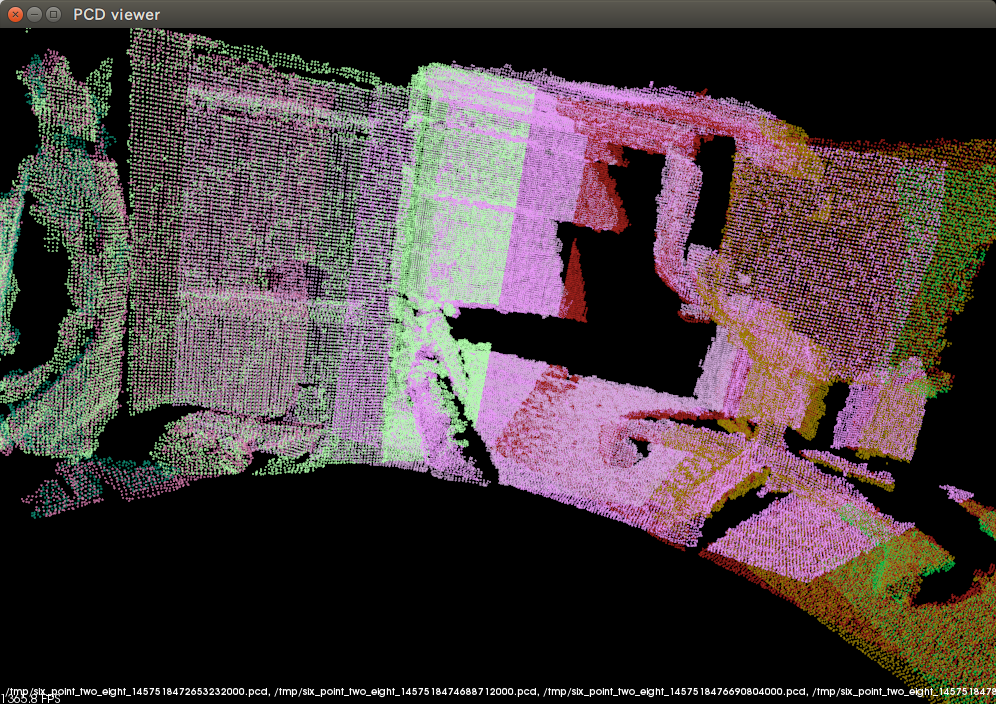

# ロボットの周囲360°の3D点群を作成する

単純な動きだけじゃツマラナイ！　センサーを使いたい！　了解しました。TurtleBotには深度センサーが付いているので、それを活用して外界データを作成してみましょう。プログラムから、以下の画像のようなデータを作ります。以下の画像のデータはオフィスの私の席の近くの3D点群で、左上で腕をブラブラさせてだらけまくっているのが私になります。もちろん、ただの画像ではなくて、グリグリ動きます。


## PointCloud2

TurtleBotには、Microsft社のKinectかASUS社のXtion PRO LIVEがついています。これらは深度センサーと呼ばれるデバイスで、外界の3D点群を作成してくれます（Kinectというと骨格のイメージがありますけど、骨格はこの3D点群を解析して作成しています）。

### 深度センサーを扱うプログラム開発時の、TurtleBotとの接続方法

[TurtleBot Installation](http://wiki.ros.org/turtlebot/Tutorials/indigo/Turtlebot%20Installation)では、PCを2台用意して、1台をTurtleBotの上に、残り1台を手元に置くようになっています。でも、深度センサーのデータは大きいので、この方式だとフレームレートが低く（私の環境は数秒に1コマ！）なってしまうんですよ。本番環境では深度センサーのデータ処理はTurtleBotの上のPCで実行するので問題ないでしょうけど、開発するには問題です。

なので、今回は手元のPCにTurtleBotをつなぐことにしましょう。長めのUSB延長ケーブルを用意して、手元のPCにTurtleBotをつなげてください。

### RViz

まずは、深度センサーのデータがどんなものか、試してみましょう。ROSにはRVizという可視化ツールがあって、それで深度センサーのデータを表示できるんです。ターミナルを3枚開いて、以下のコマンドを実行してください。

* ターミナル#1

```bash
$ roslaunch turtlebot_bringup minimal.launch
```

* ターミナル#2

```bash
$ roslaunch turtlebot_bringup 3dsensor.launch
```

* ターミナル#3

```bash
$ roslaunch turtlebot_rviz_launchers view_model.launch
```

これで、RVizの画面が表示されるはずです。画面が表示されたら左下の[Add]ボタンを押して、表示されたダイアログの[By display type]タブの[PointCloud2]アイコンを選択し、[OK]ボタンを押してください。RVizの画面左側の[Displays]パネルに[PointCloud2]アイコンが追加されるはずです。なお、ここまでGUI上で実施した作業は、プログラミングでのメッセージの型の指定に相当します。


ROSではメッセージとトピックの両方が必要なのは前の章でやりましたから、メッセージに続いてトピックも設定しましょう。[PointCloud2]アイコンの下の[Topic]ドロップ・ダウン・リストを開いて、「/camera/depth_registered/points」（シミュレーターの場合は「/camera/depth/points」）を選択してください。これで、深度センサーのデータが画面に表示されるはずです。マウスの左ボタンのドラッグで回転、シフト・キーを押しながらの左ドラッグで平行移動、右ドラッグで拡大/縮小できますから、グリグリ回して楽しんでみてください。


グリグリ回している途中のキャプチャなので分かりづらいですけれど、3Dのデータができています。


なお、実機の場合でトピックを「/camera/depth/points」に変更すると、カメラからの画像を合成していない（色が着いていない）点群が表示されます。このように、トピックやメッセージの内容を調べるためにもRVizは使えますので、いろいろと活用してみてください。

### PointCloud2

さて、先ほどRVizのメッセージ型として選択したのは、`PointCloud2`でした。ポイント・クラウドの日本語訳は点群で、点の集合です（数学の点群と字は同じだけど意味は違う）。RVizの[PointCloud2]アイコン以下の[Style]を「Points」、[Size (Pixels)]を「1」にして点群部分を拡大してみると、点の集合であることが分かるでしょう。なお、`PointCloud2`の「2」は、2次元じゃなくてバージョン2の「2」です。以前の`PointCloud`メッセージは拡張性が不足していたみたいで、新しく`PointCloud2`が定義されました。

[Wikipediaによれば](https://ja.wikipedia.org/wiki/%E7%82%B9%E7%BE%A4_(%E3%83%87%E3%83%BC%E3%82%BF%E5%BD%A2%E5%BC%8F))、点群から面を計算してポリゴンにしたり、NURB（Non-uniform rational B-spline）で曲面を出したりすることもできるようです。うん、点群ってなんだか便利そう。ただ表示するだけでも、ちょっと面白いですしね。そうだ、TurtleBotにその場でグルッと回転させて、周囲360°の点群を取得して表示してグリグリしたら楽しいんじゃね？

## Subscriber

というわけで、TurtleBotの周囲360°の点群を生成するROSプログラムを作りましょう。そのために、まずは深度センサーからデータをもらわないと。

### いつものpackage.xmlとCMakeLists.txt

`PointCloud2`メッセージを扱うので、いつものとおりに参照するパッケージを追加しなければなりません。でも、`PointCloud2`のパッケージって、どうやって調べればよいのでしょうか？　答え。`rosmsg show PointCloud2`で調べられます。

```bash
ryo@ryo-T550:~$ rosmsg show PointCloud2
[sensor_msgs/PointCloud2]:
std_msgs/Header header
  uint32 seq
  time stamp
  string frame_id
uint32 height
uint32 width
sensor_msgs/PointField[] fields
  uint8 INT8=1
  uint8 UINT8=2
  uint8 INT16=3
  uint8 UINT16=4
  uint8 INT32=5
  uint8 UINT32=6
  uint8 FLOAT32=7
  uint8 FLOAT64=8
  string name
  uint32 offset
  uint8 datatype
  uint32 count
bool is_bigendian
uint32 point_step
uint32 row_step
uint8[] data
bool is_dense
```

というわけで、`sensor_msgs`を追加しましょう。

#### package.xml

```xml
<?xml version="1.0"?>
<package>
  <!-- 略 -->
  
  <buildtool_depend>catkin</buildtool_depend>
  
  <build_depend>geometry_msgs</build_depend>
  <build_depend>nodelet</build_depend>
  <build_depend>roscpp</build_depend>
  <build_depend>sensor_msgs</build_depend>  <!-- 追加 -->
  
  <run_depend>geometry_msgs</run_depend>
  <run_depend>roscpp</run_depend>
  <run_depend>nodelet</run_depend>
  <run_depend>sensor_msgs</run_depend>      <!-- 追加 -->

  <!-- 略 -->
</package>
```

#### CMakeLists.txt

```bash
cmake_minimum_required(VERSION 2.8.3)
project(six_point_two_eight)

find_package(catkin REQUIRED COMPONENTS
  geometry_msgs
  nodelet
  roscpp
  sensor_msgs  <!-- 追加 -->
)

# 略
```

### roslaunchで、トピックをリマップ。あと、includeも

先ほどRVizで点群を見た時、TurtleBotの実機とシミュレーターで、設定するトピックが異なっていました。実機は`/camera/depth_registered/points`で、シミュレーターでは`/camera/depth/points`でしたもんね。ということは、トピックだけが異なっていて他は同じプログラムを2つ作らなければならない？

そんな保守性ダダ下がりの馬鹿な話はないわけで、`roslaunch`に少し記述を追加するだけでトピックをリマップできます。

#### 実機用

```xml
<launch>
  <node pkg="nodelet" type="nodelet" name="six_point_two_eight_nodelet_manager" args="manager" output="screen"/>
  <node pkg="nodelet" type="nodelet" name="make_world_models" args="load six_point_two_eight/make_world_models six_point_two_eight_nodelet_manager" output="screen">
    <remap from="points" to="camera/depth_registered/points"/>  <!-- 追加 -->
  </node>
</launch>
```

#### シミュレーター用

```xml
<launch>
  <node pkg="nodelet" type="nodelet" name="six_point_two_eight_nodelet_manager" args="manager" output="screen"/>
  <node pkg="nodelet" type="nodelet" name="make_world_models" args="load six_point_two_eight/make_world_models six_point_two_eight_nodelet_manager" output="screen">
    <remap from="points" to="camera/depth/points"/>  <!-- 変更 -->
  </node>
</launch>
```

あれ？　トピックだけが異なっていて他は同じ`launch`ファイルを2つ作るのは、保守性ダダ下がりでやっぱり馬鹿らしいので状況は悪いまま？　というわけで、[`roslaunch`のドキュメント](http://wiki.ros.org/roslaunch)にのっている、`<arg>`と`<include>`を使ってみます。ついでに、`mobile_base/commands/velocity`も`<remap>`しちゃいましょう。

#### 実機用（launch/make\_world\_models.launch）

```xml
<launch>
  <arg name="velocity" default="mobile_base/commands/velocity"/>  <!-- argを宣言 -->
  <arg name="points" default="camera/depth_registered/points"/>   <!-- argを宣言 -->
  
  <node pkg="nodelet" type="nodelet" name="six_point_two_eight_nodelet_manager" args="manager" output="screen"/>
  <node pkg="nodelet" type="nodelet" name="make_world_models" args="load six_point_two_eight/make_world_models six_point_two_eight_nodelet_manager" output="screen">
    <remap from="velocity" to="$(arg velocity)"/>  <!-- argを使用 -->
    <remap from="points" to="$(arg points)"/>      <!-- argを使用 -->
  </node>
</launch>
```

#### シミュレーター用（launch/make\_world\_models\_in\_gazebo.launch）

```xml
<launch>
  <include file="$(find six_point_two_eight)/launch/make_world_models.launch">
    <arg name="points" value="camera/depth/points"/>  <!-- argの値を上書きします。 -->
  </include>
</launch>
```

はい、これで重複がなくなりました。`<include>`と`<arg>`って便利ですね。ついでですから、`turtlebot_bringup minimal.launch`と`turtlebot_bringup 3dsensor.launch`を2回実行するのは面倒なので、`<include>`を使用してこの2つをまとめる`launch`ファイルも作成しましょう。

#### TurtleBot起動用（launch/turtlebot\_driver.launch）

```xml
<launch>
  <include file="$(find turtlebot_bringup)/launch/minimal.launch" />
  <include file="$(find turtlebot_bringup)/launch/3dsensor.launch" />
</launch>
```

### make_world_models.h

以上で準備は完了。プログラミングに入りましょう。

```cpp
#pragma once

#include <nodelet/nodelet.h>
#include <ros/ros.h>

#include <geometry_msgs/Twist.h>
#include <sensor_msgs/PointCloud2.h>  // 追加。

namespace six_point_two_eight {
  inline auto createTwistMsg(double linear_x, double angular_z) {
    geometry_msgs::Twist msg;
    msg.linear.x = linear_x;
    msg.angular.z = angular_z;
    
    return msg;
  }
  
  class MakeWorldModels : public nodelet::Nodelet {
  private:
    ros::Publisher velocity_publisher_;
    ros::Subscriber points_subscriber_;  // サブスクライバーを保持するメンバー変数。
    ros::Timer timer_1_;
    ros::Timer timer_2_;

  public:
    void onInit() {
      velocity_publisher_ = getNodeHandle().advertise<geometry_msgs::Twist>("velocity", 1);  // remapに合わせて、トピックを変更。

      // PointCloud2を取得するサブスクライバーを設定します。
      points_subscriber_ = getNodeHandle().subscribe<sensor_msgs::PointCloud2>(
        "points", 10,  // トピックはremapのfromの値。
        [&](sensor_msgs::PointCloud2ConstPtr message) {  // ラムダ式の展開のされかた次第では（具体的には、中で外側の変数や関数を呼ばない場合は）、const auto&は使えませんでした。
          ROS_INFO_STREAM("Got PointCloud2. Width: " << message->width);  // とりあえず、データを取得したことを表示。
        });

      timer_1_ = getNodeHandle().createTimer(
        ros::Duration(0.1),
        [&](const auto& message) {
          velocity_publisher_.publish(createTwistMsg(0.0, M_PI * 2 / 30));  // 前進ではなく、回転に変更。1周（M_PI * 2）を30秒で回る速度を指示します。
        });
      
      timer_2_ = getNodeHandle().createTimer(
        ros::Duration(45.0),  // 計算上は30秒でよいはずなのですけど、30秒では一周してくれませんでしたので、多めの値で。
        [&](const auto& message) {
          points_subscriber_.shutdown();  // ros::Subscriberの終了は、stop()ではなくてshutdown()です。
          timer_1_.stop();
          timer_2_.stop();
        });
    }
  };
}
```

subscribeは、`ros::Subscriber`を使用して実施します。`getNodehandle()`して`ros::NodeHandle`を取得して、そのメンバー関数の`subscribe<メッセージの方>(トピック名、キューのサイズ、メッセージ取得時の処理)`を呼び出してください。引数のトピック名は`make_world_models.launch`の`<remap>`の`from`属性に合わせ、キューのサイズは処理中に次のデータがやってきても取りこぼさないよう、多めに10を指定してみました。

処理は、例によってラムダ式で指定します。C++のラムダ式はその内容によって展開のされ方が違う、かつ、しかもROS側で受け取る引数の型の`boost::function`は癖が強いみたいで、ラムダ式の引数の型を`const auto&`にできる場合とできない場合がありました。どうやら、ラムダ式の中でキャプチャした変数や関数を呼び出しているのでファンクター相当品が生成される場合は`const auto&`OKで、今回のコードのようにただの無名の関数で表現できる場合は駄目みたいです。というわけで、今回はメッセージを受け取る処理の引数の型を明示しました。この型は、コンスタントでスマート・ポインターな型のエイリアスで、メッセージの型の後ろに`ConstPtr`という文字列を付加した型になります（`ros::NodeHandle.subscribe()`のコードを見ると`const sensor_msgs::PointCloud2&`を引数に使うバージョンもあるのですけれど、ラムダ式の場合は使えませんでした）。処理の内容は、`rosmsg show sensor_msgs/PointCloud2`で見ても何を表現しているのか分からないデータばかりだったので、とりあえず、`width`を表示するだけにしています。

これでセンサーのデータを読み込めるようになったわけですけど、それにしても、センサーのデータを「読み込む」処理なのに、データを渡された時に実行する処理を渡す形になっているのは、なぜなのでしょうか？　私は、「読み取りなんだから戻り値でいーじゃん」と感じました。

その答えは多分、ROSは様々な周波数で動作する大きめのユニットを統合するための環境だから。「様々な周波数」なのだから、前の章の最初の頃の`Timer`を使う前のプログラムのような、ループを組んで「一定の周波数」で動作する中でセンサーのデータを読み取る方式は採用できません。センサーやユニットがデータを送りたいタイミングでデータを取得できないとね。だから、処理を登録する形になっているんだと思います。ROS.orgに載っているプログラムはサンプル・プログラムなので単純な場合が多く、単純な処理なのでループで実現していてArduinoのコードと見た目そっくりでだったらArduinoみたいに読み取りでいいじゃんと混乱してしまうのですけれど、実際のアプリケーションを作成すれば、この方式が優れていることが分かると考えます。まぁ、使いづらくて腹がたつ場合も多いんですけど、後述する`actionlib`とかラムダ式とスマート・ポインターの組み合わせとかで対処できるのでまぁいいかなぁと。

### nodelet_topic_tools::NodeletThrottle

とはいえ、データを受け取って処理する側の都合も重要です。publish側の深度センサーが全力で送ってくるデータをすべて処理するのは、かなり大変ですもんね。私が使っているASUS Xtion PRO LIVEの読み取りは30fpsなんで、30秒かけてTurtleBotを一周させる先ほどのプログラムだと、点群の数が900個になっちゃう。なんとかして、深度センサーの周波数を下げたい。

そんな時は、`nodelet_topic_tools`パッケージの`NodeletThrottle`が便利です。メッセージの流量制御を、パフォーマンスを落とさずにとても簡単に実現できます。さっそく使ってみましょう。

#### package.xmlとCMakeLists.txt

依存するパッケージに、`nodelet_topic_tools`を追加してあげてください。これまで何度も見て飽きているでしょうから、コードは省略します。

#### include/six\_point\_two\_eight/point\_cloud\_2\_throttle.h

`nodelet_topic_tools::NodeletThrottle`クラスを継承して、`throttle()`メンバー関数を実装する……などという手間はかかりません。取り扱うメッセージの型を指定するために、`using`でテンプレート引数を補うだけでOK。C++14（正しくはC++11以降）では`typedef`と`using`の両方があって、`using`の方が高機能です。`nodelet_topic_tools`のドキュメントでは`typedef`を使っていますけど、そして、今回の使い方ではどっちを使っても変わらないのですけれど、コードを統一するために`using`にしましょう。

```cpp
#pragma once

#include <nodelet_topic_tools/nodelet_throttle.h>
#include <sensor_msgs/PointCloud2.h>

namespace six_point_two_eight {
  using PointCloud2Throttle = nodelet_topic_tools::NodeletThrottle<sensor_msgs::PointCloud2>;
}
```

#### src/six\_point\_two\_eight.cpp

`Nodelet`の場合と同様に、エクスポートします。

```cpp
#include <pluginlib/class_list_macros.h>

#include "six_point_two_eight/make_world_models.h"
#include "six_point_two_eight/point_cloud_2_throttle.h"  // 追加。

PLUGINLIB_EXPORT_CLASS(six_point_two_eight::MakeWorldModels, nodelet::Nodelet)
PLUGINLIB_EXPORT_CLASS(six_point_two_eight::PointCloud2Throttle, nodelet::Nodelet)  // 追加。
```

#### six\_point\_two\_eight.xml

やはり`Nodelet`と同様に、ROSに名前を登録します。

```xml
<library path="lib/libsix_point_two_eight">
  <class name="six_point_two_eight/make_world_models" type="six_point_two_eight::MakeWorldModels" base_class_type="nodelet::Nodelet"/>
  <!-- ここから追加。 -->
  <class
    name="six_point_two_eight/point_cloud_2_throttle"
    type="six_point_two_eight::PointCloud2Throttle"
    base_class_type="nodelet::Nodelet"/>
  <!-- ここまで。 --->
</library>
```

#### launch/make\_world\_models.launch

起動も`Nodelet`と一緒。`topic_in`から取得したメッセージを、`<param name="update_rate">`を通じてHzで設定した周波数で`topic_out`に流します。

```xml
<launch>
  <arg name="velocity" default="mobile_base/commands/velocity"/>
  <arg name="points" default="camera/depth_registered/points"/>
  
  <node pkg="nodelet" type="nodelet" name="six_point_two_eight_nodelet_manager" args="manager" output="screen"/>
  <node pkg="nodelet" type="nodelet" name="make_world_models" args="load six_point_two_eight/make_world_models six_point_two_eight_nodelet_manager" output="screen">
    <remap from="velocity" to="$(arg velocity)"/>
    <remap from="points" to="$(arg points)_throttled"/>  <!-- 修正。 -->
  </node>
  <!-- ここから追加。 -->
  <node
    pkg="nodelet"
    type="nodelet"
    name="point_cloud_2_throttle"
    args="load six_point_two_eight/point_cloud_2_throttle six_point_two_eight_nodelet_manager"
    output="screen">
    <remap from="topic_in" to="$(arg points)"/>
    <remap from="topic_out" to="$(arg points)_throttled"/>
    <param name="update_rate" value="0.5"/>  <!-- 0.5Hzは1秒に0.5回なので、2秒に1回になります。 -->
  </node>
  <!-- ここまで。 -->
</launch>
```

はい、これで深度センサーからのデータ量を減らすことができました。

## PCLを使用して、点群を保存する

とまぁ、いろいろやって`PointCloud2`を取得できたわけですけれど、取得できただけではなんの意味もありません。でも、`rosmsg sensor_msgs/PointCloud2`で仕様を見ても、どう使えばよいのかよくわからないし……。

というわけで、`PCL`と省略して呼ばれる`Point Cloud Library`を使ってみましょう。

### PCLでできること

[PCLのドキュメント](http://pointclouds.org/documentation/)を開くと、PCLの説明でよく使われる下の絵が表示されます。


`filters`モジュールでフィルタ処理して特徴を保ったままで点の数を減らし、`features`モジュールで特徴量を推定して座標位置以外のモノサシを用意して、`keypoints`モジュールで特徴点を抽出して点群処理の際に注目すべき点を箇所を特定する。`registration`モジュールで複数の点群を統合して大きな点群を作成し、`kdtree`モジュールや`octree`モジュールで点を構造化する。`segmentation`モジュールと`sample_concensus`モジュールで点群を形状に基づいて分割し、`surface`モジュールで面を構築して3次元コンピューター・グラフィックスのライブラリに流す。`recognition`モジュールで物体認識して処理対象を見つけて`io`モジュールで保存したり、`visualization`モジュールでスクリーンに表示する……と（点群処理の素人が書いています。間違いがあったらごめんなさい）、とにかく多機能です。

### PCLを使う場合の、コードの書き方

プログラマーとしてPCLについて知って置かなければならない最も重要なことは、「C++のライブラリであること」と「バージョン1.7.2ではC++14（C++11も）に対応していないこと」です。

ROSからPCLを扱うための便利機能が詰まった`pcl_ros`パッケージを使ったとしても、ROSの通信機能経由でPCLの機能を使えるわけではありません。ROSそのものはC++とPythonとCommon Lispとその他多数の言語で使えるのですけれど、PCLを使うプロジェクトではC++一択になります（PCLのPythonのバインディングもありますけれど、カバー範囲が狭い）。

C++14に対応していないというのはC++14の機能を使用して書かれていないという意味ではなく、PCLを使うコードをC++14モードでコンパイルすると、コンパイルはできるけど実行時に異常終了しちゃうということです（異常終了するかどうかは、使う機能次第ですけど。普通に使える機能もありました。PCL1.8でC++11でも大丈夫になるみたいなことは書いてあったのですけど、未確認です）。

なので、PCLを使用する部分は通常のコードとは分離して、しかもC++03で書かなければなりません。以下に、その具体的な方法を示します。とりあえずの処理として、PCLを使用して点群を保存してみました。

#### package.xmlとCMakeLists.txt

`package.xml`と`CMakeLists.txt`に、`pcl_ros`パッケージを追加してください。

#### include/six\_point\_two\_eight/point\_cloud\_utilities.h

コードの分離を確実にするために、C++14とPCLを完全に排除した\*.hを作ります。ここには関数宣言だけを記述しました。

```cpp
#ifndef SIX_POINT_TWO_EIGHT_POINT_CLOUD_UTILITIES_H
#define SIX_POINT_TWO_EIGHT_POINT_CLOUD_UTILITIES_H

#include <sensor_msgs/PointCloud2.h>

namespace six_point_two_eight {
  sensor_msgs::PointCloud2Ptr savePointCloud2File(sensor_msgs::PointCloud2ConstPtr points);
}

#endif
```

#### src/point\_cloud\_utiliites.cpp

PCLの`io`モジュールを使えば点群の保存なんて簡単……ではありますけど、悲しいことにそれなりの量のコードを書かなければなりません。PCLって機能はスゴイんですけど、プログラミング・スタイルが少し独特なんですよ。入力も出力も引数でやる方式なので、関数呼び出しのためだけに変数を定義したりreturnを別に書いたりしなければなりません。引数をスマート・ポインターで渡す時と参照で渡すときがあって、混乱しちゃいますし。

```cpp
#include <pcl/io/pcd_io.h>
#include <pcl/point_cloud.h>
#include <pcl/point_types.h>
#include <pcl_conversions/pcl_conversions.h>

#include "six_point_two_eight/point_cloud_utilities.h"

// 点群の型の整理。
typedef pcl::PointXYZRGB Point;  // 本稿では、色付きの点を使用します。あと、C++03なので、usingではなくtypedefを使用します。
typedef pcl::PointCloud<Point> PointCloud;

// 引数で指定した点群のファイル・パスを取得します。パスは、/tmp/six_point_two_eight_<点群の時刻>.pcdになります。
std::string filePathString(PointCloud::ConstPtr point_cloud) {
  std::stringstream file_path_stringstream;
  file_path_stringstream << "/tmp/six_point_two_eight_" << std::setfill('0') << std::setw(19) << pcl_conversions::fromPCL(point_cloud->header).stamp.toNSec() << ".pcd";

  return file_path_stringstream.str();
}

// 点群を保存します。
PointCloud::Ptr savePointCloudFile(PointCloud::ConstPtr point_cloud) {
  std::string file_path_string = filePathString(point_cloud);  // C++03なので、autoは使えません。

  pcl::io::savePCDFileBinary(file_path_string, *point_cloud);
  ROS_INFO_STREAM("PointCloud is saved to " << file_path_string);

  //  続けて別の関数を呼び出せるように、点群を返します。
  return PointCloud::Ptr(new PointCloud(*point_cloud));  // boost::shared_ptr<const X>からboost::shared_ptr<X>には変換できないので、新たにインスタンスを生成します。
}

// ROSの点群を、PCLの点群に変換します。
PointCloud::Ptr fromROSMsg(sensor_msgs::PointCloud2ConstPtr points) {
  PointCloud::Ptr converted_point_cloud(new PointCloud());
  pcl::fromROSMsg(*points, *converted_point_cloud);
    
  return converted_point_cloud;
}

// PCLの点群を、ROSの点群に変換します。
sensor_msgs::PointCloud2Ptr toROSMsg(PointCloud::ConstPtr point_cloud) {
  sensor_msgs::PointCloud2Ptr converted_points(new sensor_msgs::PointCloud2());
  pcl::toROSMsg(*point_cloud, *converted_points);
  
  return converted_points;
}

// 機能へのインターフェースを提供します。
sensor_msgs::PointCloud2Ptr six_point_two_eight::savePointCloud2File(sensor_msgs::PointCloud2ConstPtr points) {
  return toROSMsg(savePointCloudFile(fromROSMsg(points)));
}
```

#### include/six\_point\_two\_eight/make\_world\_models.h

ロボット制御側の（C++14の）コードは以下の通り。`point_cloud_utilities`にPCLを隠蔽させましたから、こちらは簡単です。

```cpp
#pragma once

#include <nodelet/nodelet.h>
#include <ros/ros.h>

#include <geometry_msgs/Twist.h>
#include <sensor_msgs/PointCloud2.h>

#include "six_point_two_eight/point_cloud_utilities.h"  // 追加。

namespace six_point_two_eight {
  inline auto createTwistMsg(double linear_x, double angular_z) {
    geometry_msgs::Twist msg;
    msg.linear.x = linear_x;
    msg.angular.z = angular_z;
    
    return msg;
  }
  
  class MakeWorldModels : public nodelet::Nodelet {
  private:
    ros::Publisher velocity_publisher_;
    ros::Subscriber points_subscriber_;
    ros::Timer timer_1_;
    ros::Timer timer_2_;

  public:
    void onInit() {
      velocity_publisher_ = getNodeHandle().advertise<geometry_msgs::Twist>("velocity", 1);

      points_subscriber_ = getNodeHandle().subscribe<sensor_msgs::PointCloud2>(
        "points", 10,
        [&](sensor_msgs::PointCloud2ConstPtr message) {
          savePointCloud2File(message);  // 点群を保存します。
        });

      timer_1_ = getNodeHandle().createTimer(
        ros::Duration(0.1),
        [&](const auto& message) {
          velocity_publisher_.publish(createTwistMsg(0.0, M_PI * 2 / 30));
        });
      
      timer_2_ = getNodeHandle().createTimer(
        ros::Duration(45.0),
        [&](const auto& message) {
          points_subscriber_.shutdown();
          timer_1_.stop();
          timer_2_.stop();
        });
    }
  };
}
```

#### CMakeLists.txt

ビルドを制御するために、CMakeLists.txtも変更しなければなりません。今回のように特定のファイルにだけコンパイル・オプションを設定したい場合は、`set_cource_files_properties()`が使えます。以下のように、PCLに対応するために「-std=c++03 -Wno-deprecated」を設定してください。`-std=c++03`に加えて`-Wno-deprecated`を指定しているのは、PCLの`visualization`モジュールが使用しているパッケージが推奨されていない古い機能を使っているためです。ビルドのたびに警告が表示されて、しかも我々のコード以外が原因で対応不可能では、ストレスがたまるだけですもんね。

```bash
cmake_minimum_required(VERSION 2.8.3)
project(six_point_two_eight)

find_package(catkin REQUIRED COMPONENTS
  geometry_msgs
  nodelet
  nodelet_topic_tools
  pcl_ros
  roscpp
  sensor_msgs
)

# 略

catkin_package(
#  CATKIN_DEPENDS
)

add_compile_options(
  "-std=c++14"
)

# PCL1.7.2はC++14に対応していません。あと、visualizationがdeprecatedな機能を使用しています。コンパイル・オプションを指定して対応します。
set_source_files_properties(src/point_cloud_utilities.cpp  # 追加
  PROPERTIES COMPILE_FLAGS "-std=c++03 -Wno-deprecated"    # 追加
)                                                          # 追加

# 略
```

#### 実行……してみたら、まだまだ機能が足りない

保存した点群は、`pcl_viewer`というコマンドで見ることができます。プログラムを実行し、`Ctrl-c`で止め、`pcl_viewer`で見てみましょう。

* ターミナル#1

```bash
$ roslaunch six_point_two_eight turtlebot_driver.launch
```

* ターミナル#2

```bash
$ catkin_make && rm -f /tmp/six_point_two_eight_*.pcd && roslaunch six_point_two_eight make_world_models.launch
# 処理が完了したら、Ctrl-cでプログラムを止める。

$ pcl_viewer /tmp/six_point_two_eight_*.pcd
# 対象が画面に映るよう、rキーを押してカメラ・アングルをリセットする。
# 使い方は、hキーを押すとターミナルに表示される。
# マウスでグリグリしてみる。
# 飽きたら、qキーを押して終了させる。
```

ターミナル#2の1行目。コマンドを`&&`でつなぐと、「前のコマンドが成功したら後ろのコマンドを実行する」という指示になります。ビルドして、前の実行で生成された点群のファイルを消して、`make_world_models`を実行する（ただし、途中で失敗したら処理を止めろ）の意味になるわけ。この形で起動することで、ビルド忘れや過去の実行結果の混入を避けています。

で、その肝心の`pcl_viewer`で見た実行結果は、なんだか意味不明です。


どうしてこうなってしまったかというと、深度センサーからの相対座標の点群を、同じ座標系に重ねちゃったから。以下のように1枚だけを表示するなら、普通に点群を見られます。

```bash
$ pcl_viewer `ls -s /tmp/six_point_two_eight_*.pcd | head -n 1`
```

というわけで、TurtleBotの姿勢に合わせて、適切に点群を移動/回転させてあげなければならないことが分かりました。

## オドメトリー

少し話は変わりますけど、車やバイクにはオドメーターというのがあって、累計走行距離が分かるようになっています。あと、スピード・メーターには速度が表示されていますけど、速度は移動距離÷時間で、やっぱり距離が関係しています。この距離は、どうやって測っているのでしょうか？

車やバイクによっていくつかバリエーションはあるのですけれど、トランスミッション等の回転速度からタイヤの回転数を推測し、カタログ上のタイヤの外周のサイズをかけて移動距離を計算しています。同じことはロボットでも可能です。モーター等のセンサーから、タイヤが何回転したかは推測できます。タイヤのサイズも設計書から分かる。だから、どれだけ移動したかが計算できるはず。TurtleBotのように左右にタイヤが付いている移動方式なら、左右のタイヤの回転数の差から、現在どちらを向いているのかも計算できるはず。

このように、モーター等のセンサーを使用して推定した位置情報を、オドメトリーと呼びます（車のオドメーターとは違って、位置と向きが分かる）。TurtleBotの場合は、`/odom`トピックでオドメトリーを取得できます。

さっそく、試してみましょう。

* ターミナル#1

```bash
$ roslaunch six_point_two_eight turtlebot_driver.launch
```

* ターミナル#2

```bash
$ roslaunch turtlebot_teleop keyboard_teleop.launch
```

* ターミナル#3

```bash
$ rostopic echo /odom
header: 
  seq: 4443
  stamp: 
    secs: 1457333175
    nsecs: 603418136
  frame_id: odom
child_frame_id: base_footprint
pose: 
  pose: 
    position: 
      x: 0.20837154614
      y: -0.108868545114
      z: 0.0
    orientation: 
      x: 0.0
      y: 0.0
      z: -0.305446027598
      w: 0.952209390956
  covariance: [0.1, 0.0, 0.0, 0.0, 0.0, 0.0, 0.0, 0.1, 0.0, 0.0, 0.0, 0.0, 0.0, 0.0, 1.7976931348623157e+308, 0.0, 0.0, 0.0, 0.0, 0.0, 0.0, 1.7976931348623157e+308, 0.0, 0.0, 0.0,
 0.0, 0.0, 0.0, 1.7976931348623157e+308, 0.0, 0.0, 0.0, 0.0, 0.0, 0.0, 0.05]
twist: 
  twist: 
    linear: 
      x: 0.0
      y: 0.0
      z: 0.0
    angular: 
      x: 0.0
      y: 0.0
      z: 0.0
  covariance: [0.0, 0.0, 0.0, 0.0, 0.0, 0.0, 0.0, 0.0, 0.0, 0.0, 0.0, 0.0, 0.0, 0.0, 0.0, 0.0, 0.0, 0.0, 0.0, 0.0, 0.0, 0.0, 0.0, 0.0, 0.0, 0.0, 0.0, 0.0, 0.0, 0.0, 0.0, 0.0, 0.0,
 0.0, 0.0, 0.0]
---
```

ターミナル#2で適当にキーを押してTurtleBotを移動させると、ターミナル#3の`pose.pose`の`position`と`orientation`の値が変わっていきます。ROSの座標系はX軸が前でY軸が左でZ軸が上、回転は上から（Z軸のプラス側からマイナス側を）見て反時計回りという知識を活用すると、`/odom`は起動時の状態からの相対座標/回転となっていることが分かります。

## PCLを使用して、座標変換してフィルタリングしてダウンサンプリングする

でも、よっしゃー`/odom`トピックからオドメトリーを取得して点群を移動/回転させてやるぜーってのは、ごめんなさい、あまりうまくいきません。以下、その理由と対策をやって、ついでなので点群のダウンサンプリングとフィルタリングをやります。

### TF

ROSのメッセージは大抵`header`を含んでいて、`header`の`stamp`はそのメッセージが採取された時刻です。この値が異なっている場合の処理、たとえば5秒前に採取した点群を3秒前のオドメトリーで変換するような処理は、無意味です。だって、その間に移動したかもしれないんですから。

でも、もし7秒前のオドメトリーも知っているならどうでしょうか？　等速度運動をしていると仮定すれば、5秒前の位置は、7秒前の位置と3秒前の位置の中間だと推定することができます。ただし、そのためには過去の状態を複数保持し、間を補完する計算処理が必要です。メモリを食いつぶすわけにはいきませんから、ある程度古くなったメッセージを捨てる処理も必要でしょう。でも、これを`/odom`トピックのサブスクライバーで作るのは大変そうです。深度センサーがロボット・アームの先に付いているような場合は、さらに面倒になります。肩のサーボ・モーターがこの角度で肘のサーボ・モーターがあの角度だから、深度センサーはこの位置でこんな向きのはずだという計算も、とてもとても面倒くさそうです。

だから、ROSのパッケージのTFを使いましょう。TFは、上に挙げた面倒な計算処理をすべて実施してくれます。

TFの解説と使い方は、[TF,TF2　完全理解](http://www.slideshare.net/kojiterada5/tftf2)にわかりやすくまとまっていて、すべての日本人ROSプログラマーはこのスライドは絶対に見ておくべきなんですけれど、本稿の範囲だと`pcl_ros`パッケージのPCLとTFを取り持ってくれる機能の範囲で大丈夫かも。この機能を使って、さくっとプログラミングしちゃいましょう。

#### package.xmlとCMakeLists.txt

TFを使用するために、package.xmlとCMakeLists.txtに、`tf`パッケージと`tf_conversions`パッケージを追加してください。

#### include/six\_point\_two\_eight/point\_cloud\_utilities.h

ごめんなさい。関数宣言の段階でTFの知識が必要だった……。まずは、フレームの話をさせてください。というのも、座標変換前の点群を調べてみると、深度センサーの位置を原点にして、前がZ軸で右がX軸、下がY軸になっているんですよ。


これはROSの座標系とは反転が必要なレベル（いわゆる右手系と左手系のレベル）で異なっているわけで、オドメトリーがどうのこうのの前に、まずはROSの座標系に変換しなければなりません。幸いなことにこの変換は、[四元数](https://ja.wikipedia.org/xxx)と呼ばれる複素数を拡張した数体系を使えば、簡単に変換できるみたいです（x = -0.5、y = 0.5、z = -0.5、w = 0.5の四元数で変換できた）。で、次に問題になるのはTurtleBotの原点と深度センサーの原点が異なっていること。これは、ベクトルの引き算で変換できます。でも、こんな変換をいちいちプログラムしていくのは大変すぎます。なので、ロボットの構成要素と構成要素を、必要な座標系の変換でつなぐことにしましょう。`camera_rgb_optical_frame`→（変換）→`camera_rgb_frame`→（変換）→`base_link`みたいな感じ。この方式ならプログラム作成ではなくてデータ作成で済むので、とても楽になります。

ただ、`base_link`には深度センサー以外の構成要素もつながっていて、例えば`wheel_right_link`（右の車輪）なんてのもあります。そう考えると、構成要素の関係はリストではなくて木構造が適切かなぁと。で、さらに考えてみると、オドメトリーとロボット本体の関係も、この木構造で表現できます。変換が毎回同じか、移動によって変わっていくかの違いだけですもんね。というわけで、TFではこの構成要素をフレームと呼んで木構造にして、座標変換でつないでいきます。TureltBotのドライバーを動かした状態だと、`odom`フレーム（名前は一緒ですしどちらもオドメトリーを表現していますけど、`odom`トピックとは別物）が根で、`camera_rgb_optical_frame`フレームや`wheel_right_link`フレームを葉に持つ木構造が作られています。

TFで座標変換する際には、このフレームを使用します。どのフレームの座標系からどのフレームの座標系に変換するかを指定するわけ。指定するフレームは木のどこにあっても大丈夫です。木構造を辿ればよいわけですから。今回の場合、点群は`camera_rgb_optical_frame`の座標系であることが分かっている（というか、ROSでは`header.frame_id`にメッセージのフレームが設定されている）ので、変換先のフレームだけ指定すればよいことになります。なので、二番目の引数として`target_frame`を渡しています。

```cpp
// 略

namespace six_point_two_eight {
  sensor_msgs::PointCloud2Ptr savePointCloud2File(sensor_msgs::PointCloud2ConstPtr points);
  sensor_msgs::PointCloud2Ptr transformPointCloud2(  // 追加。
    sensor_msgs::PointCloud2ConstPtr points, const std::string& target_frame, double x_adjust = 0.0);  // 追加。
}

// 略
```

残りの引数の`x_adjust`は、プログラムを作成して試してみたら奥行きに少しずれがったから追加してみました。こんな引数があってはならないのですけれど、ここだけはご容赦ください。

#### src/point\_cloud\_utilities.cpp

なんだかとても長いコードになってしまいました……。その理由は、1つのグローバル変数と3つの処理が必要だったから。以下、それぞれについて述べます。

グローバル変数。`transform_listener_`のところ。TFが機能するには、流れてくる姿勢情報（親フレームからどのように座標変換したか）を蓄えておかなければなりません（そうしないと指定時刻の姿勢を推定できなくなってしまう）。その役割を担っているのが`tf::TransformListener`です。常に待機しておかなければならないわけで、だから一般にグローバル変数にします。気持ち悪いけど。

処理その1。奥行きの補正です。補正しないバージョンのプログラムでデータを調べてみたら、なんだか少しだけずれていたので追加しました。C++14なら`拡張for`が使えるのですけど、C++03なので`BOOST_FOREACH`を使用しました。

処理その2。TFは5秒前の姿勢情報と3秒前の姿勢情報から、4秒前の姿勢を推測できます。しかし、3秒前の姿勢情報の後の姿勢情報を受け取っていない場合は、2秒前の姿勢を推測できません。TF関連でよくある失敗として、「現在の姿勢を教えてくれ」と聞いて毎回もれなくエラーになるというのがあります。TFはデータの間を補間する機能しかなくて、未来のデータなんて存在しないのだからまぁ当たり前なんですけどね。本稿のコードでは、点群の時刻が新しすぎて、点群の時刻以降のロボットの姿勢情報をまだ受け取っていないのでエラーになる危険性があります。それでは困るので、点群の時刻よりもあとの姿勢情報を受信するまで待つように指示しています。これが`waitForTransform()`メンバー関数を呼び出しているところ。で、「待っても姿勢情報が来なかった」場合と、「姿勢情報を貯めこむ`TransformListener`に最初の姿勢情報が届く前の点群がとれちゃったので待ってもどうにもならない」場合は、エラーになります。だから、`if`文で戻り値をチェックしてエラー・ハンドリングしました。

処理その3。やっと本番の座標変換。ここでは普通は失敗しないのですけど、コードに統一性を持たせるためにエラー・ハンドリングしてみました。

```cpp
#include <boost/foreach.hpp>  // 追加。
#include <pcl/filters/filter.h>  // 追加。
#include <pcl/io/pcd_io.h>
#include <pcl/point_cloud.h>
#include <pcl/point_types.h>
#include <pcl_conversions/pcl_conversions.h>
#include <pcl_ros/transforms.h>  // 追加。
#include <tf/transform_listener.h>  // 追加。

#include "six_point_two_eight/point_cloud_utilities.h"

typedef pcl::PointXYZRGB Point;
typedef pcl::PointCloud<Point> PointCloud;

static tf::TransformListener transform_listener_;  // 追加。

// 略

// 点群をtarget_frameの座標系に変換します。その際に、x_adjustで指定された値で、奥行きも補正します。
PointCloud::Ptr transformPointCloud(
  PointCloud::ConstPtr point_cloud, const std::string& target_frame, double x_adjust) 
{
  // 奥行きがずれているようだったので、補正します。
  PointCloud::Ptr x_adjusted_point_cloud(new PointCloud(*point_cloud));
  BOOST_FOREACH(Point& point, *x_adjusted_point_cloud) {
    point.z += x_adjust;  // 深度センサーの生データは、実は座標系が異なります。右がX軸で下がY軸、前がZ軸なんです。
  }

  // TFは姿勢情報と姿勢情報の間しか補完できない（最新の姿勢情報よりも後の時刻で問い合わせるとエラーになる）ので、点群よりも後の姿勢情報が来るまで待ちます。
  std_msgs::Header header = pcl_conversions::fromPCL(point_cloud->header);
  if (!transform_listener_.waitForTransform(target_frame, header.frame_id, header.stamp, ros::Duration(1.0))) {
    ROS_WARN_STREAM("Can't wait...");
    throw std::exception();
  }
  
  // 内部でTFを使用して、座標変換します。
  PointCloud::Ptr transformed_point_cloud(new PointCloud());
  if (!pcl_ros::transformPointCloud(
    target_frame, *x_adjusted_point_cloud, *transformed_point_cloud, transform_listener_)) 
  {
    ROS_WARN("Transform failed...");
    throw std::exception();
  }

  // 座標変換した点群を返します。
  return transformed_point_cloud;
}

// 略

sensor_msgs::PointCloud2Ptr six_point_two_eight::transformPointCloud2(
  sensor_msgs::PointCloud2ConstPtr points, const std::string& target_frame, double x_adjust) 
{
  return toROSMsg(transformPointCloud(fromROSMsg(points), target_frame, x_adjust));
}
```

#### include/six\_point\_two\_eight/make\_world\_models.h

C++14のロボット制御側は、いつものとおりに簡単です。`point_cloud_utilities.cpp`のエラー・ハンドリングで例外を使用しましたので、`try/catch`を追加しました。

```cpp
// 略

namespace six_point_two_eight {
  // 略
  
  class MakeWorldModels : public nodelet::Nodelet {
    // 略
    
    void onInit() {
      velocity_publisher_ = getNodeHandle().advertise<geometry_msgs::Twist>("velocity", 1);

      points_subscriber_ = getNodeHandle().subscribe<sensor_msgs::PointCloud2>(
        "points", 10,
        [&](sensor_msgs::PointCloud2ConstPtr message) {
          try {                                 // 追加。
            savePointCloud2File(
              transformPointCloud2(             // 追加。
                message,
                "odom",                         // 追加。
                -0.05));                        // 追加。
            
          } catch (const std::exception& ex) {  // 追加。
            ROS_WARN_STREAM(ex.what());         // 追加。
          }                                     // 追加。
        });

      timer_1_ = getNodeHandle().createTimer(
        ros::Duration(0.1),
        [&](const auto& message) {
          velocity_publisher_.publish(createTwistMsg(0.0, M_PI * 2 / 30));
        });
      
      timer_2_ = getNodeHandle().createTimer(
        ros::Duration(45.0),
        [&](const auto& message) {
          points_subscriber_.shutdown();
          timer_1_.stop();
          timer_2_.stop();
        });
    }
  };
}
```

#### 試してみた

作成したプログラムを、動かしてみました。結果は以下の通り。正しく座標変換できているけど、まだダメそう。


だって、遠くにある点の精度が悪すぎますもんね。センサーの有効範囲外なので、遠くにある点の精度向上は望めません。近くの点だけをフィルタリングする処理が必要みたいです。

### フィルタリング

C++14なら、boostと組み合わせてラムダ式を引数に与えて1行で簡単にフィルタリングできる……のですけど、C++03で書いている今は駄目。PCLに点群の点をフィルタリングする機能がありますので、それで我慢しましょう。

[PCLのフィルタリングのチュートリアルの中の、Removing outliers using a Conditional or RadiusOutlier removal](http://pointclouds.org/documentation/tutorials/remove_outliers.php)を読むと、フィールドと定義済み演算子と比較対象の値を渡すという簡単なフィルターが使われています。このやり方だと直方体の切り抜きしかできなくて、直方体だとセンサーからの距離が一定にならないので駄目。他によいのがあるかもしれないとリファレンスを見ても、うん、見つかりませんね……。というわけで、`pcl::ConditionRemoval`クラスと独自作成の`pcl::Condition`クラスで実装しました。

#### include/six\_point\_two\_eight/point\_cloud\_utilities.h

センサーからの距離が一定の値以下の点を集めたいわけですから、球の中にある点だけを抽出すればよい。球を表現するには中心と半径が必要。というわけで、点群と中心と半径を引数に撮る`getShperePointCloud()`を宣言しました。

```cpp
// 略

#include <geometry_msgs/Point.h>  // 追加。
#include <sensor_msgs/PointCloud2.h>

namespace six_point_two_eight {
  sensor_msgs::PointCloud2Ptr getSpherePointCloud2(  // 追加。
    sensor_msgs::PointCloud2ConstPtr points, const geometry_msgs::Point& center, double radius);  // 追加。
  sensor_msgs::PointCloud2Ptr savePointCloud2File(sensor_msgs::PointCloud2ConstPtr points);
  sensor_msgs::PointCloud2Ptr transformPointCloud2(
    sensor_msgs::PointCloud2ConstPtr points, const std::string& target_frame, double z_adjust = 0.0);
}

// 略
```

#### src/point\_cloud\_utilities.h

フィルタリング条件は、`pcl::ConditionBase`を継承して作成するみたいです。ラムダ式なんて贅沢は言わないけど、せめてファンクターにして欲しかった……。`getSpherePointCloud()`関数は、作成したクラスを使うだけです。

```cpp
#include <boost/foreach.hpp>
#include <pcl/filters/conditional_removal.h>  // 追加。#include <pcl/filters/filter.h>は削除。
#include <pcl/io/pcd_io.h>
#include <pcl/point_cloud.h>
#include <pcl/point_types.h>
#include <pcl_conversions/pcl_conversions.h>
#include <pcl_ros/transforms.h>
#include <tf/transform_listener.h>

// 略

// 目的に合致するpcl::Conditionがなかったので、新規に作成しました。
template <typename PointT>
class SphereCondition : public pcl::ConditionBase<PointT> {
private:
  Eigen::Vector3f center_;
  double radius_;

public:
  SphereCondition(const Eigen::Vector3f& center, double radius)
    : center_(center), radius_(radius)
  {
    ;
  }

  virtual bool evaluate(const PointT& point) const {
    // 中心からの距離がradius_以下ならtrueを返す。
    return (point.getVector3fMap() - center_).norm() <= radius_;  // Eigenでは、ベクトル演算ができます。norm()は、原点からの距離を返します。
  }
};

// pcl::ConditionalRemovalを使用して、球の内側の点のみを抽出します。
PointCloud::Ptr getSpherePointCloud(PointCloud::ConstPtr point_cloud, const Eigen::Vector3f& center, double radius) {
  // コンディションを生成。
  SphereCondition<Point>::Ptr(new SphereCondition<Point>(center, radius));

  // pcl::ConditionRemovalを生成。
  pcl::ConditionalRemoval<Point> conditional_removal(condition);

  // 入力用の点群を設定。
  conditional_removal.setInputCloud(point_cloud);
  
  // 出力用の点群を設定。
  PointCloud::Ptr sphere_point_cloud(new PointCloud());
  conditional_removal.filter(*sphere_point_cloud);

  // 球の内側の点のみの点群をリターン。
  return sphere_point_cloud;
}

// 略

sensor_msgs::PointCloud2Ptr six_point_two_eight::getSpherePointCloud2(
  sensor_msgs::PointCloud2ConstPtr points, const geometry_msgs::Point& center, double radius) 
{
  return toROSMsg(getSpherePointCloud(fromROSMsg(points), Eigen::Vector3f(center.x, center.y, center.z), radius));
}
```

### サブスクライバーとラムダ式とスマート・ポインター

作成した`getSpherePointCloud2()`関数を呼びだすには点群とオドメトリーの両方のデータが必要なのですけど、その2つは異なるラムダ式の引数です。さて、どうしましょうか？

ROSのサンプル・プログラムでは、メンバー変数に格納することで対応しているようです。以下みたいな感じ。

```cpp
class Foo : public nodelet::Nodelet {
private:
  ros::Subscriber odom_subscriber_;
  ros::Subscriber points_subscriber_;

  // オドメトリーを共有するためのメンバー変数。
  nav_msgs::Odometry odom_;
  
  void odomCallback(nav_msgs::OdometryConstPtr message) {
    odom_ = *message;
  }
  
  void pointsCallback(sensor_msgs::PointCloud2ConstPtr message) {
    // messageとodom_を使う処理。
  }

public:
  void onInit() {
    odom_subscriber_   = getNodeHandle().subscribe("odom",   1, &Foo::odomCallback,   this);
    points_subscriber_ = getNodeHandle().subscribe("points", 1, &Foo::pointsCallback, this);
  }
};
```

でも、この方式って、状態遷移があると条件分岐が増えてしまうので、できれば避けたい。例えば、オドメトリーを使用して目標地点まで移動したあとに深度センサーのデータを取得する処理だと、以下のように`if文`だらけになってしまいます。

```cpp
class Foo : public nodelet::Nodelet {
private:
  ros::Subscriber odom_subscriber_;
  ros::Subscriber points_subscriber_;

  // オドメトリーを共有するためのメンバー変数。
  nav_msgs::Odometry odom_;
  
  // 移動先を示すメンバー変数。
  geometry_msgs::Pose goal_pose_;

  // 移動が完了したかどうかを示すメンバー変数。
  bool is_reached_goal_;
  
  void odomCallback(nav_msgs::OdometryConstPtr message) {
    if (!is_reached_goal_) {
      if (!isReached(message, goal_pose_)) {
        // goal_pose_に近づくように、ロボットを移動させる。
        
      } else {
        is_reached_goal_ = true;
        odom_ = *message;
      }
    }
  }
  
  void pointsCallback(sensor_msgs::PointCloud2ConstPtr message) {
    if (is_reached_goal_) {
      // messageとodom_を使う処理。
    }
  }

public:
  void onInit() {
    odom_subscriber_   = getNodeHandle().subscribe("odom",   1, &Foo::odomCallback,   this);
    points_subscriber_ = getNodeHandle().subscribe("points", 1, &Foo::pointsCallback, this);
    
    goal_pose_ = // 目標地点。
    is_reached_goal_ = false;
  }
};
```

この種の問題は、デザイン・パターンのStateパターンで解決できます。でも、Stateパターンって、クラスがいっぱい必要で書くのが面倒なんですよ……。だから、C++14な我々はラムダ式で解決しましょう。

```cpp
class Foo : public nodelet::Nodelet {
private:
  ros::Subscriber odom_subscriber_;
  ros::Subscriber points_subscriber_;

  void takePhoto(const nav_msgs::Odometry& odom) {
    points_subscriber_ = getNodeHandle().subscribe<sensor_msgs::PointCloud2>(
      "points", 1,
      [&, odom](sensor_msgs::PointCloud2ConstPtr message) {
        // messageとodomを使う処理。
      });
  }

  void moveTo(const geometry_msgs::Pose& goal_pose) {
    odom_subscriber_ = getNodeHandle().subscribe<nav_msgs::Odometry>(
      "odom", 1,
      [&, goal_pose](nav_msgs::OdometryConstPtr message) {
        if (!isReached(message, goal_pose)) {
          // goal_poseに近づくように、ロボットを移動させる。
          
        } else {
          this->takePhoto(*message);
          odom_subscriber_.shutdown();
        }
      });
  }

public:
  void onInit() {
    moveTo(/* 目標地点 */);
  }
};
```

ほら、簡単になったでしょ？

ついでですから、一番最初に書いたオドメトリーを共有する場合のコードもラムダ式版にしてみましょう。C++はラムダ式が参照していても関数を抜けると自動変数を破棄してしまうので、スマート・ポインターを使って寿命を管理しています。

```cpp
class Foo : public nodelet::Nodelet {
private:
  ros::Subscriber odom_subscriber_;
  ros::Subscriber points_subscriber_;

public:
  void onInit() {
    // 共有したい情報を格納するstruct。
    struct State {
      nav_msgs::Odometry odom;
    };
    
    // 寿命管理のために、スマート・ポインターを使用します。
    std::shared_ptr<State> state(new State());
  
    odom_subscriber_ = getNodeHandle().subscribe<nav_msgs::Odometry>(
      "odom", 1,
      [&, state](nav_msgs::OdometryConstPtr message) {
        state->odom = *message;
      });
      
    points_subscriber_ = getNodeHandle().subscribe<sensor_msgs::PointCloud2>(
      "points", 1,
      [&, state](sensor_msgs::PointCloud2ConstPtr message) {
        // messageとstate->odomを使う処理。
      });
  }
};
```

メンバー変数版とは違い、状態が増えてもメンバー関数を増やすことで対応できます。Sateパターンにおけるクラス相当のモノを、ラムダ式なら関数で作れるんです。

以上、方針が決まりましたから、プログラミングに入りましょう。

#### package.xmlとCMakeLists.txt

`nav_msgs/Odometry`メッセージを使いますので、package.xmlとCMakeLists.txtに、`nav_msgs`パッケージを追加してください。

#### include/six\_point\_two\_eight/make\_world\_models.h

ロボット制御側のコードはこんな感じ。今作成している処理の場合はすべてを`odom`のサブスクライバーのラムダ式の中に書く方式が適切なのですけれど、この後に本稿で作る処理にはスマート・ポインターでステート共有できる処理はなさそうで、それだとスマート・ポインター方式を使うサンプルがどこにもなくなってしまう……。だから、敢えてスマート・ポインター方式にしてみました。あと、深度センサーのカメラは起動直後は安定しないみたいなので、3秒待つ処理も付け加えてみました。ラムダ式を使うと、いろいろ簡単で捗りますな。

```cpp
#pragma once

#include <nodelet/nodelet.h>
#include <ros/ros.h>

#include <geometry_msgs/Twist.h>
#include <nav_msgs/Odometry.h>  // 追加。
#include <sensor_msgs/PointCloud2.h>

#include "six_point_two_eight/point_cloud_utilities.h"

namespace six_point_two_eight {
  // 略。

  class MakeWorldModels : public nodelet::Nodelet {
  private:
    ros::Publisher velocity_publisher_;
    ros::Subscriber odom_subscriber_;  // 追加。
    ros::Subscriber points_subscriber_;
    ros::Timer timer_1_;
    ros::Timer timer_2_;

  public:
    void onInit() {
      velocity_publisher_ = getNodeHandle().advertise<geometry_msgs::Twist>("velocity", 1);

      // ラムダ式間で共有するステート。C++のラムダ式は寿命管理をしないので、スマート・ポインターで寿命管理します。
      struct State {
        geometry_msgs::Point position;
      };
      std::shared_ptr<State> state(new State());

      odom_subscriber_ = getNodeHandle().subscribe<nav_msgs::Odometry>(
        "odom", 1,
        [&, state](const auto& message) {
          state->position = message->pose.pose.position;  // 現在位置をステートに保存します。
        });

      auto starting_time = ros::Time::now();  // 開始時刻。
      points_subscriber_ = getNodeHandle().subscribe<sensor_msgs::PointCloud2>(
        "points", 10,
        [&, state, starting_time](const auto& message) {  // キャプチャーにstateとstarting_timeを追加。
          // 起動直後は動作が安定しないので、3秒間は何もしません。
          if (message->header.stamp < starting_time + ros::Duration(3.0)) {
            return;
          }
          
          try {
            savePointCloud2File(
              getSpherePointCloud2(  // 追加。
                transformPointCloud2(
                  message,
                  "odom",
                  -0.05),
                state->position,     // TurtleBotの位置から
                1.5));               // 1.5m以内の点群を取得します。
            
          } catch (const std::exception& ex) {
            ROS_WARN_STREAM(ex.what());
          }
        });

      // 略
    }
  };
}
```

#### 試してみた

試してみると、以下のキャプチャのような感じ。うまくフィルタリングできています。でも、点の密度が濃すぎてちょっと重たいかなと感じます。


PCLにはダウンサンプリングの機能がありますから、さくっとダウンサンプリングして点の数を減らしてみましょう。

### ダウンサンプリング

PCLにはいろいろなダウンサンプリングの機能がありますけど、今回使用するのは`pcl::VoxelGrid`クラスです。指定した密度になるように点を間引いてくれます。

#### include/six\_point\_two\_eight/point\_cloud\_utilities.h

`pcl::VoxelGrid`クラスは「`leaf_size`で指定した空間あたり点は1つ」にするものなので、2番目の引数として`leaf_size`を追加しました。

```cpp
// 略

namespace six_point_two_eight {
  sensor_msgs::PointCloud2Ptr downsamplePointCloud2(sensor_msgs::PointCloud2ConstPtr points, double leaf_size);  // 追加。
  sensor_msgs::PointCloud2Ptr getSpherePointCloud2(sensor_msgs::PointCloud2ConstPtr points, const geometry_msgs::Point& center, double radius);
  sensor_msgs::PointCloud2Ptr savePointCloud2File(sensor_msgs::PointCloud2ConstPtr points);
  sensor_msgs::PointCloud2Ptr transformPointCloud2(sensor_msgs::PointCloud2ConstPtr points, const std::string& target_frame, double z_adjust = 0.0);
}

// 略
```

#### src/point\_cloud\_utilities.cpp

PCLの少し面倒なコーディング・スタイルにも慣れてきました。ダウンサンプリングの機能を一から作るのに比べれば圧倒的に楽なのですから、このくらいのコードは余裕です。

```cpp
#include <boost/foreach.hpp>
#include <pcl/filters/conditional_removal.h>
#include <pcl/filters/voxel_grid.h>  // 追加。
#include <pcl/io/pcd_io.h>
#include <pcl/point_cloud.h>
#include <pcl/point_types.h>
#include <pcl_conversions/pcl_conversions.h>
#include <pcl_ros/transforms.h>
#include <tf/transform_listener.h>

// 略

// pcl::VoxelGridを使用して、ダウンサンプリングします。
PointCloud::Ptr downsamplePointCloud(PointCloud::ConstPtr point_cloud, double leaf_size) {
  pcl::VoxelGrid<Point> voxel_grid;
  voxel_grid.setInputCloud(point_cloud);
  voxel_grid.setLeafSize(leaf_size, leaf_size, leaf_size);

  PointCloud::Ptr downsampled_point_cloud(new PointCloud());
  voxel_grid.filter(*downsampled_point_cloud);

  return downsampled_point_cloud;
}

// 略

sensor_msgs::PointCloud2Ptr six_point_two_eight::downsamplePointCloud2(sensor_msgs::PointCloud2ConstPtr points, double leaf_size) {
  return toROSMsg(downsamplePointCloud(fromROSMsg(points), leaf_size));
}

// 略
```

#### include/six\_point\_two\_eight/make\_world\_models.h

ロボットを制御する側は、例によって簡単です。ダウンサンプリングした後に他の処理を実行したほうが点の数が少なくて効率がよいので、一番内側で呼び出しました。

```cpp
// 略

namespace six_point_two_eight {
  // 略
  
  class MakeWorldModels : public nodelet::Nodelet {
  // 略

  public:
    void onInit() {
      // 略
      
      auto starting_time = ros::Time::now();
      points_subscriber_ = getNodeHandle().subscribe<sensor_msgs::PointCloud2>(
        "points", 10,
        [&, state, starting_time](const auto& message) {
          if (message->header.stamp < starting_time + ros::Duration(3.0)) {
            return;
          }
          
          try {
            savePointCloud2File(
              getSpherePointCloud2(
                transformPointCloud2(
                  downsamplePointCloud2(  // 追加。
                    message,
                    0.005),               // 0.005m（5mm）あたり、点が1つ。
                  "odom",
                  -0.05),
                state->position,
                1.5));
            
          } catch (const std::exception& ex) {
            ROS_WARN_STREAM(ex.what());
          }
        });

      // 略
    }
  };
}
```

#### 完成！

ついにプログラム完成です。点の数が減りました。ちなみに、左側が机のキャビネットで、右側が椅子です。



はい、お疲れさまでした。実は作成した点群を拡大するとズレがあって本章の最初に載せたキャプチャのレベルに達していないのですけど、今は気がつかなかったことにして[^8]、対象物の周囲360°からの点群の作成に入りましょう。

[^8]: 点群のズレ問題は最後の章で解消しますので、ご安心ください。
