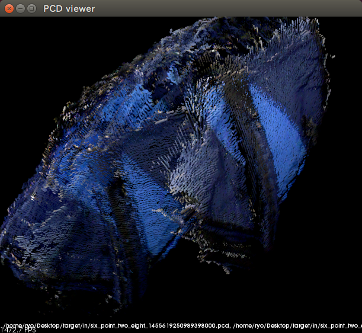

# 対象物の周囲360°からの3D点群を作成する

もっとロボットをダイナミックに動かしたい。だいたい、その場でグルッと回る方式だと、ドーナッツみたいなデータになってしまうのでちょっと寂しい。というわけで、対象物の周囲を回りながら深度センサーで点群を採取して、3Dモデルを作るプログラムをやりましょう。以下の画像のような感じ。私が通勤で使っている、サラリーマンとは思えないカバンの3D点群です。


## とりあえず、目的地まで移動させてみる

千里の道も一歩から。とりあえず、狙った場所まで移動するプログラムを書いてみましょう[^9]。

[^9]: `turtlebot_actions`パッケージの説明を読むとまさにこの移動を実現してくれそうなのですけれど、試した限りでは精度が低くてためでした。

### 共有する関数はどうしよう？

移動するためには`geometry_msgs/Twist`メッセージを作成しなければならなくて、作成のための`createTwistMsg()`関数は`make_world_models.h`に書きました。このままだと、同じ関数を2回プログラミングすることになってしまいます。なので、別ファイルに移しましょう。`include/six_point_two_eight/utilities.h`を作成し、`createTwistMsg()`関数を移しました。

#### include/six\_point\_two\_eight/utilities.h

単純にコピー＆ペーストしただけです。

```cpp
#pragma once

#include <geometry_msgs/Twist.h>

namespace six_point_two_eight {
  inline auto createTwistMsg(double linear_x, double angular_z) {
    geometry_msgs::Twist msg;
    msg.linear.x = linear_x;
    msg.angular.z = angular_z;
    
    return msg;
  }
}
```

#### include/six\_point\_two\_eight/make\_world\_models.h

ただ削除して、`#include`を調節しただけです。

```cpp
#pragma once

#include <nodelet/nodelet.h>
#include <ros/ros.h>

#include <nav_msgs/Odometry.h>
#include <sensor_msgs/PointCloud2.h>

#include "six_point_two_eight/utilities.h"
#include "six_point_two_eight/point_cloud_utilities.h"

namespace six_point_two_eight {
  class MakeWorldModels : public nodelet::Nodelet {
  private:
    ros::Publisher velocity_publisher_;
    ros::Subscriber odom_subscriber_;
    ros::Subscriber points_subscriber_;
    ros::Timer timer_1_;
    ros::Timer timer_2_;

    // 略
```

### 9時の方向に0.5m進んでみる

移動プログラムでは、`/odom`トピックの値に合わせた、適切な`geometry_msgs/Twist`メッセージを作成していけばよいはず。目的地までの距離が遠かったり角度のズレが大きい場合は少し速く動いたり回転したりして、近くなったらゆっくりで。目的地と`/odom`が一致したら、移動終了。ただし、一致と言ってもピッタリにはできないだろうから、少し誤差を認めよう。目的地は、三角関数で計算できるはずだな。

と、この程度を考えたところで、プログラムを組んでみました。先に結果を述べておくと、プログラムが複雑になってしまうので、別のやり方を考えないと駄目な感じでした。

#### include/six\_point\_two\_eight/utilities.h

位置を表現するための`geometry_msgs/Point`メッセージ作成関数と、角度を正規化する関数を追加しました。

```cpp
#pragma once

#include <cmath>

#include <geometry_msgs/Pose.h>
#include <geometry_msgs/Twist.h>

namespace six_point_two_eight {
  inline auto createTwistMsg(double linear_x, double angular_z) {
    // 略
  }

  // geometry_msgs::Pointを作成します。
  inline auto createPointMsg(double x, double y) {
    geometry_msgs::Point msg;
    msg.x = x;
    msg.y = y;

    return msg;
  }

  // -π〜πになるように、角度を正規化します。
  inline auto normalizeAngle(double angle) {
    return std::atan2(std::sin(angle), std::cos(angle));  // -1000とかの場合に備えるための再帰やループは面倒だったので、ライブラリ任せで実現しました。
  }
}
```

#### include/six\_point\_two\_eight/make\_target\_model.h

新規に作成しました。速度調節用の`tunedLinearX()`メンバー関数と`tunedAngularZ()`メンバー関数、移動をするための`moveTo()`メンバー関数を2つ（片方は作業用）、あとはいつもの`onInit()`メンバー関数を作成しました。

```cpp
#pragma once

#include <nodelet/nodelet.h>
#include <ros/ros.h>
#include <tf/transform_datatypes.h>

#include <nav_msgs/Odometry.h>

#include "six_point_two_eight/utilities.h"

namespace six_point_two_eight {
  class MakeTargetModels : public nodelet::Nodelet {
  private:
    ros::Publisher velocity_publisher_;
    ros::Subscriber odom_subscriber_;

    // 適切な前進速度を返します。
    auto tunedLinearX(double distance, double angle) const {
      if (distance < 0.05) {  // 目的地への距離が0.05mになったら、前進をやめる。
        return 0.0;
      }
      if (std::fabs(angle) > M_PI / 180 * 45) {  // 目的地への角度が±45°を超える場合は、前進しない（で回転する）。
        return 0.0;
      }
      
      return std::min(std::fabs(distance) * 0.5, 0.1);  // 0.1m/secか距離*0.5/secの小さい方を返す。
    }
    
    // 適切な回転速度を返します。
    auto tunedAngularZ(double angle) const {
      if (std::fabs(angle) < M_PI / 180 * 1) {  // 目的地への角度が±1°になったら、回転をやめる。
        return 0.0;
      }
      
      return std::min(std::fabs(angle) * 0.5, M_PI / 180 * 10) * (angle / std::fabs(angle));  // 10°/secか角度*0.5/secの小さい方を返す。マイナスの場合があることに注意。
    }

    // 目的地まで移動します（作業用）。
    auto moveTo(const geometry_msgs::Point& goal_position, nav_msgs::OdometryConstPtr odometry) {
      // 目的地と現在位置の差を計算します。
      auto difference = createPointMsg(
        goal_position.x - odometry->pose.pose.position.x, goal_position.y - odometry->pose.pose.position.y);

      // 距離と角度を計算します。計算が単純なので、TFやEigenを使わずに自前でやります。
      auto distance = std::sqrt(std::pow(difference.x, 2) + std::pow(difference.y, 2));
      auto angle = 
        normalizeAngle(std::atan2(difference.y, difference.x) - tf::getYaw(odometry->pose.pose.orientation));

      // 移動速度を計算します。
      auto linear_x = this->tunedLinearX(distance, angle);
      auto angular_z = this->tunedAngularZ(angle);

      // ロボットを移動させます。
      velocity_publisher_.publish(createTwistMsg(linear_x, angular_z));

      // 移動したかどうかを返します。
      return linear_x != 0.0 || angular_z != 0.0;
    }

    // 目的地まで移動します。
    auto moveTo(geometry_msgs::Point goal_position) {
      odom_subscriber_ = getNodeHandle().subscribe<nav_msgs::Odometry>(
        "odom", 1,
        [&, goal_position](const auto& message) {
          if (this->moveTo(goal_position, message)) {  // 移動した場合は、それで今回分の処理は終了なので、
            return;                                    // そのままリターンします。
          }
          
          ROS_INFO_STREAM("Reached!");  // 移動しない＝到着なので、ログを出して、
          odom_subscriber_.shutdown();  // サブスクライバーをシャットダウンします。
        });
    }
    
  public:
    void onInit() {
      velocity_publisher_ = getNodeHandle().advertise<geometry_msgs::Twist>("velocity", 1);

      odom_subscriber_ = getNodeHandle().subscribe<nav_msgs::Odometry>(
        "odom", 1,
        [&](const auto& message) {
          auto position = message->pose.pose.position;
          auto yaw = tf::getYaw(message->pose.pose.orientation);  // TFの関数を使用して、ヨーを取得します。

          this->moveTo(
            createPointMsg(
              position.x + std::cos(yaw + M_PI / 2) * 0.5, position.y + std::sin(yaw + M_PI / 2) * 0.5));  // 9時の方向に0.5m移動。
        });
    }
  };
}
```

うーん、対象物の周囲360°からの点群を作るということは、今回作成した移動の後に対象物が正面に来るように回転して、回転が終わったら深度センサーから点群をとって、また移動に戻るのを繰り返さなければなりません。関数の中から関数を呼び出して延々と処理がつながっていくわけで、それっていわゆるJavaScriptのコールバック地獄じゃん……。なんとかしないと……。

#### src/six\_point\_two\_eight.cpp

でも、なんとかする前に、まずはプログラムを動かしてテストしないとね。そのためにはコンパイルしなければなりませんので、`src/six_point_two_eight.cpp`を修正しました。

```cpp
#include <pluginlib/class_list_macros.h>

#include "six_point_two_eight/make_target_models.h"  // 追加。
#include "six_point_two_eight/make_world_models.h"
#include "six_point_two_eight/point_cloud_2_throttle.h"

PLUGINLIB_EXPORT_CLASS(six_point_two_eight::MakeTargetModels, nodelet::Nodelet)  // 追加。
PLUGINLIB_EXPORT_CLASS(six_point_two_eight::MakeWorldModels, nodelet::Nodelet)
PLUGINLIB_EXPORT_CLASS(six_point_two_eight::PointCloud2Throttle, nodelet::Nodelet)
```

#### six\_point\_two\_eight.xml

続けて、プログラムを起動できるように`six_point_two_eight.xml`を修正しました。

```xml
<library path="lib/libsix_point_two_eight">
  <class
    name="six_point_two_eight/make_target_models"
    type="six_point_two_eight::MakeTargetModels"
    base_class_type="nodelet::Nodelet"/>  <!-- 追加 -->
  <class name="six_point_two_eight/make_world_models" type="six_point_two_eight::MakeWorldModels" base_class_type="nodelet::Nodelet"/>
  <class name="six_point_two_eight/point_cloud_2_throttle" type="six_point_two_eight::PointCloud2Throttle" base_class_type="nodelet::Nodelet"/>
</library>
```

#### launch/make\_target\_models.launch

起動を簡単にするために、`launch`ファイルも作成しました。

```xml
<launch>
  <arg name="odom" default="odom"/>
  <arg name="velocity" default="mobile_base/commands/velocity"/>
  
  <node pkg="nodelet" type="nodelet" name="six_point_two_eight_nodelet_manager" args="manager" output="screen"/>
  <node pkg="nodelet" type="nodelet" name="make_target_models" args="load six_point_two_eight/make_target_models six_point_two_eight_nodelet_manager" output="screen">
    <remap from="odom" to="$(arg odom)"/>
    <remap from="velocity" to="$(arg velocity)"/>
  </node>
</launch>
```

#### launch/make\_target\_models\_in\_gazebo.launch

シミュレーター用の`launch`ファイルも。

```xml
<launch>
  <include file="$(find six_point_two_eight)/launch/make_target_models.launch"/>
</launch>
```

## actionlib

先ほどのコールバック地獄まっしぐらなプログラムを、ここで何とかしましょう。サービスを使えば解決できそうな気がしますけど、サービスは柔軟性が低いのでできれば使いたくない。幸いなことに、ROSには`actionlib`という、中断することが可能な、長い時間をかけて実行するサーバー・プログラムを作成するためのパッケージがあって、この`actionlib`を使えばコールバック地獄をキレイに解決できるんです。

### 地図作成と自律移動のパッケージを動かして、ROSの可能性を感じてみる

申し訳ないのですけれど`actionlib`はとりあえず脇に置いて、一時的に本稿から離れて[Build a map with SLAM](http://wiki.ros.org/turtlebot_navigation/Tutorials/indigo/Build%20a%20map%20with%20SLAM)と[Autonomously navigate in a known map](http://wiki.ros.org/turtlebot_navigation/Tutorials/indigo/Aotonomously%20navigate%20in%20a%20known%20map)を開いて、指示に従ってみてください（もっと細かい情報が欲しいという場合は、[Learn TurtleBot and ROS](http://learn.turtlebot.com/)も参照してください）。

これらのページの指示に従ってコマンドを入力していくと、TurtleBotに地図を作成させ、作成した地図を活用して自律走行させることができます。しかも、必要な作業はパッケージの起動だけ。プログラミングは無しです。

本稿はここまでROSを通信ライブラリとして扱ってきましたけど、実は、ROSの凄さは2,000を超えるROS対応パッケージ群にあります。しかも、それらのパッケージはメッセージとトピックという抽象的なレベルでつながるのですから、様々なロボットで使用可能です。先ほどのページでも、最終的には汎用パッケージを使用しています。ページ中の呼び出しに使用している`turtlebot_navigation`パッケージは、汎用の`gmapping`パッケージ[^10]と`navigation`パッケージを呼び出すための`launch`ファイル[^11]が詰まったパッケージなんです。

時間があるときに、[ROS.orgのBrowse Software](http://www.ros.org/browse/list.php?package_type=package&distro=indigo)を見てみてください。私のお気に入りは[hector_slam](http://wiki.ros.org/hector_slam)と[navigation](http://wiki.ros.org/navigation)。これらのパッケージの紹介ビデオを見れば、自律移動するロボットを簡単に作れることが分かって、ROSがいかに便利なものなのかを感じ取れるはずです。あと、[MoveIt!](http://moveit.ros.org/)もスゴイです。ロボット・アームがグリグリして、なんでもできちゃいそう。

* hector_slam

<iframe width="560" height="315" src="https://www.youtube.com/embed/F8pdObV_df4" frameborder="0" allowfullscreen></iframe>

* navigation

<iframe width="560" height="315" src="https://www.youtube.com/embed/qziUJcUDfBc" frameborder="0" allowfullscreen></iframe>

[^10]: 実は、`gmapping`パッケージも`OpenSlam`のラッパーなのですけど。
[^11]: 深度センサーのデータをLiDARのデータに偽装するプログラム等も含まれていますので、`launch`ファイル「だけ」ではありませんけど。

### actionlib::SimpleActionClient

先ほどのTurtleBotの自律移動のチュートリアルでは移動先をRVizのGUIで指定していましたけれど、一味違う我々は、プログラムから指定してみましょう。`turtlebot_navigation`パッケージが使用している`navigation`パッケージのドキュメントの[Sending Goals to the Navigation Stack](http://wiki.ros.org/navigation/Tutorials/SendingSimpleGoals)に、移動先をプログラムから指定する方法が書いてありました。そして、このドキュメントの途中には、`actionlib`を使うと書いてあります。つまり、`navigation`に指示を出すプログラムを組めば、`actionlib`を試せるというわけ。

とってもお得な話ですから、さっそく試してみましょう。

#### package.xmlとCMakeLists.txt

「Sending Goals to the Navigation Stack」に必要だと書いてある`move_base_msgs`パッケージと`actionlib`パッケージを、依存するパッケージに追加してください。

#### launch/make\_target\_models.launch

使用するトピックが変更になりますので、`launch`ファイルを変更します。

```xml
<launch>
  <arg name="move_base" default="move_base"/>  <!-- 追加。他のargは削除しました。 -->
  
  <node pkg="nodelet" type="nodelet" name="six_point_two_eight_nodelet_manager" args="manager" output="screen"/>
  <node pkg="nodelet" type="nodelet" name="make_target_models" args="load six_point_two_eight/make_target_models six_point_two_eight_nodelet_manager" output="screen">
    <remap from="move_base" to="$(arg move_base)"/>  <!-- 追加。他のremapは削除しました。 -->
  </node>
</launch>
```

#### include/six\_point\_two\_eight/utilities.h

`actionlib`は、通常のROSのメッセージ通信を活用して、長時間処理を実現しています。だからプログラムから使用するのはメッセージです。どんなメッセージがあるのかを確認するために、ターミナルで`rosmsg show move_base_msgs/MoveBase`まで入力して[Tab]キーを押してみてください。`MoveBase`を実現するのに必要なメッセージが一覧表示されます。

```bash
$ rosmsg show move_base_msgs/MoveBase
move_base_msgs/MoveBaseAction          move_base_msgs/MoveBaseActionResult    move_base_msgs/MoveBaseResult
move_base_msgs/MoveBaseActionFeedback  move_base_msgs/MoveBaseFeedback
move_base_msgs/MoveBaseActionGoal      move_base_msgs/MoveBaseGoal
```

この中で我々が中身を知らなければならないのは、`move_base_msgs/MoveBaseGoal`メッセージと`move_base_msgs/MoveBaseResult`メッセージと`move_base_msgs/MovebaseFeedback`メッセージ。ゴール（何をするかの指示）と結果と途中経過のフィードバックですね。他のメッセージは動作を制御するためのもので、ライブラリがうまいこと隠蔽してくれます。

`utilities.h`では、とりあえず移動先を指定するための`MoveBaseGoal`メッセージを作成する関数を追加しました。`MoveBaseGoal`メッセージを構成する`geometry_msgs/PoseStamped`と`geometry_msgs/Pose`、`geometry_msgs/Quaternion`を生成する関数も、合わせて作成しておきます。

```cpp
#pragma once

#include <cmath>
#include <tf/transform_datatypes.h>  // 追加。

#include <geometry_msgs/Twist.h>
#include <move_base_msgs/MoveBaseGoal.h>  // 追加。<geometry_msgs/Pose.h>は削除。

namespace six_point_two_eight {
  // 略。

  // move_base_msgs/MoveBaseGoalに必要なgeometry_msgs/PoseStampedに必要なgeometry_msgs/Poseに必要なgeometry_msgs/Quaternionを作成します。
  inline auto createQuaternionMsg(double yaw) {
    return tf::createQuaternionMsgFromYaw(yaw);
  }
  
  // move_base_msgs/MoveBaseGoalに必要なgeometry_msgs/PoseStampedに必要なgeometry_msgs/Poseを作成します。
  inline auto createPoseMsg(double x, double y, double yaw) {
    geometry_msgs::Pose msg;
    msg.position = createPointMsg(x, y);
    msg.orientation = createQuaternionMsg(yaw);

    return msg;
  }
  
  // move_base_msgs/MoveBaseGoalに必要なgeometry_msgs/PoseStampedを作成します。
  inline auto createPoseStampedMsg(
    const std::string& frame_id, const ros::Time& stamp, double x, double y, double yaw) 
  {
    geometry_msgs::PoseStamped msg;
    msg.header.frame_id = frame_id;
    msg.header.stamp = stamp;
    msg.pose = createPoseMsg(x, y, yaw);

    return msg;
  }

  // move_base_msgs/MoveBaseGoalを作成します。
  inline auto createMoveBaseGoalMsg(
    const std::string& frame_id, const ros::Time& stamp, double x, double y, double yaw) 
  {
    move_base_msgs::MoveBaseGoal msg;
    msg.target_pose = createPoseStampedMsg(frame_id, stamp, x, y, yaw);

    return msg;
  }

  // 略。
}
```

#### include/six\_point\_two\_eight/make\_target\_models.h

`MoveBaseAction`を呼び出す形で、`six_point_two_eight::MakeTargetModels`クラスを全面的に書きなおしました。`actionlib`なし版と比較できるようにお題は同じえ、9時の方向に0.5m進みます。

```cpp
#pragma once

#include <actionlib/client/simple_action_client.h>  // 追加。
#include <nodelet/nodelet.h>
#include <ros/ros.h>
#include <thread>  // 追加。

#include <move_base_msgs/MoveBaseAction.h>  // 追加。

#include "six_point_two_eight/utilities.h"

namespace six_point_two_eight {
  class MakeTargetModels : public nodelet::Nodelet {
  private:
    std::thread working_thread_;

    auto moveTo(const move_base_msgs::MoveBaseGoal& goal) {
      // actionlibのクライアントを作成します。
      actionlib::SimpleActionClient<move_base_msgs::MoveBaseAction> action_client("move_base", true);

      // actionlibのサーバーの起動を待ちます。
      if (!action_client.waitForServer(ros::Duration(60.0))) {
        ROS_ERROR_STREAM("Timeout occured when waiting action server.");
        throw std::exception();
      }

      // actionlibのサーバーにゴールを送信します。
      action_client.sendGoal(goal);

      // actionlibのサーバーの処理が完了するのを待ちます。
      if (!action_client.waitForResult(ros::Duration(60.0))) {
        ROS_ERROR_STREAM("Timeout occured when waiting result.");
        throw std::exception();
      }

      // ステータスを調べます。
      if (action_client.getState() != actionlib::SimpleClientGoalState::StateEnum::SUCCEEDED) {
        ROS_ERROR_STREAM(action_client.getState().toString());
        throw std::exception();
      }

      // 結果を返します。
      return *action_client.getResult();
    }
    
  public:
    void onInit() {
      // onInitの中でループするとNodeletManagerの処理が止まってしまうので、別スレッドで実行します。
      working_thread_ = std::thread(
        [&]() {
          // base_linkの現在の座標系で、X=0、Y=0.5、向きはそのままになるように移動させる（9時の方向に0.5mで方向は変えない）。
          moveTo(createMoveBaseGoalMsg("base_link", ros::Time::now(), 0.0, 0.5, 0.0));

          // 移動が終わったら実行する処理を、ここに書くことができます！
          ROS_INFO_STREAM("Finished!");
        });
    }
  };
}
```

`onInit()`に注目してください。移動が完了した後の処理（今回は`ROS_INFO_STREAM()`）が、`moveTo()`メンバー関数の呼び出しの後に書かれています。コールバック地獄が発生しない、実に見通しがよいコードです。`actionlib`便利すぎですね。

あと、移動先をどのフレームの座標系で示すかを指示できるので、三角関数が不要になりました。やっぱり便利すぎ。

### actionlib::SimpleActionClient呼び出しを、ライブラリ化する

でも、先ほどのコードの`actionlib`のサーバーを呼び出す部分、書くのが面倒くさい……。ライブラリ化してしまいましょう。

#### include/six\_point\_two\_eight/utilities.h

本稿の要件では、`actionlib`のフィードバックは不要です。同期処理にできるのですから、ファンクターで実装できるでしょう。早速やってみます。

```cpp
#pragma once

#include <actionlib/client/simple_action_client.h>  // 追加。
#include <cmath>
#include <tf/transform_datatypes.h>

#include <geometry_msgs/Twist.h>
#include <move_base_msgs/MoveBaseAction.h>  // 追加。<move_base_msgs/MoveBaseGoal.h>の#includeは削除。

namespace six_point_two_eight {
  // 本稿用の例外。
  class SixPointTwoEightException : public std::exception {
  private:
    std::string what_;

  public:
    SixPointTwoEightException(const std::string& what)
      : what_(what)
    {
      ;
    }

    const char* what() const noexcept {
      return what_.c_str();
    }
  };
  
  // 略。

  // actionlib呼び出し用ファンクター。
  template <typename Action>
  struct CallAction {
    // Goalの型。
    using Goal = typename Action::_action_goal_type::_goal_type;
    
    // Resultの型。
    using Result = typename Action::_action_result_type::_result_type;
    
    // Nodeletの初期化はonInit()なので、メンバー変数の初期化をやりづらい。なので、トピックはoperator()の引数にしました。
    // ただし、毎回引数にトピックを書くと保守性が低くなってしまうので、onInit()でトピックをstd::bindできるようにします。以下は、バインド後の変数のための型です。
    using TopicBinded = std::function<Result(const Goal&)>;

    // 何度もstd::bindを書くのは面倒なのでヘルパー用関数を用意します。この関数をonInit()の中で呼んでください。
    static auto bindTopic(const std::string& topic) {
      return std::bind(CallAction<Action>(), topic, std::placeholders::_1);
    }

    // 例外メッセージを生成します。
    auto exceptionWhat(const std::string& message, const std::string& topic) const {
      std::stringstream what;
      what << message << " topic = " << topic << ".";
      
      return what.str();
    }

    // actionlibを呼び出します。
    auto operator()(const std::string& topic, const Goal& goal) {
      actionlib::SimpleActionClient<Action> action_client(topic, true);
      if (!action_client.waitForServer(ros::Duration(60.0))) {
        throw SixPointTwoEightException(exceptionWhat("Timeout occured when waiting action server.", topic));
      }
      
      action_client.sendGoal(goal);
      if (!action_client.waitForResult(ros::Duration(60.0))) {
        throw SixPointTwoEightException(exceptionWhat("Timeout occured when waiting result.", topic));
      }
      
      if (action_client.getState() != actionlib::SimpleClientGoalState::StateEnum::SUCCEEDED) {
        throw SixPointTwoEightException(exceptionWhat(action_client.getState().toString(), topic));
      }
      
      return *action_client.getResult();
    }
  };

  // メンバー変数宣言とbindTopic()で2回クラス名を書くのは大変なので、usingしておきます。
  using CallMoveBaseAction = CallAction<move_base_msgs::MoveBaseAction>;
}
```

`TopicBinded`と`bindTopic()`のあたりが複雑になっているのは、`Nodelet`の初期化は`onInit()`で実施されるためです。メンバー変数の初期化をコンストラクターの初期化リストに書けない（初期化リストに書くと、初期化のコードが分散するので保守性が落ちてしまう）ので、トピックは`operator()`の引数になります。でも呼び出しのたびにトピックを引数に書くのは面倒だし保守性が下がってしまうので、`onInit()`の中でトピックを`std::bind`しておきたい。この`std::bind`した結果を格納するメンバー変数の型が`TopicBinded`、`std::bind`呼び出しを少しだけ楽にするのが`bindTopic()`メンバー関数です。具体的な使い方は、次の`make_target_models.h`でやります。

#### include/six\_point\_two\_eight/make\_target\_models.h

作成した`CallAction`を使用する形に、`MakeTargetModels`を書き直しましょう。

```cpp
#pragma once

#include <nodelet/nodelet.h>
#include <ros/ros.h>
#include <thread>

// <actionlibclient/simple_action-client.h>と<move_base_msgs/MoveBaseGoal.h>の#includeは削除。

#include "six_point_two_eight/utilities.h"

namespace six_point_two_eight {
  class MakeTargetModels : public nodelet::Nodelet {
  private:
    // actionlibは、CallActionを経由して呼び出します。
    CallMoveBaseAction::TopicBinded move_base_;
    
    std::thread working_thread_;
    
  public:
    void onInit() {
      // トピックをバインドします。
      move_base_ = CallMoveBaseAction::bindTopic("move_base");
      
      working_thread_ = std::thread(
        [&]() {
          // actionlibを呼び出します。
          move_base_(createMoveBaseGoalMsg("base_link", ros::Time::now(), 0.0, 0.5, 0.0));
          
          ROS_INFO_STREAM("Finished!");
        });
    }
  };
}
```

とても簡単。`actionlib`は本当に便利ですな。

### actionlib::SimpleActionServer

でも、対象物の周囲360°からの点群作成のための道具としては、`navigation`パッケージはちょっとオーバースペックかも。`acitonlib`の勉強がてら、同じ処理（ただし、地図を参照して最短経路を探したり障害物を避けたりしない。指定された座標にただ進むだけの低機能版）をする`Nodelet`を作ってみましょう。

#### include/six\_point\_two\_eight/move\_base\_server.h

`actionlib`のサーバーは、`actionlib::SimpleActionServer`クラスを使用して作成します。実際の処理をする関数を引数に渡して、処理が終了したら`setSucceeded()`メンバー関数を呼ぶだけ。使い方そのものは簡単です。

ただし、この`SimpleActionServer`クラス、初期化はコンストラクタでやることになっていて、しかも`operator=`が無効になっているんですよ。このプログラミング・スタイルそのものは、良いプログラミング・スタイルだと考えます。不完全なインスタンスは危険ですから、初期化をコンストラクタで完全にやっておくのは良いことでしょう。そのクラスをメンバー変数に持ちたい時は、コンストラクタの初期化リストで初期化すればよい。初期化リストでメンバー変数を初期化するのは、良いスタイルだとされていますしね。変数への再代入を禁止しておけば状態遷移がなくなって、関数型言語のコードみたいに単純になるでしょう。と、感じに良いこと尽くめなプログラミング・スタイルなのですけれど、残念なことに`Nodelet`と相性が悪いんです……。

`Nodelet`の場合、`SimpleActionServer`をコンストラクタの初期化リストで初期化するのは駄目です。`Nodelet`の`onInit()`がまだ呼ばれていませんからね。`operator=`が無効になっているので、`onInit()`の中での初期化も不可能です。

```cpp
class MoveBaseServer : public nodelet::Nodelet {
private:
  actionlib::SimpleActionServer<move_base_msgs::MoveBaseAction> move_base_action_server_;
  
public:
  MoveBaseServer()
    : move_base_action_server_(getNodeHandle(), "move_base", false)  // NG。Nodeletの初期化がなされていないのに、getNodeHandle()を呼んでいる。
  {
    ;
  }
  
  void onInit() {
    velocity_publisher_ = getNodeHandle().advertise<geometry_msgs::Twist>("velocity", 1);
    
    // 以下はコンパイル・エラーになります。
    // move_base_action_server_ = actionlib::SimpleActionServer<move_base_msgs::MoveBaseAction>(getNodeHandle(), "move_base", false);
    
    ...
  }
};
```

困った時のGoogle先生ということで、インターネットを検索したら別クラス作る方式のコードがありました。以下のような感じ。

```cpp
class MoveBaseServerImpl {
private:
  actionlib::SimpleActionServer<move_base_msgs::MoveBaseAction> move_base_action_server_;

public:
  MoveBaseServerImpl(ros::NodeHandle* node_handle)
    : move_base_action_server_(*node_handle, "move_base", false)
  {
    // move_base_action_server_を使う処理。
  }
};

class MoveBaseServer {
private:
  boost::optional<MoveBaseServerImpl> impl_;
  
public:
  void onInit() {
    velocity_publisher_ = getNodeHandle().advertise<geometry_msgs::Twist>("velocity", 1);

    impl_ = boost::in_place(&getNodeHandle());
  }
};
```

ただ、このコードだと、ちょっと不格好ですね……。処理が分散していて、保守性が低そうです。

でも、このコードはよいヒントになります。このコードで使われているboostのIn-Place Factoryなら、初期化を遅らせることが可能なわけ（このコードを見るまで、私はIn-Place Factoryを知りませんでした）。だったら、間にクラスを挟まなくてもよいはず。というわけで、以下のように、In-Place Factoryを使ってコードを書きました。

移動処理のほとんどは、以前作成した`actionlib`を使わないバージョンからのコピー＆ペーストです。回転する処理と、`/odom`以外のフレームが指定された時に備えるために`TF`で座標変換する処理を付け加えた程度です。

```cpp
#pragma once

#include <actionlib/server/simple_action_server.h>
#include <boost/utility/in_place_factory.hpp>
#include <nodelet/nodelet.h>
#include <ros/ros.h>

#include <move_base_msgs/MoveBaseAction.h>

#include "six_point_two_eight/utilities.h"

namespace six_point_two_eight {
  class MoveBaseServer : public nodelet::Nodelet {
  private:
    ros::Publisher velocity_publisher_;
    ros::Subscriber odom_subscriber_;

    // MoveBaseActionのサーバーです。boostのIn-Place Factoryを使用して、初期化を遅らせます。
    boost::optional<actionlib::SimpleActionServer<move_base_msgs::MoveBaseAction>> move_base_action_server_;
    
    auto tunedLinearX(double distance, double angle) const {  // 前に作成したものと同じ。
      if (distance < 0.05) {
        return 0.0;
      }
      if (std::fabs(angle) > M_PI / 180 * 45) {
        return 0.0;
      }
      
      return std::min(std::fabs(distance) * 0.5, 0.1);
    }
    
    auto tunedAngularZ(double angle) const {  // 以前作成したものと同じ。
      if (std::fabs(angle) < M_PI / 180 * 1) {
        return 0.0;
      }
      
      return std::min(std::fabs(angle) * 0.5, M_PI / 180 * 10) * (angle / std::fabs(angle));
    }

    // ゴールの向きと同じなるように回転します（作業用）。
    auto turnTo(const geometry_msgs::Pose& goal_pose, nav_msgs::OdometryConstPtr odometry) {
      // ゴールの向きと現在の向きの差を計算します。
      auto angular_z = this->tunedAngularZ(
        normalizeAngle(tf::getYaw(goal_pose.orientation) - tf::getYaw(odometry->pose.pose.orientation)));

      // ロボットを回転させます。
      velocity_publisher_.publish(createTwistMsg(0, angular_z));

      // 回転したかどうかを返しhます。
      return angular_z != 0.0;
    }

    // ゴールの向きと同じなるように回転します。
    auto turnTo(const geometry_msgs::Pose& goal_pose) {
      odom_subscriber_ = getNodeHandle().subscribe<nav_msgs::Odometry>(
        "odom", 1,
        [&, goal_pose](const auto& message) {
          if (this->turnTo(goal_pose, message)) {  // 回転した場合は、それで今回分の処理は終了なので、
            return;                                // そのままリターンします。
          }

          move_base_action_server_->setSucceeded(move_base_msgs::MoveBaseResult());  // 回転しない＝終了なので、MoveBaseActionを終了させます。
          odom_subscriber_.shutdown();  // サブスクライバーをシャットダウンします。
        });
    }
    
    auto moveTo(const geometry_msgs::Pose& goal_pose, nav_msgs::OdometryConstPtr odometry) {  // 以前作成したものから、1つ目の引数を変えただけ。
      auto difference = createPointMsg(
        goal_pose.position.x - odometry->pose.pose.position.x, goal_pose.position.y - odometry->pose.pose.position.y);
      
      auto distance = std::sqrt(std::pow(difference.x, 2) + std::pow(difference.y, 2));
      auto angle =
        normalizeAngle(std::atan2(difference.y, difference.x) - tf::getYaw(odometry->pose.pose.orientation));
      
      auto linear_x = this->tunedLinearX(distance, angle);
      auto angular_z = this->tunedAngularZ(angle);
      
      velocity_publisher_.publish(createTwistMsg(linear_x, angular_z));
      
      return linear_x != 0.0 || angular_z != 0.0;
    }

    auto moveTo(const geometry_msgs::Pose& goal_pose) {
      odom_subscriber_ = getNodeHandle().subscribe<nav_msgs::Odometry>(
        "odom", 1,
        [&, goal_pose](const auto& message) {
          if (this->moveTo(goal_pose, message)) {
            return;
          }

          this->turnTo(goal_pose);  // 撮影ポイントまで移動した後は、対象物が正面に来るように回転します。
        });
    }

  public:
    void onInit() {
      velocity_publisher_ = getNodeHandle().advertise<geometry_msgs::Twist>("velocity", 1);

      // boostのIn-Place Factoryを使用して、サーバーを初期化します。
      move_base_action_server_ = boost::in_place(getNodeHandle(), "move_base", false);
      
      // Goalが送られてきた場合の処理を登録します。
      move_base_action_server_->registerGoalCallback(
        [&]() {
          // acceptNewGoal()でゴールを取得します。
          auto goal = move_base_action_server_->acceptNewGoal();

          // TFで座標変換します。
          geometry_msgs::PoseStamped goal_pose_stamped;
          transform_listener_.transformPose("odom", goal->target_pose, goal_pose_stamped);

          // 実際の処理を担当するのメンバー関数を呼び出します。
          moveTo(goal_pose_stamped.pose);
        });

      // サーバーを開始します。
      move_base_action_server_->start();
    }
  };
}
```

#### src/six\_point\_two\_eight.cpp

`move_base_server.h`がコンパイルされるように、\*.cppを修正します。

```cpp
#include <pluginlib/class_list_macros.h>

#include "six_point_two_eight/make_target_models.h"
#include "six_point_two_eight/make_world_models.h"
#include "six_point_two_eight/move_base_server.h"  // 追加。
#include "six_point_two_eight/point_cloud_2_throttle.h"

PLUGINLIB_EXPORT_CLASS(six_point_two_eight::MakeTargetModels, nodelet::Nodelet)
PLUGINLIB_EXPORT_CLASS(six_point_two_eight::MakeWorldModels, nodelet::Nodelet)
PLUGINLIB_EXPORT_CLASS(six_point_two_eight::MoveBaseServer, nodelet::Nodelet)  // 追加。
PLUGINLIB_EXPORT_CLASS(six_point_two_eight::PointCloud2Throttle, nodelet::Nodelet)
```

##### six\_point\_two\_eight.xml

作成した`six_point_two_eight::MoveBaseServer`をROSから扱えるように、名前を付けます。

```xml
<library path="lib/libsix_point_two_eight">
  <class name="six_point_two_eight/make_target_models" type="six_point_two_eight::MakeTargetModels" base_class_type="nodelet::Nodelet"/>
  <class name="six_point_two_eight/make_world_models" type="six_point_two_eight::MakeWorldModels" base_class_type="nodelet::Nodelet"/>
  <!-- ここから追加。 -->
  <class
    name="six_point_two_eight/move_base_server"
    type="six_point_two_eight::MoveBaseServer"
    base_class_type="nodelet::Nodelet"/>
  <!-- ここまで。 -->
  <class name="six_point_two_eight/point_cloud_2_throttle" type="six_point_two_eight::PointCloud2Throttle" base_class_type="nodelet::Nodelet"/>
</library>
```

#### include/six\_point\_two\_eight/make\_target\_models.h

ついでですから、対象物の周囲360°を回るように、`make_target_models.h`を修正してしまいましょう。対象物は正面にあるものとし、その対象物の周囲の撮影ポイントを回ります。`/odom`を使用して、絶対位置で計算するようにしました。

```cpp
#pragma once

#include <nodelet/nodelet.h>
#include <ros/ros.h>

#include <nav_msgs/Odometry.h>  // 追加。<thread>の#includeは削除。

#include "six_point_two_eight/utilities.h"

namespace six_point_two_eight {
  class MakeTargetModels : public nodelet::Nodelet {
  private:
    static constexpr double radius = 1.25;  // 対象物の周囲を回る円の半径。
    static const int step_size = 16;        // 1周回る間に撮影する回数。

    ros::Subscriber odom_subscriber_;
    CallMoveBaseAction::TopicBinded move_base_;
    
  public:
    void onInit() {
      move_base_ = CallMoveBaseAction::bindTopic("move_base");

      // 相対座標だとプログラムが複雑になるので、/odomを使用して絶対座標で位置決めをします。
      odom_subscriber_ = getNodeHandle().subscribe<nav_msgs::Odometry>(
        "odom", 1,
        [&](const auto& message) {
          // 自機の絶対位置。
          auto position = message->pose.pose.position;
          auto yaw = tf::getYaw(message->pose.pose.orientation);

          // ターゲットの絶対位置を計算します。
          auto target_position = createPointMsg(position.x + std::cos(yaw) * radius, position.y + std::sin(yaw) * radius);
          auto target_yaw = normalizeAngle(yaw + M_PI);  // ターゲットから見た、自機の方向。

          // ターゲットの周囲を回ります。
          for (auto i = 0; i < step_size; ++i) {
            ROS_INFO_STREAM("Step " << (i + 1) << "/" << step_size);

            // 次の撮影位置に移動します。
            target_yaw = normalizeAngle(target_yaw + M_PI * 2 / step_size);
            move_base_(
              createMoveBaseGoalMsg(
                "odom",
                ros::Time::now(),
                target_position.x + std::cos(target_yaw) * radius,
                target_position.y + std::sin(target_yaw) * radius,
                normalizeAngle(target_yaw + M_PI)));
          }

          ROS_INFO_STREAM("Finished!");
          odom_subscriber_.shutdown();
        });
    }
  };
}
```

`actionlib`のおかげで、移動→回転→移動……をループで表現出来ました。やっぱり`actionlib`は便利ですね。

#### launch/make_target_models.launch

最後。動作確認をするために、起動用の`launch`ファイルを修正しましょう。、

```xml
<launch>
  <arg name="move_base" default="move_base"/>
  <arg name="odom" default="odom"/>  <!-- 追加 -->
  <arg name="velocity" default="mobile_base/commands/velocity"/>  <!-- 追加 -->
  
  <node pkg="nodelet" type="nodelet" name="six_point_two_eight_nodelet_manager" args="manager" output="screen"/>
  <node pkg="nodelet" type="nodelet" name="make_target_models" args="load six_point_two_eight/make_target_models six_point_two_eight_nodelet_manager" output="screen">
    <remap from="move_base" to="$(arg move_base)"/>
  </node>
  <!-- ここから追加。 -->
  <node
    pkg="nodelet"
    type="nodelet"
    name="move_base_server"
    args="load six_point_two_eight/move_base_server six_point_two_eight_nodelet_manager"
    output="screen">
    <remap from="odom" to="$(arg odom)"/>
    <remap from="velocity" to="$(arg velocity)"/>
  </node>
  <!-- ここまで。 -->
</launch>
```

で、実際に動かしてみると、移動が遅くて完了までかなり長い時間がかかります……。これは、オドメトリーの誤差をできるだけ減らすためです。`navigation`パッケージで速く動けているのは、あれは深度センサーの情報を元に現在位置を補正し続けているからなんです。今回はそんな高度な処理は作成していませんから、申し訳ないですけど、遅いのは我慢してください。

### \*.actionの定義

点群を取得する処理も、`actionlib`化してしまいましょう。ターミナルで`rosmsg list | grep ActionGoal`してみても使えそうな既存のアクションはなさそうなので、新しいアクションの定義方法を学ぶこともできますしね。

#### action/GetPointCloud2.action

アクションは、`action`ディレクトリの下に、`*.action`として定義してください。ファイル名がそのままアクション名になります。`*.action`の中は、`---`で3つに区切られます。区切り方は、以下のような感じ。

```
Goalのメッセージ定義
---
Resultのメッセージ定義
---
Feedbackのメッセージ定義
```

で、メッセージ定義は、`型 変数名`の0行以上の繰り返し。何もなくてよい（move_base_msgs/MoveBaseResultのような）場合は、0行になります。今回は、どのトピックからデータを取得するのかを渡して、PointCloud2を返す感じ。途中経過がないので、フィードバックは無しで。なので、`GetPointCloud2.action`の中身は以下になります。

```
string target_topic
---
sensor_msgs/PointCloud2 points
---
```

#### package.xmlとCMakeLists.xml

メッセージ定義の場合は、`package.xml`の`<build_depend>`に`message_generation`、`<run_depend>`に`message_runtime`を指定するという面倒なルールがあるのですけれど、アクション定義の場合はどちらも`actionlib_msgs`パッケージで大丈夫です。`actionlib_msgs`をpackage.xmlの`<build_depends>`と`<run_depends>`に追加してください。

CMakeLists.xmlはもう少し複雑です。というのも、`*.action`をコンパイル（といってもC++やPython、Common Lispのコード生成）するように指示しなければならないんです。あと、`*.ation`のコンパイルが終了してC++のコードが生成されるまで、`*.cpp`のビルドを待つようにも指示します。

```bash
cmake_minimum_required(VERSION 2.8.3)
project(six_point_two_eight)

find_package(catkin REQUIRED COMPONENTS
  actionlib
  actionlib_msgs
  geometry_msgs
  move_base_msgs
  nav_msgs
  nodelet
  nodelet_topic_tools
  pcl_ros
  roscpp
  sensor_msgs
  tf
  tf_conversions
)

# find_package(Boost REQUIRED COMPONENTS system)

# add_message_files(
#   FILES
#   Message1.msg
#   Message2.msg
# )

# add_service_files(
#   FILES
#   Service1.srv
#   Service2.srv
# )

# *.actionを登録します。
add_action_files(FILES
  GetPointCloud2.action
)

# メッセージを生成するように指示します。add_xxx_filesに加えて、generate_massagesも必要です。
generate_messages(DEPENDENCIES  # 追加。
  actionlib_msgs                # 追加。\*.actionが参照するメッセージを含むパッケージを書きます。
  sensor_msgs                   # 追加。\*.actionが参照するメッセージを含むパッケージを書きます。
)                               # 追加。

catkin_package(CATKIN_DEPENDS
  actionlib_msgs  # 追加。ここには、catkinの実行に必要なパッケージを設定します。
)

add_compile_options(
  "-std=c++14"
)

set_source_files_properties(src/point_cloud_utilities.cpp
  PROPERTIES COMPILE_FLAGS "-std=c++03 -Wno-deprecated"
)

include_directories(
  include
  ${catkin_INCLUDE_DIRS}
)

add_library(six_point_two_eight
  src/six_point_two_eight.cpp
  src/point_cloud_utilities.cpp
  src/utilities.cpp
)

# メッセージの生成が終わるまで（*.hが生成されるまで）、*.cppのビルドを待つように指示します。
add_dependencies(six_point_two_eight ${${PROJECT_NAME}_EXPORTED_TARGETS} ${catkin_EXPORTED_TARGETS})

target_link_libraries(six_point_two_eight
  ${catkin_LIBRARIES}
)
```

ここまで書いたらターミナルで`catkin_make`してみてください。`<catkin_ws>/devel/include/six_point_two_eight`ディレクトリに以下のファイルができていればOKです。

```bash
$ ls devel/include/six_point_two_eight
GetPointCloud2ActionFeedback.h  GetPointCloud2Action.h        GetPointCloud2Feedback.h   GetPointCloud2Result.h
GetPointCloud2ActionGoal.h      GetPointCloud2ActionResult.h  GetPointCloud2Goal.h
```

#### include/six\_point\_two\_eight/utilities.h

いつもの`utilities.h`に、メッセージ生成関数と`CallAction`の別名定義を追加しておきます。

`six_point_two_eight`パッケージの中で定義したメッセージのの名前空間は、`six_point_two_eight`になります。あと、`include`ファイルは`six_point_two_eight/メッセージ名.h`。一般には、我々がmove_base_msgs/MoveBaseActionを再利用したようにメッセージだけが再利用される可能性もありますから、`*_msgs`という名前のパッケージを作ってそこにメッセージを定義すべきです。でもまぁ、今回のメッセージは`six_point_two_eight`パッケージ内でしか利用しないでしょうから、ごめんなさい、パッケージを分けませんでした。

```cpp
#pragma once

#include <actionlib/client/simple_action_client.h>
#include <cmath>
#include <tf/transform_datatypes.h>
#include <tf/transform_listener.h>

#include <geometry_msgs/Twist.h>
#include <move_base_msgs/MoveBaseAction.h>
#include <six_point_two_eight/GetPointCloud2Action.h>  // 追加。

namespace six_point_two_eight {
  // 略。
  
  // GetPointCloud2Goalメッセージを生成します。
  inline auto createGetPointCloud2GoalMsg(const std::string& target_topic) {
    six_point_two_eight::GetPointCloud2Goal msg;
    msg.target_topic = target_topic;

    return msg;
  }

  // GetPointCloud2Resultメッセージを生成します。
  inline auto createGetPointCloud2ResultMsg(sensor_msgs::PointCloud2ConstPtr points) {
    six_point_two_eight::GetPointCloud2Result msg;
    msg.points = *points;

    return msg;
  }

  // 利便性のために、別名を定義しておきます。
  using CallGetPointCloud2Action = CallAction<six_point_two_eight::GetPointCloud2Action>;

  // 略。
}
```

#### include/six\_point\_two\_eight/get\_point\_cloud\_server.h

`GetPointCloud2`アクションを担当する`Nodelet`を作ります。これまでに学習した知識（と作成したコードのコピー＆ペーストと少しの修正）で、サクッと作りました。

```cpp
#pragma once

#include <actionlib/server/simple_action_server.h>
#include <boost/utility/in_place_factory.hpp>
#include <nodelet/nodelet.h>
#include <ros/ros.h>

#include <six_point_two_eight/GetPointCloud2Action.h>

#include "six_point_two_eight/utilities.h"

namespace six_point_two_eight {
  class GetPointCloud2Server : public nodelet::Nodelet {
  private:
    ros::Subscriber points_subscriber_;
    boost::optional<actionlib::SimpleActionServer<six_point_two_eight::GetPointCloud2Action>> get_point_cloud_2_action_server_;
    
    auto getPointCloud2(const std::string& target_topic) {
      auto points_subscribing_time = ros::Time::now();
      points_subscriber_ = getNodeHandle().subscribe<sensor_msgs::PointCloud2>(
        target_topic, 1,
        [&, points_subscribing_time](const auto& message) {
          // 起動直後は動作が安定しないので、3秒間は何もしません。
          if (message->header.stamp < points_subscribing_time + ros::Duration(3.0)) {
            return;
          }
          
          get_point_cloud_2_action_server_->setSucceeded(createGetPointCloud2ResultMsg(message));
          points_subscriber_.shutdown();
        });
    }

  public:
    void onInit() {
      get_point_cloud_2_action_server_ = boost::in_place(getNodeHandle(), "get_point_cloud_2", false);
      get_point_cloud_2_action_server_->registerGoalCallback(
        [&]() {
          getPointCloud2(get_point_cloud_2_action_server_->acceptNewGoal()->target_topic);
        });
      get_point_cloud_2_action_server_->start();
    }
  };
}
```

#### src/six\_point\_two\_eight.cpp

`move_base_server.h`の時と同じ、単純作業です。

```cpp
#include <pluginlib/class_list_macros.h>

#include "six_point_two_eight/get_point_cloud_2_server.h"  // 追加。
#include "six_point_two_eight/make_target_models.h"
#include "six_point_two_eight/make_world_models.h"
#include "six_point_two_eight/move_base_server.h"
#include "six_point_two_eight/point_cloud_2_throttle.h"

PLUGINLIB_EXPORT_CLASS(six_point_two_eight::GetPointCloud2Server, nodelet::Nodelet)  // 追加。
PLUGINLIB_EXPORT_CLASS(six_point_two_eight::MakeTargetModels, nodelet::Nodelet)
PLUGINLIB_EXPORT_CLASS(six_point_two_eight::MakeWorldModels, nodelet::Nodelet)
PLUGINLIB_EXPORT_CLASS(six_point_two_eight::MoveBaseServer, nodelet::Nodelet)
PLUGINLIB_EXPORT_CLASS(six_point_two_eight::PointCloud2Throttle, nodelet::Nodelet)
```

#### six\_point\_two\_eight.xml

単純作業が続いて申し訳ありませんが、`Nodelet`に名前を付けてあげてください。

```cpp
<library path="lib/libsix_point_two_eight">
  <!-- ここから追加。 -->
  <class
    name="six_point_two_eight/get_point_cloud_2_server"
    type="six_point_two_eight::GetPointCloud2Server"
    base_class_type="nodelet::Nodelet"/>
  <!-- ここまで。 -->
  <class name="six_point_two_eight/make_target_models" type="six_point_two_eight::MakeTargetModels" base_class_type="nodelet::Nodelet"/>
  <class name="six_point_two_eight/make_world_models" type="six_point_two_eight::MakeWorldModels" base_class_type="nodelet::Nodelet"/>
  <class name="six_point_two_eight/move_base_server" type="six_point_two_eight::MoveBaseServer" base_class_type="nodelet::Nodelet"/>
  <class name="six_point_two_eight/point_cloud_2_throttle" type="six_point_two_eight::PointCloud2Throttle" base_class_type="nodelet::Nodelet"/>
</library>
```

#### include/six\_point\_two\_eight/make\_target\_models.h

作成した`actionlib`を呼び出す`make_world_models.h`も、修正しましょう。

`point_cloud_utilities.h`の関数は`sensor_msgs::PointCloud2ConstPtr`を引数にとる形で定義していて、`six_point_two_eight::GetPointCloud2Result`から受け取れるデータは`sensor_msgs::PointCloud2`（`ConstPtr`がつかない）なので、型変換しています。あと、`point_cloud_utilities.h`の関数を呼び出した時に例外が発生してもデータを取り直せるように、`while`ループで囲んでいます。

```cpp
#pragma once

#include <nodelet/nodelet.h>
#include <ros/ros.h>

#include <nav_msgs/Odometry.h>
#include <sensor_msgs/PointCloud2.h>  // 追加。

#include "six_point_two_eight/point_cloud_utilities.h"  // 追加。
#include "six_point_two_eight/utilities.h"

namespace six_point_two_eight {
  class MakeTargetModels : public nodelet::Nodelet {
  private:
    static constexpr double radius = 1.25;
    static const int step_size = 16;

    ros::Subscriber odom_subscriber_;
    CallGetPointCloud2Action::TopicBinded get_point_cloud_2_;  // 追加。
    CallMoveBaseAction::TopicBinded move_base_;

  public:
    void onInit() {
      get_point_cloud_2_ = CallGetPointCloud2Action::bindTopic("get_point_cloud_2");  // 追加。
      move_base_ = CallMoveBaseAction::bindTopic("move_base");

      odom_subscriber_ = getNodeHandle().subscribe<nav_msgs::Odometry>(
        "odom", 1,
        [&](const auto& message) {
          auto position = message->pose.pose.position;
          auto yaw = tf::getYaw(message->pose.pose.orientation);

          auto target_position = createPointMsg(position.x + std::cos(yaw) * radius, position.y + std::sin(yaw) * radius);
          auto target_yaw = normalizeAngle(yaw + M_PI);

          // ターゲットの周囲を、深度センサーからデータを取得しながら回ります。
          for (auto i = 0; i < step_size; ++i) {
            ROS_INFO_STREAM("Step " << (i + 1) << "/" << step_size);

            // ここから追加。
            // 深度センサーからデータを取得します。
            while (ros::ok()) {
              try {
                savePointCloud2File(
                  getSpherePointCloud2(
                    transformPointCloud2(
                      sensor_msgs::PointCloud2ConstPtr(  // PointCloud2をPointCloud2ConstPtrに変換します。
                        new sensor_msgs::PointCloud2(
                          get_point_cloud_2_(createGetPointCloud2GoalMsg("points")).points)),  // アクションから点群を取得。
                      "odom"),
                    target_position,
                    radius * 0.5));
                break;
              
              } catch (const std::exception& ex) {
                ROS_WARN_STREAM(ex.what());
              }
            }
            // ここまで。
            
            target_yaw = normalizeAngle(target_yaw + M_PI * 2 / step_size);
            
            move_base_(
              createMoveBaseGoalMsg(
                "odom",
                ros::Time::now(),
                target_position.x + std::cos(target_yaw) * radius,
                target_position.y + std::sin(target_yaw) * radius,
                normalizeAngle(target_yaw + M_PI)));
          }

          ROS_INFO_STREAM("Finished!");
          odom_subscriber_.shutdown();
        });
    }
  };
}
```

### launch/make_target_models.launch

`launch`ファイルも修正します。せっかく`Nodelet`を作っても、起動させなければ無意味ですもんね。

```xml
<launch>
  <arg name="get_point_cloud_2" default="get_point_cloud_2"/>
  <arg name="move_base" default="move_base"/>
  <arg name="odom" default="odom"/>
  <arg name="points" default="camera/depth_registered/points"/>  <!-- 追加 -->
  <arg name="velocity" default="mobile_base/commands/velocity"/>
  
  <node pkg="nodelet" type="nodelet" name="six_point_two_eight_nodelet_manager" args="manager" output="screen"/>
  <node pkg="nodelet" type="nodelet" name="make_target_models" args="load six_point_two_eight/make_target_models six_point_two_eight_nodelet_manager" output="screen">
    <remap from="get_point_cloud_2" to="$(arg get_point_cloud_2)"/>
    <remap from="move_base" to="$(arg move_base)"/>
  </node>
  <!-- ここから追加。 -->
  <node
    pkg="nodelet"
    type="nodelet"
    name="get_point_cloud_2_server"
    args="load six_point_two_eight/get_point_cloud_2_server six_point_two_eight_nodelet_manager"
    output="screen">
    <remap from="points" to="$(arg points)"/>
  </node>
  <!-- ここまで。 -->
  <node pkg="nodelet" type="nodelet" name="move_base_server" args="load six_point_two_eight/move_base_server six_point_two_eight_nodelet_manager" output="screen">
    <remap from="odom" to="$(arg odom)"/>
    <remap from="velocity" to="$(arg velocity)"/>
  </node>
</launch>
```

#### launch/make_target_models_in_gazebo.launch

今回の処理は点群を扱いますから、シミュレーター用の`launch`ファイルも修正しておきます。

```xml
<launch>
  <include file="$(find six_point_two_eight)/launch/make_target_models.launch">
    <arg name="points" value="camera/depth/points"/>
  </include>
</launch>
```

## PCLを使用して、床を除去する

知識と作成済みコードが増えた結果、なんだか大抵の作業が機械的にできちゃってつまんない。少し新しいことやりたいな……。というわけで、点群の処理をやってみましょう。床の除去です。

### 床を除去？

今回のプログラムでは床を除去する意味はあまりないのですけれど、ロボット・アームを使う場合等では、床の除去はとても重要です。ロボット・アームでテーブルの上にあるモノを掴むとき、テーブル板を除去できれば、どこにどんなモノがあるのかを簡単に判定できるようになりますから。

PCLは当然この機能を提供していて、チュートリアルの[Plane model segmentation](http://pointclouds.org/documentation/tutorials/planar_segmentation.php)で、平面を検出する方法を紹介しています。点群を分割する、セグメンテーションの機能で平面を検出しています。このセグメンテーション機能を使って、やってみましょう[^12]。

[^12]: まぁ、床なら、平面の検出ではなくて、`z`軸の値で検出できますけどね……。

### セグメンテーション

ただね、PCLが提供する機能は、点群の中で一番大きな平面の検出だけなんですよ。たとえば、平らな壁も、平面として識別されてしまいます。対象物に平面がある場合も危険です。幸いなことに平面を識別する機能では見つかった平面の式の係数（平面の方程式ax + by + cz + d = 0のaとb、c、d）を返してくれます。`a`と`b`が小さくて`c`が大きいなら水平面だと考えられますから、床と壁を区別できそう。`d`が小さければ位置が低いので、対象物の平面ではなさそう。というわけで、ロジックが決まりました。

#### include/six\_point\_two\_eight/point\_cloud\_utilities.h

作成する関数の名前は、`removeFloorFromPointCloud2`としました。

```cpp
#ifndef SIX_POINT_TWO_EIGHT_POINT_CLOUD_UTILITIES_H
#define SIX_POINT_TWO_EIGHT_POINT_CLOUD_UTILITIES_H

#include <geometry_msgs/Point.h>
#include <sensor_msgs/PointCloud2.h>

namespace six_point_two_eight {
  sensor_msgs::PointCloud2Ptr downsamplePointCloud2(sensor_msgs::PointCloud2ConstPtr points, double leaf_size);
  sensor_msgs::PointCloud2Ptr getSpherePointCloud2(sensor_msgs::PointCloud2ConstPtr points, const geometry_msgs::Point& center, double radius);
  sensor_msgs::PointCloud2Ptr removeFloorFromPointCloud2(sensor_msgs::PointCloud2ConstPtr points);  // 追加。
  sensor_msgs::PointCloud2Ptr savePointCloud2File(sensor_msgs::PointCloud2ConstPtr points);
  sensor_msgs::PointCloud2Ptr transformPointCloud2(sensor_msgs::PointCloud2ConstPtr points, const std::string& target_frame, double z_adjust = 0.0);
}

#endif
```

#### src/point\_cloud\_utilities.cpp

床を削除するコードは、こんな感じ。床ではない平面が検出された場合は次の平面を探さなければなりませんので、再帰呼出ししています。平面の数はそれほど多くないでしょうから、再帰呼出しでもスタックが不足することはないでしょう。また、点を削除するときにインデックスが変わらないように、`setKeepOrganized()`に`true`を設定できるようにもしてあります。

あと、ごめんなさい。以前のコードはグローバルな名前空間を汚していて嫌だっとので、今回、実装部分の関数を`point_cloud_utilities`名前空間で囲んでみました。

```cpp
#include <boost/foreach.hpp>
#include <pcl/filters/conditional_removal.h>
#include <pcl/filters/extract_indices.h>  // 追加。
#include <pcl/filters/voxel_grid.h>
#include <pcl/io/pcd_io.h>
#include <pcl/point_cloud.h>
#include <pcl/point_types.h>
#include <pcl/sample_consensus/method_types.h>  // 追加。
#include <pcl/sample_consensus/model_types.h>  // 追加。
#include <pcl/segmentation/sac_segmentation.h>  // 追加。
#include <pcl_conversions/pcl_conversions.h>
#include <pcl_ros/transforms.h>
#include <tf/transform_listener.h>

#include "six_point_two_eight/point_cloud_utilities.h"

namespace point_cloud_utilities {  // グローバルな名前空間を汚さないように、名前空間で囲みました。
  // 略。

  // 点群からインデックス群で示される点を除去します。
  PointCloud::Ptr removeIndicesFromPointCloud(PointCloud::ConstPtr point_cloud, pcl::PointIndices::ConstPtr point_indices, bool keep_organized = false) {
    // インデックス群抽出のpcl::ExtractIndicesを生成します。
    pcl::ExtractIndices<Point> extract_indices;
    extract_indices.setInputCloud(point_cloud);
    extract_indices.setIndices(point_indices);
    extract_indices.setKeepOrganized(keep_organized);  // 点を削除するか、NaNとして保持しておくかどうか。
    extract_indices.setNegative(true);  // trueにすると、インデックス群以外を残します。falseにするとインデックス群を残す（切り抜き）になります。デフォルトはfalse。

    // インデックス群を除去します。
    PointCloud::Ptr indices_removed_point_cloud(new PointCloud());
    extract_indices.filter(*indices_removed_point_cloud);

    return indices_removed_point_cloud;
  }

  // 点群の中の、床だと思われる点のインデックス群を取得します。
  pcl::PointIndices::Ptr getFloorPointIndices(PointCloud::ConstPtr point_cloud) {
    // 再帰呼出しの終了条件その1。点群に点がなくなったら再帰呼び出しを終了します。
    if (point_cloud->size() == 0) {
      return pcl::PointIndices::Ptr();
    }
    
    // 平面検出用のpcl::SACSegmentationを生成します。
    pcl::SACSegmentation<Point> segmentation;
    segmentation.setOptimizeCoefficients(true);
    segmentation.setModelType(pcl::SACMODEL_PLANE);
    segmentation.setMethodType(pcl::SAC_RANSAC);
    segmentation.setDistanceThreshold(0.025);
    segmentation.setInputCloud(point_cloud);

    // 平面を検出します。
    pcl::ModelCoefficients::Ptr floor_model_coefficients(new pcl::ModelCoefficients());
    pcl::PointIndices::Ptr floor_point_indices(new pcl::PointIndices());
    segmentation.segment(*floor_point_indices, *floor_model_coefficients);

    // 平面を検出できなかった場合の処理。
    if (floor_point_indices->indices.size() == 0) {
      ROS_WARN_STREAM("Can't find plane...");
      return pcl::PointIndices::Ptr();
    }

    // 検出した平面が床ではないと思われる場合の処理。
    if (std::abs(floor_model_coefficients->values[0]) > 0.2 ||
        std::abs(floor_model_coefficients->values[1]) > 0.2 ||
        floor_model_coefficients->values[2] < 0.9 ||
        std::abs(floor_model_coefficients->values[3] > 0.2))
    {
      ROS_WARN_STREAM(
        "Can't find floor... Coefficients are " <<
        floor_model_coefficients->values[0] <<
        ", " <<
        floor_model_coefficients->values[1] <<
        ", " <<
        floor_model_coefficients->values[2] <<
        " and " <<
        floor_model_coefficients->values[3]);

      // 床ではない平面を除去して、再帰呼出しします。
      return getFloorPointIndices(removeIndicesFromPointCloud(point_cloud, floor_point_indices, true));
    }

    // 床と思われる平面を返す。再帰呼出しは完了します。
    return floor_point_indices;
  }

  // 点群から床を除去します。
  PointCloud::Ptr removeFloorFromPointCloud(PointCloud::ConstPtr point_cloud) {
    // 床のインデックス群を取得します。
    pcl::PointIndices::Ptr floor_point_indices = getFloorPointIndices(point_cloud);
    if (!floor_point_indices) {
      ROS_WARN_STREAM("Can't find floor...");
      throw std::exception();
    }

    // 床のインデックスの点を除去します。
    return removeIndicesFromPointCloud(point_cloud, floor_point_indices);
  }

  // 略。
}

// 処理関数を名前空間で囲んだので、以下の関数群の実装に、point_cloud_utiliites::を付けました。

sensor_msgs::PointCloud2Ptr six_point_two_eight::downsamplePointCloud2(sensor_msgs::PointCloud2ConstPtr points, double leaf_size) {
  return point_cloud_utilities::toROSMsg(point_cloud_utilities::downsamplePointCloud(point_cloud_utilities::fromROSMsg(points), leaf_size));
}

sensor_msgs::PointCloud2Ptr six_point_two_eight::getSpherePointCloud2(sensor_msgs::PointCloud2ConstPtr points, const geometry_msgs::Point& center, double radius) {
  return point_cloud_utilities::toROSMsg(point_cloud_utilities::getSpherePointCloud(point_cloud_utilities::fromROSMsg(points), Eigen::Vector3f(center.x, center.y, center.z), radius));
}

// ここから追加。
sensor_msgs::PointCloud2Ptr six_point_two_eight::removeFloorFromPointCloud2(
  sensor_msgs::PointCloud2ConstPtr points) 
{
  return 
    point_cloud_utilities::toROSMsg(
      point_cloud_utilities::removeFloorFromPointCloud(
        point_cloud_utilities::fromROSMsg(
          points)));
}
// ここまで。

sensor_msgs::PointCloud2Ptr six_point_two_eight::savePointCloud2File(sensor_msgs::PointCloud2ConstPtr points) {
  return point_cloud_utilities::toROSMsg(point_cloud_utilities::savePointCloudFile(point_cloud_utilities::fromROSMsg(points)));
}

sensor_msgs::PointCloud2Ptr six_point_two_eight::transformPointCloud2(sensor_msgs::PointCloud2ConstPtr points, const std::string& target_frame, double x_adjust) {
  return point_cloud_utilities::toROSMsg(point_cloud_utilities::transformPointCloud(point_cloud_utilities::fromROSMsg(points), target_frame, x_adjust));
}
```

#### include/six\_point\_two\_eight/make\_target\_models.h

作成した`removeFloorFromPointCloud2()`関数を呼び出すように、呼び出し側の`make_target_models.h`を修正します。

```cpp
// 略。

namespace six_point_two_eight {
  class MakeTargetModels : public nodelet::Nodelet {
  private:
    // 略。
    
  public:
    void onInit() {
      // 略。
      
      odom_subscriber_ = getNodeHandle().subscribe<nav_msgs::Odometry>(
        "odom", 1,
        [&](const auto& message) {
          auto position = message->pose.pose.position;
          auto yaw = tf::getYaw(message->pose.pose.orientation);

          auto target_position = createPointMsg(position.x + std::cos(yaw) * radius, position.y + std::sin(yaw) * radius);
          auto target_yaw = normalizeAngle(yaw + M_PI);

          for (auto i = 0; i < step_size; ++i) {
            ROS_INFO_STREAM("Step " << (i + 1) << "/" << step_size);

            while (ros::ok()) {
              try {
                savePointCloud2File(
                  removeFloorFromPointCloud2(  // 追加。
                    getSpherePointCloud2(
                      transformPointCloud2(
                        sensor_msgs::PointCloud2ConstPtr(
                          new sensor_msgs::PointCloud2(
                            get_point_cloud_2_(createGetPointCloud2GoalMsg("points")).points)),
                        "odom"),
                      target_position,
                      radius * 0.5)));
                break;
              
              } catch (const std::exception& ex) {
                ROS_WARN_STREAM(ex.what());
              }
            }
            
            target_yaw = normalizeAngle(target_yaw + M_PI * 2 / step_size);
            
            move_base_(
              createMoveBaseGoalMsg(
                "odom",
                ros::Time::now(),
                target_position.x + std::cos(target_yaw) * radius,
                target_position.y + std::sin(target_yaw) * radius,
                normalizeAngle(target_yaw + M_PI)));
          }

          ROS_INFO_STREAM("Finished!");
          odom_subscriber_.shutdown();
        });
    }
  };
}
```

## センサーの誤差

さて、ついに完成したプログラムを動かしてみると……ガッタガタじゃん！　分身の術みたいになってる。カバンのショルダー・ストラップが2本に分裂しちゃってるよ！



と、このようにガタガタの点群になった理由は、タイヤがスリップしたりモーターの回転数をセンサーが数え間違えたりして、オドメトリーに誤差が出るためです。ビジネス・アプリケーションでRDBMSでトランザクションな世界に慣れているとびっくりするんですけど、センサーからのデータを信用しては駄目なんです。だから、どうにかして誤差を抑えこまなければなりません。でも、ねぇ、どうやって？
