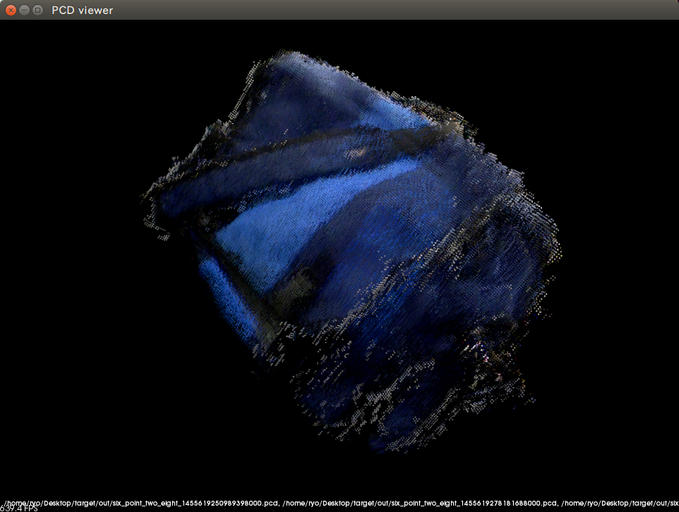

# 3D点群を統合する

誤差を抑えこむために高度な数学を駆使する技巧の限りを尽くしたプログラムを作成する……のは大変そうですから、PCLにどうにかしてもらいましょう。PCLのドキュメントを見ると、Registrationのチュートリアルの[Interactive Iterative Closest Point](http://pointclouds.org/documentation/tutorials/interactive_icp.php)のやり方で出来そうです。このドキュメントの最後にある位置と角度がずれた点群を重ねあわせていくGIFアニメーションを見ると、うん、簡単にできそう。さっそく、やってみましょう。

## Boost Range

点群を統合するには、その前に点群のファイルを読み込む処理を作らないとなりません。処理経過を見るためのビューアーも表示したい。`make_world_models`では360°以上回っていますから、無駄を省くために360°を超えるデータを捨てる処理も書きたい。なので、とりあえずPCLによる点群の統合部分はダミーにして、処理全体をうまく流す呼び出し部分を作ってしまいましょう。

### beginとendって、もうやめた方がよいと思う

まずは、ファイルの読み込み部分から考えてみます。`/tmp`にあるファイルの一覧の取得処理は、`boost::filesystem::directory_iterator`を使えば作れます。`six_point_two_eight`のデータ・ファイルかどうかはファイル名で分かりますから、判定する関数は書けるでしょう。条件が一致するものを集めるのは`std::copy_if`で可能。`boost::filesystem::directory_iterator`が指し示す`boost::filesystem::directory_entry`を文字列に変換する処理は、ラムダ式で書けちゃうくらいに簡単。コレクションの要素の変換は、たしか`std::transform`でできたなぁ。

と考えて、コードを書いてみたら、以下に示すやたらと面倒なコードになっちゃった……。

```cpp
#pragma once

#include <boost/filesystem.hpp>
#include <nodelet/nodelet.h>
#include <ros/ros.h>
#include <thread>

namespace six_point_two_eight {
  class RegisterModels : public nodelet::Nodelet {
  private:
    std::thread working_thread_;

    // six_point_two_eightのファイルの場合かどうか判定します。
    auto isSixPointTwoEightFile(const boost::filesystem::directory_entry& directory_entry) const {
      auto path = directory_entry.path();
      auto file_prefix = std::string("six_point_two_eight_");

      return path.filename().string().substr(0, file_prefix.size()) == file_prefix && path.extension().string() == ".pcd";
    }
    
  public:
    void onInit() {
      working_thread_ = std::thread(
        [&]() {
          // six_point_two_eightのデータ・ファイル（型はdirectory_entry）の集合を作成します。
          std::vector<boost::filesystem::directory_entry> six_point_two_eight_directory_entries;
          std::copy_if(
            boost::filesystem::directory_iterator("/tmp"), boost::filesystem::directory_iterator(),
            std::back_inserter(six_point_two_eight_directory_entries),
            std::bind(&RegisterModels::isSixPointTwoEightFile, this, std::placeholders::_1));

          // six_point_two_eightのデータ・ファイル（型はstring）の集合を作成します。
          std::vector<std::string> six_point_two_eight_path_strings;
          std::transform(
            six_point_two_eight_directory_entries.begin(), six_point_two_eight_directory_entries.end(),
            std::back_inserter(six_point_two_eight_path_strings),
            [](const auto& six_point_two_eight_directory_entry) { return six_point_two_eight_directory_entry.path().string(); });

          // この後に、ファイル読み込み等の処理を似た感じで作る。
        });
    }
  };
}
```

何か作業をするたびにコレクションに値を入れ直している点が、上のコードの致命的な欠陥だと考えます。何か処理をする際には、必ず変数宣言という前処理をしなければならないんですもんね。でも、そうしないと、次の関数の引数の`begin`と`end`を用意できなくなっちゃうし……。C++以外のほとんどの言語では、イテレーターが開始と終了をパックして管理するので`copy_if`の戻り値を`transform`の引数に回すことができるのになぁ。たとえばPythonなら、こんな感じで書けるのに……。

```python
x = map(lambda filename: "/tmp/" + filename, 
        (filter(lambda filename: filename.startswith("six_point_two_eight_") and filename.endswith(".pcd"), 
                os.listdir("/tmp"))))
```

### Boost Rangeに乗り換えよう

C++が`begin`と`end`方式を採用したのは、最も軽量な順次アクセス手段であるポインターをイテレーターとして扱えるようにするためです。その理屈は分かるけれども、高速なCPUで高度なコレクションを扱うときに面倒なコードを強制されるのは、勘弁して欲しい。

と、このように思う人は多かったみたいで、BoostにはRangeというライブラリが含まれています。Rangeは、範囲を持つイテレーター。他の言語での、ごく普通のイテレーター相当ですな。このRangeを使うと、以下のコードのように簡潔に記述できます。名前空間があるので少しゴチャゴチャしているけど、それを除けばPython版とあまり変わりません。

```cpp
auto x =
  boost::adaptors::transform(
    boost::adaptors::filter(
      boost::make_iterator_range(boost::filesystem::directory_iterator(boost::filesystem::path("/tmp")), {}),
      std::bind(&RegisterModels::isSixPointTwoEightFile, this, std::placeholders::_1)),
    [](const auto& directory_entry) { return directory_entry.path().string(); });
```

でもなぁ、処理結果を引数にするコードって、先に処理される関数が後に記述されるので分かりづらいんだよなぁ。AしてBするのに、`B(A())`と書くんだもん。と、このように考える人も多かったみたいで、Rangeはパイプライン記法と呼ばれる機能も提供しています。パイプライン記法を使って先ほどのコードを書き換えた結果は、以下の通り。

```cpp
auto xxx =
  boost::make_iterator_range(boost::filesystem::directory_iterator(boost::filesystem::path("/tmp")), {}) |
  boost::adaptors::filtered(std::bind(&RegisterModels::isSixPointTwoEightFile, this, std::placeholders::_1)) |
  boost::adaptors::transformed([](const auto& directory_entry) { return directory_entry.path().string(); });
```

美しい！　`begin`と`end`はもうやめて、Rangeに乗り換えることにしましょう。

### データ・ファイルを読み込んで、ダミーの点群レジストレーション処理を呼び出して、保存する

Boost Rangeを活用して、点群のレジストレーション以外の処理を作成してしまいましょう。

#### include/six\_point\_two\_eight/point\_cloud\_utilities.h

作成する処理の中で少し難しいのは、360°回転した以降のデータを捨てるところでしょう。この処理を実現するには、360°回転したところの点群かどうかを判断しなければなりませんから。幸いなことにオドメトリーの誤差はそれほど大きくはありませんから、単純に2つの点群がどれだけ重なっているかで判断できそうです。そして、点群の大きさに差はありませんから、PCLのAPIを眺めていた時に見つけた`compute3DCentroid()`で重心を求めて、その距離を測るだけでよいでしょう。というわけで、`getCentroidOfPointCloud2()`関数を宣言しました。あと、データ・ファイルを削除するための`removePointcloud2File()`関数と、もちろん、`loadPointCloud2File()`も。

点群を画面に表示する方法を学ぶために、PCLのチュートリアルの[PCLVisualizer](http://pointcloud.org/documentation/tutorials/pcl_visualizer.php)を見たところ、点群はIDで管理されて更新/削除されるらしい。あと、画面上の点群を区別するに色分けが必要ということで、`std::string id`と`int rgb`を引数に取る`showPointCloud2()`関数を宣言しました。また、どうやらPCLVisualizerは別スレッドを起動して独自に動いてくれるわけではなくて、画面を更新させるには`spinOnce()`メンバー関数の呼び出しが必要みたい。だから、`spinVisualizer()`関数も宣言します。

最後に何もしないダミーの`registerPointCloud2()`関数を作成して、`point_cloud_utilities.h`の更新は完了です。

```cpp
#ifndef SIX_POINT_TWO_EIGHT_POINT_CLOUD_UTILITIES_H
#define SIX_POINT_TWO_EIGHT_POINT_CLOUD_UTILITIES_H

#include <geometry_msgs/Point.h>
#include <sensor_msgs/PointCloud2.h>

namespace six_point_two_eight {
  sensor_msgs::PointCloud2Ptr downsamplePointCloud2(sensor_msgs::PointCloud2ConstPtr points, double leaf_size);
  geometry_msgs::Point getCentroidOfPointCloud2(sensor_msgs::PointCloud2ConstPtr points);  // 追加。
  sensor_msgs::PointCloud2Ptr getSpherePointCloud2(sensor_msgs::PointCloud2ConstPtr points, const geometry_msgs::Point& centroid, double radius);
  sensor_msgs::PointCloud2Ptr loadPointCloud2File(const std::string& file_path); // 追加。
  inline sensor_msgs::PointCloud2Ptr registerPointCloud2(  // 追加。
    sensor_msgs::PointCloud2ConstPtr source_points, sensor_msgs::PointCloud2ConstPtr target_points) 
  {
    return sensor_msgs::PointCloud2Ptr(new sensor_msgs::PointCloud2(*source_points));  // とりあえず、何もしないダミー実装で。
  }
  sensor_msgs::PointCloud2Ptr removeFloorFromPointCloud2(sensor_msgs::PointCloud2ConstPtr points);
  sensor_msgs::PointCloud2Ptr removePointCloud2File(sensor_msgs::PointCloud2ConstPtr points); // 追加。
  sensor_msgs::PointCloud2Ptr savePointCloud2File(sensor_msgs::PointCloud2ConstPtr points);
  sensor_msgs::PointCloud2Ptr showPointCloud2(  // 追加。
    sensor_msgs::PointCloud2ConstPtr points, const std::string& id, int rgb);
  void spinVisualizer();  // 追加。
  sensor_msgs::PointCloud2Ptr transformPointCloud2(sensor_msgs::PointCloud2ConstPtr points, const std::string& target_frame, double z_adjust = 0.0);
}

#endif
```

#### src/point\_cloud\_utilities.cpp

PCLのAPIリファレンスを見ながら、淡々と処理を実装します。APIが揃っていますから、ただ呼び出すだけ。

```cpp
#include <boost/foreach.hpp>
#include <pcl/common/centroid.h>  // 追加。
#include <pcl/filters/conditional_removal.h>
#include <pcl/filters/extract_indices.h>
#include <pcl/filters/voxel_grid.h>
#include <pcl/io/pcd_io.h>
#include <pcl/point_cloud.h>
#include <pcl/point_types.h>
#include <pcl/sample_consensus/method_types.h>
#include <pcl/sample_consensus/model_types.h>
#include <pcl/segmentation/sac_segmentation.h>
#include <pcl/visualization/pcl_visualizer.h>
#include <pcl_conversions/pcl_conversions.h>
#include <pcl_ros/transforms.h>
#include <tf/transform_listener.h>

#include "six_point_two_eight/point_cloud_utilities.h"

namespace point_cloud_utilities {
  typedef pcl::PointXYZRGB Point;
  typedef pcl::PointCloud<Point> PointCloud;

  tf::TransformListener transform_listener_;
  pcl::visualization::PCLVisualizer::Ptr visualizer_;  // 追加。

  // 略。

  // 点群の重心を取得します。
  Eigen::Vector4f getCentroidOfPointCloud(PointCloud::ConstPtr point_cloud) {
    Eigen::Vector4f centroid;
    pcl::compute3DCentroid(*point_cloud, centroid);
    
    return centroid;
  }
 
  // 文字列をunsigned longに変換します。
  unsigned long strtoul(const std::string& string) {
    char* e = 0;
    return std::strtoul(string.c_str(), &e, 10);
  }
  
  // 点群のデータ・ファイル（*.pcd）を読み込みます。
  PointCloud::Ptr loadPointCloudFile(const std::string& file_path) {
    PointCloud::Ptr loaded_point_cloud(new PointCloud());
    pcl::io::loadPCDFile(file_path, *loaded_point_cloud);

    // ファイルにはROSヘッダーに相当する情報がないので、独自に設定します。
    std_msgs::Header header;
    header.stamp = ros::Time().fromNSec(point_cloud_utilities::strtoul(file_path.substr(file_path.size() - 4 - 19, 19)));
    loaded_point_cloud->header = pcl_conversions::toPCL(header);
    
    return loaded_point_cloud;
  }

  std::string filePathString(PointCloud::ConstPtr point_cloud) {
    std::stringstream file_path_stringstream;
    file_path_stringstream << "/tmp/six_point_two_eight_" << std::setfill('0') << std::setw(19) << pcl_conversions::fromPCL(point_cloud->header).stamp.toNSec() << ".pcd";

    return file_path_stringstream.str();
  }

  // 略。

  // 点群のデータ・ファイルを削除します。
  PointCloud::Ptr removePointCloudFile(PointCloud::ConstPtr point_cloud) {
    std::remove(filePathString(point_cloud).c_str());

    return PointCloud::Ptr(new PointCloud(*point_cloud));
  }

  // 点群を表示します。
  PointCloud::Ptr showPointCloud(PointCloud::ConstPtr point_cloud, const std::string& id, int rgb) {
    // PCLVisualizerのインスタンスが生成されていない場合は、生成します。
    if (!visualizer_) {
      visualizer_.reset(new pcl::visualization::PCLVisualizer("Viewer"));
    }

    // 点群の表示色を作成します。
    pcl::visualization::PointCloudColorHandlerCustom<Point> point_cloud_color(point_cloud, (rgb >> 16) & 0x00ff, (rgb >> 8) & 0x00ff, rgb & 0x00ff);
    
    // 点群を表示します。
    if (!visualizer_->updatePointCloud(point_cloud, point_cloud_color, id)) {  // 追加の場合は、
      visualizer_->addPointCloud(point_cloud, point_cloud_color, id);          // 色と表示方法を設定します。
      visualizer_->setPointCloudRenderingProperties(pcl::visualization::PCL_VISUALIZER_POINT_SIZE, 1, id);
    }
    
    return PointCloud::Ptr(new PointCloud(*point_cloud));
  }

  // PCLVisualizerを再描画します。
  void spinVisualizer() {
    visualizer_->spinOnce(100);
  }
  
  // 略。
}

// 略。

geometry_msgs::Point six_point_two_eight::getCentroidOfPointCloud2(sensor_msgs::PointCloud2ConstPtr points) {
  Eigen::Vector4f centroid = point_cloud_utilities::getCentroidOfPointCloud(point_cloud_utilities::fromROSMsg(points));

  // Eigen::Vector4fをgeometry_msgs::Pointに変換します。
  geometry_msgs::Point point;
  point.x = centroid.x();
  point.y = centroid.y();
  point.z = centroid.z();

  return point;
}

// 略。

sensor_msgs::PointCloud2Ptr six_point_two_eight::loadPointCloud2File(const std::string& file_path) {
  return point_cloud_utilities::toROSMsg(point_cloud_utilities::loadPointCloudFile(file_path));
}

// 略。

sensor_msgs::PointCloud2Ptr six_point_two_eight::removePointCloud2File(sensor_msgs::PointCloud2ConstPtr points) {
  return point_cloud_utilities::toROSMsg(point_cloud_utilities::removePointCloudFile(point_cloud_utilities::fromROSMsg(points)));
}

// 略。

sensor_msgs::PointCloud2Ptr six_point_two_eight::showPointCloud2(sensor_msgs::PointCloud2ConstPtr points, const std::string& id, int rgb) {
  return point_cloud_utilities::toROSMsg(point_cloud_utilities::showPointCloud(point_cloud_utilities::fromROSMsg(points), id, rgb));
}

void six_point_two_eight::spinVisualizer() {
  point_cloud_utilities::spinVisualizer();
}

sensor_msgs::PointCloud2Ptr six_point_two_eight::transformPointCloud2(sensor_msgs::PointCloud2ConstPtr points, const std::string& target_frame, double x_adjust) {
  return point_cloud_utilities::toROSMsg(point_cloud_utilities::transformPointCloud(point_cloud_utilities::fromROSMsg(points), target_frame, x_adjust));
}
```

#### include/six\_point\_two\_eight/register\_models.h

メインの処理です。ちょっと複雑なので、コメントをいっぱい入れてみました。`onInit()`の前半ではBoost Rangeを使って快調にプログラミングできたのですけれど、二周目の点群のインデックスの取得や点群のレジストレーションではBoost Rangeでキレイに処理を書けませんでした……。なので、別関数に抜き出して隠しました。

二周目の点群のインデックス取得処理（`getNextRoundStartingIndex()`）では、上で述べたように点群の重心間の距離で判断しています。一番距離が近い点群の「インデックス」を取得するのですけれど、インデックス化に必要なUbuntu 14.04のBoost 1.54の`boost::adaptors::indexed`は使いづらかった（1.60のだと使いやすそう）ので、`for`ループで実現しました。あと、1番目と2番目の点群の重心の距離は近いでしょうから、処理の対象は点群の集合の後ろ半分としています。

点群の表示(`shorPointCloud2()`)では、点群のIDと色が毎回同じになるように、点群のタイムスタンプを使用しました。

点群のレジストレーション処理（`registerPointCloud2s()`）では、最初の点群に2番目の点群をレジストレーションした結果に3番目の点群をレジストレーションした結果に4番目の……と繰り返して処理が続きます。これは、関数型言語での`reduce`とか`fold`と呼ばれる処理パターンですね。C++の場合は名前が変わって、`accumulate`になります。`accumulate`に渡すラムダ式の中では、どこまで処理が進んだかを我々にレポートさせるために`ROS_INFO_STREAM`でログ出力し、レジストレーションして表示してレジストレーション済み点群の集合に追加して、次のターンのためにレジストレーション済み点群の集合をリターンしています。

あと、`make_world_models`の結果の統合では二周目の点群を削除、`make_target_models`なら何もしないように分岐しなければなりません。これは、パラメーターで実現することにしましょう。`Nodelet`でパラメーターを取得するには、`getPrivateNodeHandle().getParam("パラメーター名", 変数)`とします。

```cpp
#pragma once

#include <boost/filesystem.hpp>
#include <boost/range.hpp>
#include <boost/range/adaptors.hpp>
#include <boost/range/algorithm.hpp>
#include <boost/range/numeric.hpp>
#include <limits>
#include <nodelet/nodelet.h>
#include <ros/ros.h>
#include <thread>

#include <sensor_msgs/PointCloud2.h>

#include "six_point_two_eight/point_cloud_utilities.h"
#include "six_point_two_eight/utilities.h"

namespace six_point_two_eight {
  class RegisterModels : public nodelet::Nodelet {
  private:
    bool cut_next_round_;
    std::thread working_thread_;

    // six_point_two_eightのデータ・ファイルかどうかを判定します。
    auto isSixPointTwoEightFile(const boost::filesystem::directory_entry& directory_entry) const {
      auto path = directory_entry.path();
      auto file_prefix = std::string("six_point_two_eight_");

      return path.filename().string().substr(0, file_prefix.size()) == file_prefix && path.extension().string() == ".pcd";
    }

    // 二周目の点群のインデックスを計算します。
    // 最初の点群の重心に最も近い重心を持つ点群を一周目の最後とみなして、処理を実施します。
    auto getNextRoundStartingIndex(const std::vector<sensor_msgs::PointCloud2ConstPtr>& point_clouds) const {
      auto next_round_starting_index = point_clouds.size();

      // Ubuntu14.04のBoostのバージョンは1.54で、1.54のboost::adaptors::indexedはとても使いづらいです。
      // なので、forループで実装しました。
      
      // これまでで最小の重心間の距離。
      auto min_distance = std::numeric_limits<double>::max();
      for (auto i = point_clouds.size() / 2; i < point_clouds.size(); ++i) {
        // 重心を計算します。
        auto centroid_1 = getCentroidOfPointCloud2(point_clouds[0]);
        auto centroid_2 = getCentroidOfPointCloud2(point_clouds[i]);

        // 重心間の距離を計算します。
        auto distance = std::sqrt(std::pow(centroid_1.x - centroid_2.x, 2) + std::pow(centroid_1.y - centroid_2.y, 2));  // 上下には動かないので、zは無視します。
        // もし、重心間の距離がこれまでの点群よりも小さいなら、そこを一周目の終わり（仮）とします。
        if (distance < min_distance) {
          min_distance = distance;
          next_round_starting_index = i + 1;  // 計算対象は二周目の最初なので、+1します。
        }
      }

      return next_round_starting_index;
    }

    // 点群を表示します。
    auto showPointCloud2(sensor_msgs::PointCloud2ConstPtr point_cloud) const {
      std::vector<int> colors{0x00ff0000, 0x00ffff00, 0x0000ffff, 0x000000ff, 0x00ff00ff};

      std::stringstream id;
      id << point_cloud->header.stamp;

      return six_point_two_eight::showPointCloud2(point_cloud, id.str(), colors[(point_cloud->header.stamp.toNSec() / 1000) & colors.size()]);
    }

    // 点群の集合を表示します。
    auto showPointCloud2s(const std::vector<sensor_msgs::PointCloud2ConstPtr>& point_clouds) {
      boost::for_each(point_clouds, std::bind(&RegisterModels::showPointCloud2, this, std::placeholders::_1));
    }

    // 点群の集合をレジストレーションします。
    auto registerPointCloud2s(const std::vector<sensor_msgs::PointCloud2ConstPtr>& point_clouds) const {
      // Ubuntu14.04のBoostのバージョンは1.54で、1.54のboost::adaptors::indexedが使いづらいので、変数管理します。
      int index = 1;
      
      return
        boost::accumulate(
          point_clouds | boost::adaptors::sliced(1, boost::distance(point_clouds)),  // レジストレーションするのは、2番目の点群から。
          std::vector<sensor_msgs::PointCloud2ConstPtr>{point_clouds.front()},       // 1番目の点群は、レジストレーション不要。
          [&](auto& registered_point_clouds, const auto& point_cloud) {
            ROS_INFO_STREAM("Register " << index++ << "/" << (point_clouds.size() - 1) << ".");
            
            registered_point_clouds.push_back(
              this->showPointCloud2(
                registerPointCloud2(point_cloud, registered_point_clouds.back())));  // レジストレーション済みの最後の点群に、レジストレーションします。

            spinVisualizer();
            
            return registered_point_clouds;
          });
    }
    
  public:
    void onInit() {
      // パラメーターを取得します。
      getPrivateNodeHandle().getParam("cut_next_round", cut_next_round_);
      
      working_thread_ = std::thread(
        [&]() {
          // boost::sort()はRandom Access Rangeを要求するので、std::vectorに変換します。
          std::vector<std::string> six_point_two_eight_file_paths;
          boost::copy(
            // ファイル一覧を作成して、
            boost::make_iterator_range(boost::filesystem::directory_iterator(boost::filesystem::path("/tmp")), {}) |
            // six_point_two_eightのファイルだけを抽出して、
            boost::adaptors::filtered(std::bind(&RegisterModels::isSixPointTwoEightFile, this, std::placeholders::_1)) |
            // 文字列に変換します。
            boost::adaptors::transformed([](const auto& directory_entry) { return directory_entry.path().string(); }),
            std::back_inserter(six_point_two_eight_file_paths));
          
          // ファイル名（時刻がファイル名に含まれているので、時刻順になる）でソートします。
          boost::sort(six_point_two_eight_file_paths);
          
          // 後の処理で複数回使用したいので、std::vectorに変換しておきます。
          std::vector<sensor_msgs::PointCloud2ConstPtr> point_clouds;
          boost::copy(
            // ファイルを読み込みます。
            six_point_two_eight_file_paths | boost::adaptors::transformed(loadPointCloud2File),
            std::back_inserter(point_clouds));
          
          // make_world_modelsのデータの場合に備えて、データを一周分に制限します。
          if (cut_next_round_) {
            auto next_round_starting_index = getNextRoundStartingIndex(point_clouds);

            // 一周目のデータを抽出します。
            std::vector<sensor_msgs::PointCloud2ConstPtr> this_round_point_clouds;
            boost::copy(
              point_clouds | boost::adaptors::sliced(0, next_round_starting_index),
              std::back_inserter(this_round_point_clouds));

            // 無関係なファイルが残っていると混乱するので、削除します。
            boost::for_each(
              point_clouds | boost::adaptors::sliced(next_round_starting_index, boost::distance(point_clouds)),
              removePointCloud2File);

            // 一周目のデータを、レジストレーションの対象に設定。
            point_clouds = this_round_point_clouds;
          }

          // とりあえず、表示します。
          this->showPointCloud2s(point_clouds);
          spinVisualizer();

          // 点群をレジストレーションします。
          std::vector<sensor_msgs::PointCloud2ConstPtr> registered_point_clouds;
          boost::copy(
            // レジストレーションした結果を、
            this->registerPointCloud2s(point_clouds) |
            // 保存します。
            boost::adaptors::transformed(savePointCloud2File),
            std::back_inserter(registered_point_clouds));
          
          // 結果を表示します。
          this->showPointCloud2s(registered_point_clouds);
          while (ros::ok()) {
            spinVisualizer();
          }
        });
    }
  };
}
```

#### src/six\_point\_two\_eight.cpp

`register_models.h`がコンパイルされるように`#include`して、`six_point_two_eight::RegisterModels`をエクスポートしましょう。

```cpp
#include <pluginlib/class_list_macros.h>

#include "six_point_two_eight/get_point_cloud_2_server.h"
#include "six_point_two_eight/make_target_models.h"
#include "six_point_two_eight/make_world_models.h"
#include "six_point_two_eight/move_base_server.h"
#include "six_point_two_eight/point_cloud_2_throttle.h"
#include "six_point_two_eight/register_models.h"  // 追加。

PLUGINLIB_EXPORT_CLASS(six_point_two_eight::GetPointCloud2Server, nodelet::Nodelet)
PLUGINLIB_EXPORT_CLASS(six_point_two_eight::MakeTargetModels, nodelet::Nodelet)
PLUGINLIB_EXPORT_CLASS(six_point_two_eight::MakeWorldModels, nodelet::Nodelet)
PLUGINLIB_EXPORT_CLASS(six_point_two_eight::MoveBaseServer, nodelet::Nodelet)
PLUGINLIB_EXPORT_CLASS(six_point_two_eight::PointCloud2Throttle, nodelet::Nodelet)
PLUGINLIB_EXPORT_CLASS(six_point_two_eight::RegisterModels, nodelet::Nodelet)  // 追加。
```

#### six\_point\_two\_eight.xml

いつものように、`Nodelet`に名前を付けてください。本稿で`six_point_two_eight.xml`を編集するのはこれで最後、単純作業はもうありませんのでご安心を。

```xml
<library path="lib/libsix_point_two_eight">
  <class name="six_point_two_eight/get_point_cloud_2_server" type="six_point_two_eight::GetPointCloud2Server" base_class_type="nodelet::Nodelet"/>
  <class name="six_point_two_eight/make_target_models" type="six_point_two_eight::MakeTargetModels" base_class_type="nodelet::Nodelet"/>
  <class name="six_point_two_eight/make_world_models" type="six_point_two_eight::MakeWorldModels" base_class_type="nodelet::Nodelet"/>
  <class name="six_point_two_eight/move_base_server" type="six_point_two_eight::MoveBaseServer" base_class_type="nodelet::Nodelet"/>
  <class name="six_point_two_eight/point_cloud_2_throttle" type="six_point_two_eight::PointCloud2Throttle" base_class_type="nodelet::Nodelet"/>
  // 追加。
  <class
    name="six_point_two_eight/register_models"
    type="six_point_two_eight::RegisterModels"
    base_class_type="nodelet::Nodelet"/>
</library>
```

#### launch/register\_models.launch

起動用の`launch`ファイルを作成します。パラメーターの値は、`register_models.launch`を`<include>`する`register_world_models.launch`と`register_target_models.launch`に設定させるようにしましょう。

```xml
<launch>
  <arg name="cut_next_round"/>
  
  <node pkg="nodelet" type="nodelet" name="six_point_two_eight_nodelet_manager" args="manager" output="screen"/>
  <node pkg="nodelet" type="nodelet" name="register_models" args="load six_point_two_eight/register_models six_point_two_eight_nodelet_manager" output="screen">
    <param name="cut_next_round" value="$(arg cut_next_round)"/>
  </node>
</launch>
```

#### launch/register\_world\_models.launch

`make_world_models`の結果の統合用の`launch`ファイルでは、`cut_next_round`を`true`に。

```xml
<launch>
  <include file="$(find six_point_two_eight)/launch/register_models.launch">
    <arg name="cut_next_round" value="true"/>
  </include>
</launch>
```

#### launch/register\_target\_models.launch

そして、`make_world_models`の結果の統合用の`launch`ファイルでは、`cut_next_round`を`false`に設定します。

```xml
<launch>
  <include file="$(find six_point_two_eight)/launch/register_models.launch">
    <arg name="cut_next_round" value="false"/>
  </include>
</launch>
```

## PCLを使用して、点群をレジストレーションする

というわけで、PCLを使った点群のレジストレーションをやってみましょう。

### CUIは便利

最初に断っておきますが、ここから先では、けっこう試行錯誤します。`make_world_models`でデータ作成→`register_world_models`でデータ統合をやる方式だと、実施する回数が多いのでかなり大変でしょう。`make_world_models`や`make_target_models`の結果を、適当なディレクトリに退避しておいてください。以下のような感じ。

```bash
$ rm -f /tmp/six_point_two_eight_*.pcd && roslaunch six_point_two_eight make_world_models.launch
$ mkdir -p ~/Desktop/world/in && cp /tmp/six_point_two_eight_*.pcd ~/Desktop/world/in
$ rm -f /tmp/six_point_two_eight_*.pcd && roslaunch six_point_two_eight make_target_models.launch
$ mkdir -p ~/Desktop/target/in && cp /tmp/six_point_two_eight_*.pcd ~/Desktop/target/in
```

`register_models`のコードを修正した後は、以下のコマンドでテストしてください。

```bash
$ catkin_make && rm -f /tmp/six_point_two_eight_*.pcd && cp ~/Desktop/world/in/six_point_two_eight_*.pcd /tmp && roslaunch six_point_two_eight register_world_models.launch
```

```bash
$ catkin_make && rm -f /tmp/six_point_two_eight_*.pcd && cp ~/Desktop/target/in/six_point_two_eight_*.pcd /tmp && roslaunch six_point_two_eight register_target_models.launch
```

入力が面倒だというなら、もちろんシェル・スクリプトを作成しても構いません。うん、CUIって便利ですね。

### チュートリアルに従ってみる

PCLのチュートリアルの[How to use iterative closest point](http://pointclouds.org/documentation/tutorials/iterative_closest_point.php)を参考に、プログラムを組んでみましょう。

#### include/six\_point\_two\_eight/point\_cloud\_utilities.h

ダミー実装を削除します。

```cpp
// 略。

namespace six_point_two_eight {
  sensor_msgs::PointCloud2Ptr downsamplePointCloud2(sensor_msgs::PointCloud2ConstPtr points, double leaf_size);
  geometry_msgs::Point getCentroidOfPointCloud2(sensor_msgs::PointCloud2ConstPtr points);
  sensor_msgs::PointCloud2Ptr getSpherePointCloud2(sensor_msgs::PointCloud2ConstPtr points, const geometry_msgs::Point& centroid, double radius);
  sensor_msgs::PointCloud2Ptr loadPointCloud2File(const std::string& file_path);
  sensor_msgs::PointCloud2Ptr registerPointCloud2(  // 修正。
    sensor_msgs::PointCloud2ConstPtr source_points, sensor_msgs::PointCloud2ConstPtr target_points);
  sensor_msgs::PointCloud2Ptr removeFloorFromPointCloud2(sensor_msgs::PointCloud2ConstPtr points);
  sensor_msgs::PointCloud2Ptr removePointCloud2File(sensor_msgs::PointCloud2ConstPtr points);
  sensor_msgs::PointCloud2Ptr savePointCloud2File(sensor_msgs::PointCloud2ConstPtr points);
  sensor_msgs::PointCloud2Ptr showPointCloud2(sensor_msgs::PointCloud2ConstPtr points, const std::string& id, int rgb);
  void spinVisualizer();
  sensor_msgs::PointCloud2Ptr transformPointCloud2(sensor_msgs::PointCloud2ConstPtr points, const std::string& target_frame, double z_adjust = 0.0);
}
```

#### src/point\_cloud\_utilities.cpp

チュートリアルを参考に、実装を書きます。チュートリアルで使用している`pcl::IterativceClosestPoint::setInputCloud()`の使用は推奨されていないみたいなので、`setInputSource()`に変えました。

```cpp
#include <boost/foreach.hpp>
#include <pcl/common/centroid.h>
#include <pcl/filters/conditional_removal.h>
#include <pcl/filters/extract_indices.h>
#include <pcl/filters/voxel_grid.h>
#include <pcl/io/pcd_io.h>
#include <pcl/point_cloud.h>
#include <pcl/point_types.h>
#include <pcl/registration/icp.h>  // 追加。
#include <pcl/sample_consensus/method_types.h>
#include <pcl/sample_consensus/model_types.h>
#include <pcl/segmentation/sac_segmentation.h>
#include <pcl/visualization/pcl_visualizer.h>
#include <pcl_conversions/pcl_conversions.h>
#include <pcl_ros/transforms.h>
#include <tf/transform_listener.h>

#include "six_point_two_eight/point_cloud_utilities.h"

namespace point_cloud_utilities {
  // 略。
  
  PointCloud::Ptr registerPointCloud(PointCloud::ConstPtr source_point_cloud, PointCloud::ConstPtr target_point_cloud) {
    pcl::IterativeClosestPoint<Point, Point> icp;
    icp.setInputSource(source_point_cloud);
    icp.setInputTarget(target_point_cloud);

    PointCloud::Ptr registered_point_cloud(new PointCloud());
    icp.align(*registered_point_cloud);

    if (!icp.hasConverged()) {
      ROS_WARN_STREAM("Can't register...");
      throw std::exception();
    }
    
    return registered_point_cloud;
  }

  // 略。
}

// 略。

sensor_msgs::PointCloud2Ptr six_point_two_eight::registerPointCloud2(
  sensor_msgs::PointCloud2ConstPtr source_points, sensor_msgs::PointCloud2ConstPtr target_points) 
{
  return
    point_cloud_utilities::toROSMsg(
      point_cloud_utilities::registerPointCloud(
        point_cloud_utilities::fromROSMsg(source_points),
        point_cloud_utilities::fromROSMsg(target_points)));
}

// 略。
```

#### 実行してみると、全然駄目……

プログラムが出来上がったので試してみると、これがもう、全然駄目……。


`register_world_models`なんて、プログラムで処理する前の方がまともだったりします。どうしましょ？

### 残りのチュートリアルを読んでみる

とりあえず、残りのチュートリアルも読んでみましょう。

#### How to incrementally register pair of clouds

法線を使って処理しているみたい。あと、`pcl::IterativeClosestPointNonLinear`ってのを使っています。で、コード中で呼び出している`setTransformationEplilon()`と`setMaxCorrespondenceDistance()`と`setPointRepresentation()`って何？

#### Interactive Iterative Closest Point

先ほど作成した失敗コードと同じやり方。でも、ドキュメント上では、ピッタリとレジストレーションできています。でも、このGIFアニメの点群って、移動と回転をさせた同じ点群なのでは？　我々が今苦労している、異なる点群のレジストレーションとは条件が違うのかと……。

#### How to use Normal Distribution Transform

`pcl::IterativeClosestPoint`クラスじゃなくて、`pcl::NormalDistributionsTransform`クラスってのを使っています。レジストレーションのアルゴリズムって、複数あるみたいですね。Normal Distribution Transformアルゴリズムは、点群が大きい時に有効だと書いてある……。

#### 試してみる

ここまでで、適当にコードを真似して試してみました。結果は、かなり良くはなるけれど、それでもまだ誤差が大きくて駄目。`register_world_models`では、一周しても最初の場所に戻りません。`register_target_models`では、途中であらぬ方行にずれてしまいます。実行にやたらと時間がかかるし。

……アルゴリズムとパラメーターについて真面目に調べないと駄目みたいですね。

### リファレンスを読んでみる

そう、リファレンスを読めば、アルゴリズムとパラメーターを理解できるはず。読んでみました。

#### pcl::IterativeClosestPointのリファレンス

[pcl::IterativeClosestPointのリファレンス](http://docs.pointclouds.org/trunk/classpcl_1_1_iterative_closest_point.html)を読んでみると、Iterative Closest Pointアルゴリズムの基本実装だって書いてあります。ということは、応用があるってことかなぁと。継承関係の図を見ると、`pcl::IterativeClosestPointNonLinear`と`pcl::IterativeClosestPointWithNormals`と`pcl::JointIterativeClosestPoint`の3つの派生クラスが見つかりました。

あと、3つの終了条件があると書いてあります。

1. 繰り返しの回数（`setMaximumIterations()`で設定）
2. 一回前の座標変換と今回の座標変換の間の差（`setTransformationEpsilon()`で設定）
3. ユークリッド座標系での差の合計（`setEuclideanFitnessEpsilon()`で設定）

でも、メンバー関数のドキュメントを見ても詳細は載っておらず、単位が何なのかすら分かりません……。1はともかくとして、2と3は何をどんなふうに指定するんでしょうか？　単位が推測できる1の繰り返しの回数も、1万と10万で実行時間が変わらないんだけど、一体どういうこと？

リファレンス中にサンプル・コードもありました。その中で`setMaxCorrespondenceDistance()`で何か設定していて、設定した値よりも離れた点の対応は無視されると書いてあるけど、無視するってのはどういう意味なのでしょうか？

#### pcl::IterativeClosestPointNonLinearのリファレンス

Levenberg-Marquard法を取り入れたと書いてあります。それ以外は`pcl::IterativeClosestPoint`と同じ。Levenberg-Marquard法ってのを少し調べてみると、局所解に陥るのをうまいこと防ぎながら、それでいて速く答えを探してくれるアルゴリズムみたい。試してみると、`pcl::IterativeClosestPoint`では中途半端にしかレジスターしない場合にも、`pcl::IterativeClosestPointNonlinear`だとさらに探索してくれました。遅いですけどね。

#### pcl::IterativeClosestPointWithNomalのリファレンス

解説が1行しか書いてなくて、なんだか分かりませんでした……。名前からして、法線を使うんでしょう。法線を使うバージョンはチュートリアルのところでも試してみたけど、あまりうまくいきませんでした。ごちゃごちゃしていて面があまりないデータだからかなぁと。だから、このクラスは無視で。

#### pcl::JointIterativeClosestPointのリファレンス

同じ座標変換を共有する複数のフレーム向け（multiple frames which sare the same transform）って書いてあるけど、意味がわかりません……。続いて"This is particularly useful when solving for camera extrinsics using multiple observations"って書いてあるけど、どんな場合に有効なのかすら分かりません……。

#### pcl::NormalDistributionsTransformのリファレンス

論文を読むように書いてありました……。でも論文はダウンロード出来ませんでした。あとでもう一度試すことにしよう。

#### 試してみる

`pcl::IterativeClosestPoint`と`pcl::IterativeClosestPointNonLinear`を試してみました。`pcl::IterativeClosestPointNonLinear`の方が、大きな間違いをしないようです。今回は`pcl::InteractiveClosestPointNonLinear`を使うことにしましょう。

パラメーターもいろいろな値を試してみました。`setMaxCorrespondenceDistance()`を0.05のような小さな値にすると精度が高まるのですけど、「Not enough correspondences found. Relax your threshold parameters」と表示されてエラーになってしまう場合もありました。`setMaximumIterations()`と`setTransformationEpsilon()`と`setEuclideanFitnessEpsilon()`については、動作が変わる場合と変わらない場合があって、なんだか分かりません。

……結局、ドキュメントの品質が低いことだけが分かりました。具体的なコードがどこかにないかなぁ。

### テスト・コードを読んでみる

PCLはオープン・ソースなので、ソース・コードのダウンロードが可能です。`git clone http://github.com/PointCloudLibrary/pcl.git`して、テストのコードを見てみましょう。

#### test_fpcs_ia.cpp、test_kfpcs_ia.cpp

これまでに見つけた以外にも、`pcl::registration::FPCSInitialAlignment`クラスと`pcl::registration::KFPCSInitialAlignment`クラスでもレジストレーションできることが分かりました。ただ、すでに手を広げすぎているので、これらのクラスは次の機会に調査することにしましょう。

#### test_registration.cpp

コードを読んだら、`pcl::JointIterativeClosestPoint`クラスの用途が分かりました。ソースとターゲットの両方に複数の点群を設定し、ソース群からターゲット群への座標変換を計算するためのクラスみたいです。やっぱりコードがあると、いろいろ明確になるなぁ。今回の処理には無関係でしたけど。

あと、`pcl::registration::CorresondenceRejector`クラスのサブ・クラスを使うと、対応する点だとみなさない条件を付加できることも分かりました。ただ、ドキュメントで`CorresondenceRejector`のサブ・クラスを調べた限りでは、今回の処理に役立ちそうなのは見つかりませんでした。残念。

`setMaxCorrespondenceDistance()`の使い方も、分かりました。対応する点とみなす距離のしきい値なんですね。値を小さくすると遠くの点に引っ張られておかしなレジストレーションをする危険性が減って精度が上がって、でも値が小さすぎると対応する点が見つからないのでレジストレーション出来なくてエラーになるというわけ。

#### 試してみる

`setMaxCorrespondenceDistance()`については、試した限りでは推測通りの動きをしました。大きめの値でレジストレーションしたあとに、小さめの値でレジストレーションすれば良さそうです。

テスト熱中症の方たちの言うとおり、テスト・コードはドキュメントなんですね。テスト・コードはとても有用でした。でも、`setMaximumIterations()`と`setTransformationEpsilon()`と`setEuclideanFitnessEpsilon()`については、まだ分かりません。動きが分からないと、どうにもならなそうです。

### ログを出力してみる

PCLはエラーの場合しかログを出力してくれない、ROSのドキュメントに従ってログ・レベルを変更してもログが増えないと思っていたのですけど、PCLのログ・レベルはROSとは別に設定しなければならないことが分かりました。

#### src/point\_cloud\_utilities.cpp

`align()`のところの、ログ・レベルを変更しました。PCLのログ・レベルの設定は、`pcl::console::setVerbosityLevel()`関数で実施します。

```cpp
PointCloud::Ptr registerPointCloud(PointCloud::ConstPtr source_point_cloud, PointCloud::ConstPtr target_point_cloud) {
  // 実験で精度が高かった、IterativeClosestPointNonLinearを使用します。
  pcl::IterativeClosestPointNonLinear<Point, Point> icp;
  icp.setInputSource(source_point_cloud);
  icp.setInputTarget(target_point_cloud);

  // 遠くの点に引きづられないように、近くの点同士を対応付けるようにします。
  icp.setMaxCorrespondenceDistance(0.1);
    
  // デバッグのために、ログ・レベルを設定します。
  pcl::console::VERBOSITY_LEVEL verbosity_level = pcl::console::getVerbosityLevel();
  pcl::console::setVerbosityLevel(pcl::console::L_DEBUG);
    
  PointCloud::Ptr registered_point_cloud(new PointCloud());
  icp.align(*registered_point_cloud);

  // ログ・レベルを元に戻します。
  pcl::console::setVerbosityLevel(verbosity_level);
    
  if (!icp.hasConverged()) {
    ROS_WARN_STREAM("Can't register...");
    throw std::exception();
  }
    
  return registered_point_cloud;
}
```

実行して、ログを調べましょう。

```
[ INFO] [1458613763.391897758]: Register 1/18.
[pcl::registration::TransformationEstimationLM::estimateRigidTransformation] LM solver finished with exit code 1, having a residual norm of 2.97591. 
Final solution: [0.002378 0.001121 -0.001424 -0.000064 -0.000951 -0.002097]
[pcl::DefaultConvergenceCriteria::hasConverged] Iteration 1 out of 10.
[pcl::DefaultConvergenceCriteria::hasConverged] Current transformation gave 0.999989 rotation (cosine) and 0.000009 translation.
[pcl::DefaultConvergenceCriteria::hasConverged] Previous / Current MSE for correspondences distances is: 179769313486231570814527423731704356798070567525844996598917476803157260780028538760589558632766878171540458953514382464234321326889464182768467546703537516986049910576551282076245490090389328944075868508455133942304583236903222948165808559332123348274797826204144723168738177180919299881250404026184124858368.000000 / 0.000269.
[pcl::registration::TransformationEstimationLM::estimateRigidTransformation] LM solver finished with exit code 1, having a residual norm of 3.00172. 
Final solution: [0.001883 0.000129 -0.001032 -0.000765 -0.000606 -0.001603]
[pcl::DefaultConvergenceCriteria::hasConverged] Iteration 2 out of 10.
[pcl::DefaultConvergenceCriteria::hasConverged] Current transformation gave 0.999993 rotation (cosine) and 0.000005 translation.
[pcl::DefaultConvergenceCriteria::hasConverged] Previous / Current MSE for correspondences distances is: 0.000269 / 0.000270.
[pcl::registration::TransformationEstimationLM::estimateRigidTransformation] LM solver finished with exit code 1, having a residual norm of 3.04932. 
Final solution: [0.001608 0.001652 -0.002038 -0.000862 -0.001092 -0.002114]

（略）

[pcl::DefaultConvergenceCriteria::hasConverged] Iteration 7 out of 10.
[pcl::DefaultConvergenceCriteria::hasConverged] Current transformation gave 0.999990 rotation (cosine) and 0.000006 translation.
[pcl::DefaultConvergenceCriteria::hasConverged] Previous / Current MSE for correspondences distances is: 0.000305 / 0.000314.
[pcl::registration::TransformationEstimationLM::estimateRigidTransformation] LM solver finished with exit code 1, having a residual norm of 3.39458. 
Final solution: [0.000741 0.002286 -0.000316 -0.000582 -0.000212 -0.002052]
[pcl::DefaultConvergenceCriteria::hasConverged] Iteration 8 out of 10.
[pcl::DefaultConvergenceCriteria::hasConverged] Current transformation gave 0.999991 rotation (cosine) and 0.000006 translation.
[pcl::DefaultConvergenceCriteria::hasConverged] Previous / Current MSE for correspondences distances is: 0.000314 / 0.000331.
[pcl::registration::TransformationEstimationLM::estimateRigidTransformation] LM solver finished with exit code 1, having a residual norm of 3.44345. 
Final solution: [0.000557 0.002939 0.000277 -0.000344 0.000082 -0.002317]
[pcl::DefaultConvergenceCriteria::hasConverged] Iteration 9 out of 10.
[pcl::DefaultConvergenceCriteria::hasConverged] Current transformation gave 0.999989 rotation (cosine) and 0.000009 translation.
[pcl::DefaultConvergenceCriteria::hasConverged] Previous / Current MSE for correspondences distances is: 0.000331 / 0.000339.
[pcl::registration::TransformationEstimationLM::estimateRigidTransformation] LM solver finished with exit code 1, having a residual norm of 3.50634. 
Final solution: [0.000586 -0.000040 -0.000448 -0.001298 -0.000152 -0.000817]
[pcl::DefaultConvergenceCriteria::hasConverged] Iteration 10 out of 10.
Transformation is:
	0.999138	0.040513	-0.009068	0.012273
	-0.040389	0.999094	0.013426	0.017471
	0.009603	-0.013048	0.999869	-0.008465
	0.000000	0.000000	0.000000	1.000000
```

`Iteration`が10回で終わってしまっています。ログ中の`Current transformation`は、繰り返しあたりの座標変換だと思われます。`Previous / Current MSE for correspondences distances`というのは、一つ前と今回の繰り返しでのレジストレーション後のズレでしょう。このログから、10回目でもまだ座標変換をしていて、ズレが減るどころか増えていることが分かります。`setMaxIterationCounts()`が必要でしょう。

#### setMaxIterationCounts()

コードに、`setMaxIterationCounts()`を追加しました。繰り返し回数は、少し多めに500回としています。

```cpp
PointCloud::Ptr registerPointCloud(PointCloud::ConstPtr source_point_cloud, PointCloud::ConstPtr target_point_cloud) {
  pcl::IterativeClosestPointNonLinear<Point, Point> icp;
  icp.setInputSource(source_point_cloud);
  icp.setInputTarget(target_point_cloud);

  icp.setMaxCorrespondenceDistance(0.1);  // 遠くの点に引きづられないように、近くの点同士を対応付けるようにします。
  
  // 繰り返しの回数を設定します。
  icp.setMaximumIterations(500);
    
  pcl::console::VERBOSITY_LEVEL verbosity_level = pcl::console::getVerbosityLevel();  // デバッグのために、ログ・レベルを設定します。
  pcl::console::setVerbosityLevel(pcl::console::L_DEBUG);
    
  PointCloud::Ptr registered_point_cloud(new PointCloud());
  icp.align(*registered_point_cloud);

  pcl::console::setVerbosityLevel(verbosity_level);  // ログ・レベルを元に戻します。
    
  if (!icp.hasConverged()) {
    ROS_WARN_STREAM("Can't register...");
    throw std::exception();
  }
    
  return registered_point_cloud;
}
```

結果は、どうでしょうか？

```
[ INFO] [1458614620.310489286]: Register 1/18.
[pcl::registration::TransformationEstimationLM::estimateRigidTransformation] LM solver finished with exit code 1, having a residual norm of 2.97591. 
Final solution: [0.002378 0.001121 -0.001424 -0.000064 -0.000951 -0.002097]
[pcl::DefaultConvergenceCriteria::hasConverged] Iteration 1 out of 500.
[pcl::DefaultConvergenceCriteria::hasConverged] Current transformation gave 0.999989 rotation (cosine) and 0.000009 translation.
[pcl::DefaultConvergenceCriteria::hasConverged] Previous / Current MSE for correspondences distances is: 179769313486231570814527423731704356798070567525844996598917476803157260780028538760589558632766878171540458953514382464234321326889464182768467546703537516986049910576551282076245490090389328944075868508455133942304583236903222948165808559332123348274797826204144723168738177180919299881250404026184124858368.000000 / 0.000269.
[pcl::registration::TransformationEstimationLM::estimateRigidTransformation] LM solver finished with exit code 1, having a residual norm of 3.00172. 
Final solution: [0.001883 0.000129 -0.001032 -0.000765 -0.000606 -0.001603]
[pcl::DefaultConvergenceCriteria::hasConverged] Iteration 2 out of 500.
[pcl::DefaultConvergenceCriteria::hasConverged] Current transformation gave 0.999993 rotation (cosine) and 0.000005 translation.
[pcl::DefaultConvergenceCriteria::hasConverged] Previous / Current MSE for correspondences distances is: 0.000269 / 0.000270.
[pcl::registration::TransformationEstimationLM::estimateRigidTransformation] LM solver finished with exit code 1, having a residual norm of 3.04932. 
Final solution: [0.001608 0.001652 -0.002038 -0.000862 -0.001092 -0.002114]

（略）

[pcl::DefaultConvergenceCriteria::hasConverged] Iteration 32 out of 500.
[pcl::DefaultConvergenceCriteria::hasConverged] Current transformation gave 1.000000 rotation (cosine) and 0.000000 translation.
[pcl::DefaultConvergenceCriteria::hasConverged] Previous / Current MSE for correspondences distances is: 0.000438 / 0.000439.
[pcl::registration::TransformationEstimationLM::estimateRigidTransformation] LM solver finished with exit code 1, having a residual norm of 3.97762. 
Final solution: [0.000040 -0.000006 -0.000010 -0.000036 -0.000011 -0.000091]
[pcl::DefaultConvergenceCriteria::hasConverged] Iteration 33 out of 500.
[pcl::DefaultConvergenceCriteria::hasConverged] Current transformation gave 1.000000 rotation (cosine) and 0.000000 translation.
[pcl::DefaultConvergenceCriteria::hasConverged] Previous / Current MSE for correspondences distances is: 0.000439 / 0.000440.
[pcl::registration::TransformationEstimationLM::estimateRigidTransformation] LM solver finished with exit code 1, having a residual norm of 3.98374. 
Final solution: [0.000033 0.000006 -0.000072 -0.000048 -0.000017 -0.000095]
[pcl::DefaultConvergenceCriteria::hasConverged] Iteration 34 out of 500.
[pcl::DefaultConvergenceCriteria::hasConverged] Current transformation gave 1.000000 rotation (cosine) and 0.000000 translation.
[pcl::DefaultConvergenceCriteria::hasConverged] Previous / Current MSE for correspondences distances is: 0.000440 / 0.000441.
[pcl::registration::TransformationEstimationLM::estimateRigidTransformation] LM solver finished with exit code 1, having a residual norm of 3.98739. 
Final solution: [0.000000 0.000000 0.000000 0.000000 0.000000 0.000000]
[pcl::DefaultConvergenceCriteria::hasConverged] Iteration 35 out of 500.
[pcl::DefaultConvergenceCriteria::hasConverged] Current transformation gave 1.000000 rotation (cosine) and 0.000000 translation.
Transformation is:
	0.998080	0.060976	-0.010927	0.015213
	-0.060726	0.997914	0.021906	0.024033
	0.012240	-0.021201	0.999700	-0.010746
	0.000000	0.000000	0.000000	1.000000
```

ちょっと時間はかかりますけど、その分、`Iteration`の回数が増えて、精度が高くなっています。私のデータ（`make_world_models`）の場合、1つ目の点群で35、2つ目の点群で31、以後、27、32、32、57、45、45、42、54……となりました。`Iteration`はこの程度の値で収束するので、だから、リファレンスを読んだ時に試した、1万とか10万とかの設定は無意味だったんですね。

さて、このコードでの結果を見ると、まだまだズレが大きすぎます。

`make_world_models`のデータの場合、一周すると床の位置がずれちゃっています。


`make_target_models`のデータの場合、途中でカバンが横に倒れてしまっています。


まだ駄目ですね。

#### setTransformationEpsilon()

だから、終了条件の2番目、`setTransformationEpsilon()`を設定してみましょう。この値は`Current transformation`の値だと思われます。ログではすでに1.000000や0.000000になっていますので、桁を1つ増やしました。

```cpp
PointCloud::Ptr registerPointCloud(PointCloud::ConstPtr source_point_cloud, PointCloud::ConstPtr target_point_cloud) {
  pcl::IterativeClosestPointNonLinear<Point, Point> icp;
  icp.setInputSource(source_point_cloud);
  icp.setInputTarget(target_point_cloud);

  icp.setMaxCorrespondenceDistance(0.1);
  icp.setMaximumIterations(500);

  // 処理を終了する、座標変換のしきい値を設定します。
  icp.setTransformationEpsilon(1.0e-8);
    
  pcl::console::VERBOSITY_LEVEL verbosity_level = pcl::console::getVerbosityLevel();  // デバッグのために、ログ・レベルを設定します。
  pcl::console::setVerbosityLevel(pcl::console::L_DEBUG);
    
  PointCloud::Ptr registered_point_cloud(new PointCloud());
  icp.align(*registered_point_cloud);

  pcl::console::setVerbosityLevel(verbosity_level);  // ログ・レベルを元に戻します。
    
  if (!icp.hasConverged()) {
    ROS_WARN_STREAM("Can't register...");
    throw std::exception();
  }
    
  return registered_point_cloud;
}
```

`make_world_models`のデータで`Iteration`の回数を見ると、29、26、29、27、28、54、45、40, 38、54……となりました。設定する前は35、31、27、32、32、57、45、45、42、54でしたので、あれ、減ってしまっています。

ただ、目で見て分かる範囲では、結果に違いはなさそうです。


もう一桁増やして`1.0e-9`にしても、やっぱり変わりません。


というわけで、`setTransformationEpsilon()`する値は、1.0e-8に決定しましょう。

さて、この先はどうしましょうか？　`setEuclideanFitnessEpsilon()`の値はログの`Previous / Current MSE for correspondences distances`だと思うのですけど、この値は点群ごとにバラバラなので、しきい値を決めるのは無理のようです。精度向上のために打てる手がなくなってしまいました……。

## 誤差を分散させる

深度センサーとして使用しているASUS Xtion PRO LIVEのデータに誤差があるのか、PCLのレジストレーションの誤差があるのかは分かりませんが、精度を向上させることで問題を解消するのは難しいのではないでしょうか？　そもそも、もしどこまでも精度を向上させられるなら、レジストレーションの前にオドメトリーの精度を向上させればよいわけですしね。

というわけで、誤差の存在を認めて、その誤差を分散させる方法について考えてみましょう。

### 四元数は、補間が可能

先ほどお見せしたPCLのログには、どのように座標変換したかが4×4の行列として含まれていました。

```
[pcl::DefaultConvergenceCriteria::hasConverged] Current transformation gave 1.000000 rotation (cosine) and 0.000000 translation.
Transformation is:
	0.998080	0.060976	-0.010927	0.015213
	-0.060726	0.997914	0.021906	0.024033
	0.012240	-0.021201	0.999700	-0.010746
	0.000000	0.000000	0.000000	1.000000
```

この行列は、`getFinalTransformation()`メンバー関数で取得できます。戻り値の型は`Eigen::Matrix4f`で、少し工夫すれば座標変換を表現するROSの`geometry_msgs/Transform`に変換できます。`geometry_msgs/Transform`は、その内部に`geometry_msgs/Vector3 translation`と`geometry_msgs/Quaternion rotation`を持ちます。Quaternionというのは、TFのところで少しだけ触れた四元数ですな。実は、この四元数って、別の四元数との間の補間が可能という素晴らしい特徴を持っています。

3Dグラフィックスでは、四元数を任意の軸を中心にどれだけ回転したかと解釈します。4元数の最初の3つ、xとyとzが回転軸を表現し、残り1つのwが回転量を表現するわけ。で、この4つの数は、4次元の球の表面の座標を表していると考えることもできるらしい（どうしてそうなるのかは、私以外の人に聞いてください……）。そして、球の表面上の点から別の点への経路は、3次元の場合は地球上を飛行機で旅するのと同じに計算できます。これは、四次元の球でもかわらないみたい。で、経路なのだから、A地点からB地点への経路を3/4進んだところとかも計算できます。つまり、2つの四元数の間の補間が可能なわけ。

補間ができるという特徴を今回の処理に当てはめると、最後の点群と最初の点群をレジストレーションした際の`rotation`を点群の数で刻んでそれぞれの点群に適用すれば、回転に関する誤差を分散できることになります。もう一方の`translation`はごく普通のベクトルですから、単純計算で補間できるでしょう。回転と移動を別々に補完して組み合わせても大丈夫かはちょっと疑問が残りますが、まぁ、やってみれば分かるでしょう。

### 誤差を均等に分散する

やることが決まりましたので、プログラミングに入ります。

#### include/six\_point\_two\_eight/point\_cloud\_utilities.h

`registerPointCloud2()`関数の戻り値を、`geometry_msgs::Transform`に変更します。そうしないと、解消すべき誤差（座標変換）を取得できませんからね。`setMaxCorrespondenceDistance()`に設定する値を小さくしながらレジストレーションできるようにするために、`max_correspondence_distance`という引数も追加しておきます。

上の変更で`registerPointCloud2()`は点群の座標変換をしないことにりましたから、`geometry_msgs::Transform`を引数似とる`transformPointCloud2()`関数も追加しておきます。これなら、`transformPointCloud2(point_cloud, registerPointCloud2(point_cloud, ...))`と書くことでこれまでと同じ処理も実施できます。座標変換を余計に1回実施するのでパフォーマンスが落ちてしまうでしょうが、レジストレーションが遅いので、この程度の差は無視できるでしょう。

`registerPointCloud2()

```cpp
#ifndef SIX_POINT_TWO_EIGHT_POINT_CLOUD_UTILITIES_H
#define SIX_POINT_TWO_EIGHT_POINT_CLOUD_UTILITIES_H

#include <geometry_msgs/Point.h>
#include <geometry_msgs/Transform.h>  // 追加。
#include <sensor_msgs/PointCloud2.h>

namespace six_point_two_eight {
  sensor_msgs::PointCloud2Ptr downsamplePointCloud2(sensor_msgs::PointCloud2ConstPtr points, double leaf_size);
  geometry_msgs::Point getCentroidOfPointCloud2(sensor_msgs::PointCloud2ConstPtr points);
  sensor_msgs::PointCloud2Ptr getSpherePointCloud2(sensor_msgs::PointCloud2ConstPtr points, const geometry_msgs::Point& centroid, double radius);
  sensor_msgs::PointCloud2Ptr loadPointCloud2File(const std::string& file_path);
  geometry_msgs::Transform registerPointCloud2(  // 変更。戻り値の型をgeometry_msgs::Transformに、max_correspondence_distanceを追加。
    sensor_msgs::PointCloud2ConstPtr source_points, sensor_msgs::PointCloud2ConstPtr target_points, double max_correspondence_distance);
  sensor_msgs::PointCloud2Ptr removeFloorFromPointCloud2(sensor_msgs::PointCloud2ConstPtr points);
  sensor_msgs::PointCloud2Ptr removePointCloud2File(sensor_msgs::PointCloud2ConstPtr points);
  sensor_msgs::PointCloud2Ptr savePointCloud2File(sensor_msgs::PointCloud2ConstPtr points);
  sensor_msgs::PointCloud2Ptr showPointCloud2(sensor_msgs::PointCloud2ConstPtr points, const std::string& id, int rgb);
  void spinVisualizer();
  sensor_msgs::PointCloud2Ptr transformPointCloud2(  // 追加。
    sensor_msgs::PointCloud2ConstPtr points, const geometry_msgs::Transform& transform);
  sensor_msgs::PointCloud2Ptr transformPointCloud2(sensor_msgs::PointCloud2ConstPtr points, const std::string& target_frame, double z_adjust = 0.0);
}

#endif
```

#### src/point\_cloud\_utilities.cpp

`transformPointCloud()`関数は、`pcl::transformPointCloud()`関数を呼び出すだけです。`registerPointCloud()`関数の戻り値の変更は、`return`の後を`icp.getFinalTransformation()`に変更するだけです。

今回大変だったのは、`geometry_msgs::Transform`と`Eigen::Matrix4f`の変換という一見簡単そうな処理（`fromROSMsg`関数と`toROSMsg`関数）でした……。この2つの型を変換する関数は存在せず、TFの型を挟まなければ変換できなかったためです[^13]。

`transformPointCloud2()`関数と`registerPointCloud2()`関数は、ただのインターフェースです。これまでと同じ形で作成しました。

```cpp
#include <boost/foreach.hpp>
#include <pcl/common/centroid.h>
#include <pcl/filters/conditional_removal.h>
#include <pcl/filters/extract_indices.h>
#include <pcl/filters/voxel_grid.h>
#include <pcl/io/pcd_io.h>
#include <pcl/point_cloud.h>
#include <pcl/point_types.h>
#include <pcl/registration/icp_nl.h>
#include <pcl/sample_consensus/method_types.h>
#include <pcl/sample_consensus/model_types.h>
#include <pcl/segmentation/sac_segmentation.h>
#include <pcl/visualization/pcl_visualizer.h>
#include <pcl_conversions/pcl_conversions.h>
#include <pcl_ros/transforms.h>
#include <tf/transform_listener.h>
#include <tf_conversions/tf_eigen.h>  // 追加。

#include "six_point_two_eight/point_cloud_utilities.h"

namespace point_cloud_utilities {
  // 略。
  
  // 点群を座標変換します。
  PointCloud::Ptr transformPointCloud(PointCloud::ConstPtr point_cloud, Eigen::Matrix4f transform) {
    PointCloud::Ptr transformed_point_cloud(new PointCloud());
    pcl::transformPointCloud(*point_cloud, *transformed_point_cloud, transform);

    return transformed_point_cloud;
  }

  // 略。

  // 点群をレジストレーションします。
  // 戻り値をEigen::Matrix4fに変更し、引数にmax_correspondence_distanceを追加しました。
  Eigen::Matrix4f registerPointCloud(PointCloud::ConstPtr source_point_cloud, PointCloud::ConstPtr target_point_cloud, double max_correspondence_distance) {
    pcl::IterativeClosestPointNonLinear<Point, Point> icp;
    icp.setInputSource(source_point_cloud);
    icp.setInputTarget(target_point_cloud);
    
    // 点の対応付けをする距離のしきい値を、引数で指定された値に設定します。
    icp.setMaxCorrespondenceDistance(max_correspondence_distance);
    
    icp.setMaximumIterations(500);
    icp.setTransformationEpsilon(1.0e-9);
    
    // pcl::console::VERBOSITY_LEVEL verbosity_level = pcl::console::getVerbosityLevel();  // デバッグのために、ログ・レベルを設定します。
    // pcl::console::setVerbosityLevel(pcl::console::L_DEBUG);
    
    PointCloud::Ptr registered_point_cloud(new PointCloud());
    icp.align(*registered_point_cloud);

    // pcl::console::setVerbosityLevel(verbosity_level);  // ログ・レベルを元に戻します。
    
    if (!icp.hasConverged()) {
      ROS_WARN_STREAM("Can't register...");
      throw std::exception();
    }
    
    return icp.getFinalTransformation();  // 戻り値を変更。
  }

  // 略。

  // ROSのメッセージのgeometry_msgs::Transformを、PCLが使用するEigen::Matrix4fに変換します。
  Eigen::Matrix4f fromROSMsg(const geometry_msgs::Transform& transform) {
    // TF→Eigenの変換ライブラリしか無いので、とりあえずTFの型に変換します。
    tf::Transform tf_transform;
    tf::transformMsgToTF(transform, tf_transform);

    Eigen::Matrix4f converted_transform;
    pcl_ros::transformAsMatrix(tf_transform, converted_transform);

    return converted_transform;
  }

  // PCLが使用するEigen::Matrix4fを、ROSのメッセージのgeometry_msgs::Transformに変換します。
  geometry_msgs::Transform toROSMsg(const Eigen::Matrix4f& transform) {
    // TF→Eigenの変換ライブラリしかないので、とりあえずTFの型に変換します。
    tf::Transform tf_transform;
    tf::transformEigenToTF(Eigen::Affine3d(transform.cast<double>()), tf_transform);

    geometry_msgs::Transform converted_transform;
    tf::transformTFToMsg(tf_transform, converted_transform);

    return converted_transform;
  }
}

// 略。

// 点群をレジストレーションします。
// 戻り値をgeometry_msgs::Transformに変更し、引数にmax_correspondence_distanceを追加しました。
geometry_msgs::Transform six_point_two_eight::registerPointCloud2(
  sensor_msgs::PointCloud2ConstPtr source_points, sensor_msgs::PointCloud2ConstPtr target_points, double max_correspondence_distance) 
{
  return
    point_cloud_utilities::toROSMsg(
      point_cloud_utilities::registerPointCloud(
        point_cloud_utilities::fromROSMsg(source_points),
        point_cloud_utilities::fromROSMsg(target_points),
        max_correspondence_distance));
}

// 略。

// 点群を座標変換します。変換の内容は引数で指示します。
sensor_msgs::PointCloud2Ptr six_point_two_eight::transformPointCloud2(sensor_msgs::PointCloud2ConstPtr points, const geometry_msgs::Transform& transform) {
  return point_cloud_utilities::toROSMsg(point_cloud_utilities::transformPointCloud(point_cloud_utilities::fromROSMsg(points), point_cloud_utilities::fromROSMsg(transform)));
}

// 略。
```

[^13]: 多言語対応するためにはしょうがないのかもしれませんけど、ROSのメッセージを表現する型は新規に作成しなければならないしメソッドも定義できません。だから、既存の型を使うことが出来ませんし、内容によってはメッセージとは別の新たな型を定義しなければなりません。結果として、似た情報を表す複数の型が存在することになって、相互変換がとにかく面倒です。もしC++で定義したクラスをメッセージにできるなら、こんな面倒はなくなるのに……。

#### include/six_point_two_eight/register_models.h

呼び出し側です。誤差の分散とレジストレーションの制御構造は同じ（どちらも`boost::accumulate`で実現できる）なので、共通部分を`processPointCloud2s()`メンバー関数として抽出しました。引数の`std::function`で、誤差の分散やレジストレーション特有の処理を渡します。

誤差の分散を実施する`adjustPointCloud2s()`メンバー関数では、四元数やベクトルを補完して誤差を分散させています。ROSのメッセージにはデータの格納以外の機能はなくて、補間の計算式をすべてプログラミングするのは大変なので、TFの型に変換してTF任せで計算をしています。最後の点群と最初の点群のレジストレーションで解消しなければならない誤差（座標変換）の量を計算して、それを`processPointCloud2s()`に渡す引数のラムダ式の中で補間しています。補間の基準点としては、最初の点群に対する座標変換は不要なので、`getIdentity()`で取得できる何も変換しない値を使用しています。

誤差の分散とレジストレーションの両方を実施するために、`registerAndAdjustPointCloud2s()`メンバー関数も追加しました。`max_correspondence_distance`の値を大→小と変更しながら、誤差の変換とレジストレーションを交互に呼び出す形で実装しています。繰り返し回数と`max_correspondence_distance`の値は、何回かプログラムを実行して結果を見ながら調整しました。

```cpp
#pragma once

#include <boost/filesystem.hpp>
#include <boost/range.hpp>
#include <boost/range/adaptors.hpp>
#include <boost/range/algorithm.hpp>
#include <boost/range/numeric.hpp>
#include <limits>
#include <nodelet/nodelet.h>
#include <ros/ros.h>
#include <thread>

#include <sensor_msgs/PointCloud2.h>

#include "six_point_two_eight/point_cloud_utilities.h"
#include "six_point_two_eight/utilities.h"

namespace six_point_two_eight {
  class RegisterModels : public nodelet::Nodelet {
  private:
    // 略。
    
    // 点群の集合に対して、引数で指示される処理を実施します。registerPointCloud2とadjustPointCloud2の共通部分をメンバー関数として抽出しました。
    auto processPointCloud2s(
      const std::vector<sensor_msgs::PointCloud2ConstPtr>& point_clouds,
      const std::string& caption,
      std::function<void(std::vector<sensor_msgs::PointCloud2ConstPtr>*, const sensor_msgs::PointCloud2ConstPtr&, int)> op) const
    {
      int index = 1;  // Ubuntu14.04のBoostのバージョンは1.54で、1.54のboost::adaptors::indexedが使いづらいので、変数管理します。
      
      return
        boost::accumulate(
          point_clouds | boost::adaptors::sliced(1, boost::distance(point_clouds)),  // 処理するのは、2番目の点群から。
          std::vector<sensor_msgs::PointCloud2ConstPtr>{point_clouds.front()},       // 1番目の点群の処理は不要。
          [&](auto& processed_point_clouds, const auto& point_cloud) {
            ROS_INFO_STREAM(caption << " " << index++ << "/" << (point_clouds.size() - 1) << ".");
            
            op(&processed_point_clouds, point_cloud, index);

            this->showPointCloud2(processed_point_clouds.back());
            spinVisualizer();
            
            return processed_point_clouds;
          });
    }

    // 誤差を分散させます。
    auto adjustPointCloud2s(const std::vector<sensor_msgs::PointCloud2ConstPtr>& point_clouds, double max_correspondence_distance) const {
      // 最終的に補正しなければならない誤差を計算します。
      ROS_INFO_STREAM("Calculating transform for adjusting.");
      auto adjusting_tf_transform = transformMsgToTF(registerPointCloud2(point_clouds.back(), point_clouds.front(), max_correspondence_distance));
      
      return
        processPointCloud2s(
          point_clouds, "Adjust",
          [&](auto* adjusted_point_clouds, const auto& point_cloud, const auto& index) {
            adjusted_point_clouds->push_back(
              transformPointCloud2(  // 誤差を補完して、座標変換します。
                point_cloud,
                transformTFToMsg(
                  tf::Transform(
                    tf::Quaternion::getIdentity().slerp(  // 四元数を補間して、解消すべき誤差を計算します。
                      adjusting_tf_transform.getRotation(),
                      static_cast<double>(index) / static_cast<double>(point_clouds.size() - 1)),
                    adjusting_tf_transform.getOrigin() * index / (point_clouds.size() - 1)))));
          });
    }
    
    // 点群の集合をレジストレーションします。
    auto registerPointCloud2s(const std::vector<sensor_msgs::PointCloud2ConstPtr>& point_clouds, double max_correspondence_distance) const {
      return
        processPointCloud2s(
          point_clouds, "Register",
          [&](auto* registered_point_clouds, const auto& point_cloud, const auto& index) {
            registered_point_clouds->push_back(
              transformPointCloud2(  // registerPointCloud2が返すTransformで座標変換します。
                point_cloud,
                registerPointCloud2(point_cloud, registered_point_clouds->back(), max_correspondence_distance)));
          });
    }

    // 誤差の分散とレジストレーションを実施します。
    auto registerAndAdjustPointCloud2s(const std::vector<sensor_msgs::PointCloud2ConstPtr>& point_clouds) const {
      // max_correspondence_distanceの値を小さく変化させながら、繰り返して誤差の分散とレジストレーションを実施します。
    
      return
        adjustPointCloud2s(          // 5. レジストレーションの誤差を補正。
          registerPointCloud2s(      // 4. 細かくレジストレーション。
            adjustPointCloud2s(      // 3. レジストレーションの誤差を補正。
              registerPointCloud2s(  // 2. 粗くレジストレーション
                adjustPointCloud2s(  // 1. オドメトリーの誤差を補正。
                  point_clouds,
                  0.1),
                0.1),
              0.1),
            0.05),
          0.05);
    }
    
  public:
    void onInit() {
      getPrivateNodeHandle().getParam("cut_next_round", cut_next_round_);
      
      working_thread_ = std::thread(
        [&]() {
          // 略。
          
          this->showPointCloud2s(point_clouds);
          spinVisualizer();

          // 誤差の修正とレジストレーションを実施し、結果を保存します。
          std::vector<sensor_msgs::PointCloud2ConstPtr> registered_and_adjusted_point_clouds;
          boost::copy(
            this->registerAndAdjustPointCloud2s(point_clouds) |
            boost::adaptors::transformed(savePointCloud2File),
            std::back_inserter(registered_and_adjusted_point_clouds));

          this->showPointCloud2s(registered_and_adjusted_point_clouds);
          while (ros::ok()) {
            spinVisualizer();
          }
        });
    }
  };
}
```

#### include/six\_point\_two\_eight/utilities.h

プログラムを実行する前に、回転について考えてみます。回転は、原点を中心に実施する処理ですよね。先ほど作成した誤差の分散では回転を補間しながら適用していますけど、原点から遠く離れた位置にある点群でも正しく動くのかどうか分かりません……。念の為、点群が原点の回りに集まるようにしておきましょう。

点群の座標変換は`point_cloud_utilities.h`の`transformPointCloud2()`関数として宣言済みです。あとは、引数の`geometry_msgs/Transform`メッセージを生成する関数を作成するだけで、点群を原点の回りに移動させられます。作成しましょう。

あと、一つ前の`register_models.h`の`adjustPointCloud2s()`関数でさりげなく使っていた（のにコードを載せなかった）`transformMsgToTF()`と`transformTFToMsg()`も、追加しました。

```cpp
ragma once

#include <actionlib/client/simple_action_client.h>
#include <cmath>
#include <tf/transform_datatypes.h>
#include <tf/transform_listener.h>

#include <geometry_msgs/Transform.h>  // 追加。
#include <geometry_msgs/Twist.h>
#include <move_base_msgs/MoveBaseAction.h>
#include <six_point_two_eight/GetPointCloud2Action.h>

namespace six_point_two_eight {
  // 略。
  
  // geometry_msgs/Vector3fメッセージを生成します。
  inline auto createVector3Msg(double x, double y) {
    geometry_msgs::Vector3 msg;
    msg.x = x;
    msg.y = y;

    return msg;
  }

  // 略。

  // geometry_msgs/Transformメッセージを生成します。
  inline auto createTransformMsg(double x, double y, double yaw) {
    geometry_msgs::Transform msg;
    msg.translation = createVector3Msg(x, y);
    msg.rotation = createQuaternionMsg(yaw);

    return msg;
  }
  
  // 略。

  // geometry_msgs/TransformメッセージをTF::Transformに変換します。
  inline auto transformMsgToTF(const geometry_msgs::Transform& transform) {
    tf::Transform converted_transform;
    tf::transformMsgToTF(transform, converted_transform);

    return converted_transform;
  }

  // TF::Transformをgeometry_msgs/Transformメッセージに変換します。
  inline auto transformTFToMsg(const tf::Transform& transform) {
    geometry_msgs::Transform converted_transform;
    tf::transformTFToMsg(transform, converted_transform);

    return converted_transform;
  }
}
```

#### include/make\_world\_models.h

点群が原点の回りに配置されるように、`make_world_models.h`も修正します。

```cpp
// 略。

namespace six_point_two_eight {
  class MakeWorldModels : public nodelet::Nodelet {
  private:
    // 略。

  public:
    void onInit() {
      // 略。
      
      auto points_subscribing_time = ros::Time::now();
      points_subscriber_ = getNodeHandle().subscribe<sensor_msgs::PointCloud2>(
        "points", 10,
        [&, state, points_subscribing_time](const auto& message) {
          // 起動直後は動作が安定しないので、3秒間は何もしません。
          if (message->header.stamp < points_subscribing_time + ros::Duration(3.0)) {
            return;
          }
          
          try {
            savePointCloud2File(
              transformPointCloud2(  // 追加。誤差補正での回転処理をやりやすくするために、原点が中心になるように補正します。
                getSpherePointCloud2(
                  transformPointCloud2(
                    downsamplePointCloud2(
                      message,
                      0.005),
                    "odom",
                    -0.05),
                  state->position,
                  1.5),
                createTransformMsg(-state->position.x, -state->position.y, 0)));  // 追加。
            
          } catch (const std::exception& ex) {
            ROS_WARN_STREAM(ex.what());
          }
        });

      // 略。
    }
  };
}
```

#### include/make\_target\_models.h

`make_target_models`も、同様に修正します。

```cpp
// 略。

namespace six_point_two_eight {
  class MakeTargetModels : public nodelet::Nodelet {
  private:
    // 略。
    
  public:
    void onInit() {
      // 略。
      
      odom_subscriber_ = getNodeHandle().subscribe<nav_msgs::Odometry>(
        "odom", 1,
        [&](const auto& message) {
          // 略。
          
          for (auto i = 0; i < step_size; ++i) {
            ROS_INFO_STREAM("Step " << (i + 1) << "/" << step_size);

            while (ros::ok()) {
              try {
                savePointCloud2File(
                  removeFloorFromPointCloud2(
                    transformPointCloud2(  // 追加。誤差補正での回転処理をやりやすくするために、原点が中心になるように補正します。
                      getSpherePointCloud2(
                        transformPointCloud2(
                          sensor_msgs::PointCloud2ConstPtr(
                            new sensor_msgs::PointCloud2(
                              get_point_cloud_2_(createGetPointCloud2GoalMsg("points")).points)),
                          "odom"),
                        target_position,
                        radius * 0.5),
                      createTransformMsg(-target_position.x, -target_position.y, 0))));  // 追加。
                
                break;
              
              } catch (const std::exception& ex) {
                ROS_WARN_STREAM(ex.what());
              }
            }

            // 略。
        });
    }
  };
}
```

#### 試してみる

おお、うまくいきました！　これでプログラム作成は完了です。本当にお疲れさまでした。


前にも載せましたけど、pcl_viewerで色付きで見るとこんな感じ。グリグリ動かすと私のお腹がぽっこりしているのが分かったりして、結構面白いです。




最終版のソースコードと私の環境でのデータは、[http://github.com/tail-island/six_point_two_eight](http://github.com/tail-island/six_point_two_eight)にありまあす。お時間があるときにでも、ご覧になってください。
